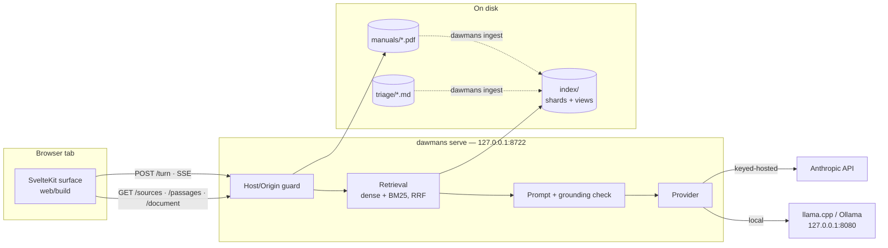
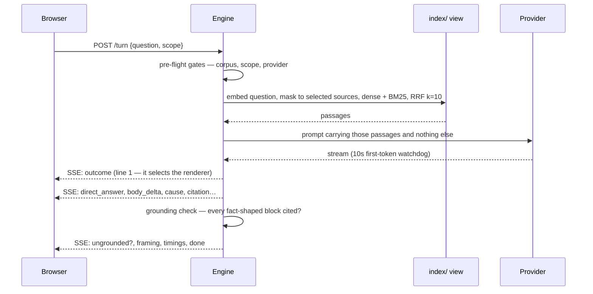
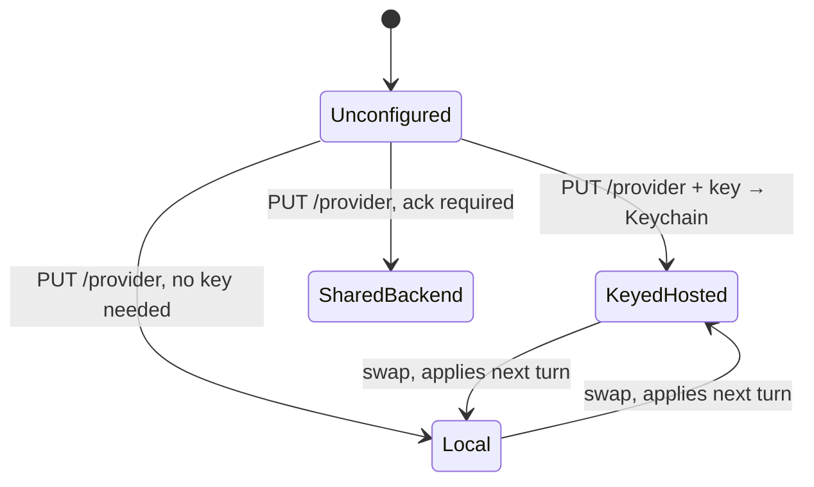

# DAWMans

A localhost webapp that answers home-studio questions from *your* gear's manuals, and nothing else.

Ask "why is my APC Key 25 not arming a track" and you get an answer assembled only from the PDFs
you dropped in `manuals/` plus the triage entries you wrote yourself — every factual claim cited to
a section and a page, with a click-through that opens the manual at that page. If the corpus can't
support an answer, it says so instead of guessing. NotebookLM-style source scoping means you pick
which sources are allowed to ground a given question.

Built for one person on one machine glancing at a second screen mid-session. The reference rig is
Ableton Live 12 Standard, an Akai APC Key 25 mk2, a Focusrite Scarlett Solo 4th Gen and an Alesis
Nitro Max, on macOS — but the rig is a YAML file, so it's yours to change.

At answer time nothing leaves the machine except the synthesis call, and even that is optional: point
it at a local llama.cpp / Ollama / LM Studio and the whole thing is offline. (Setup needs the network
twice — once for dependencies, once for the embedding model.)

---

## Stack

| Half | What | Why |
|---|---|---|
| Ingestion + engine | Python 3.12, **uv** | PyMuPDF for PDF extraction, numpy + bm25s for retrieval |
| Embeddings | fastembed, `BAAI/bge-small-en-v1.5` | ~67MB ONNX, runs on CPU, cached in `models/` |
| HTTP | Starlette + uvicorn | loopback only, SSE for streaming turns |
| Synthesis | Anthropic SDK **or** any OpenAI-compatible local server | pluggable `Provider` protocol |
| Browser surface | **SvelteKit 2 / Svelte 5**, `adapter-static`, **pnpm** | builds to `web/build`, served by the engine |
| Credentials | `keyring` → macOS Keychain | never a file, never an env var |
| Tests | pytest + hypothesis, vitest, Playwright + axe | 65 Python test modules, 23 web ones; e2e runs against a stub engine |



Two processes at dev time, one at rest: `make dev` runs Vite on 5173 and the engine on 8722; a
built `web/build` gets mounted at `/` by the engine, so production is a single command.

---

## How a turn works



Event order is contract, not convenience: `outcome` comes first because it picks the renderer before
the first word is painted, `direct_answer` precedes the first `body_delta` so first paint never waits
on block disambiguation, and `done` is last and happens exactly once.

Every turn ends in exactly one of **17 outcomes** — a closed taxonomy, so the UI never has to guess
what happened. `answered` and `partially-answered` render as answers; `needs-narrowing` and
`ranked-causes` are their own renderers; `refused-not-covered`, `out-of-domain` and
`no-manual-for-device` are the honest refusals; the rest cover configuration, provider and lifecycle
failures. A rejection that carries no envelope at all — an over-length question, a `Host`/`Origin`
refusal, a stream-version mismatch — is deliberately *not* a member: it describes a request, not a
turn. See `specs/CONTRACTS.md` §6; it's governing.

## Ingestion


Order matters and is load-bearing: superseded views are collected *first* so a live reader keeps its
files; the embedding model loads *once* before any source; the authored triage store loads *last*
so its fix pointers resolve against this run's manuals. `index/` is fully derived from the two
stores with no other input — delete the whole directory and `dawmans ingest` rebuilds it.

---

## Running it

Three passes over the same ground, shallow to deep.

### Pass 1 — just get it up

```bash
make build          # uv sync --all-extras + pnpm build
make fetch-model    # one-off, needs network, fills models/
# drop your PDFs in manuals/ — see manuals/README.md for the filename rules
uv run dawmans ingest
make serve          # http://127.0.0.1:8722
```

Then open the app, hit the provider config, and either paste an Anthropic key or point it at a
local model. That's the whole loop.

Day to day you want `make dev` instead — Vite HMR on 5173 talking to the engine on 8722.

### Pass 2 — the shape of it

**Two extras, deliberately.** `pyproject.toml` splits dependencies into `ingest` and `serve`.
PyMuPDF is AGPL, so it is confined to `src/dawmans/corpus/pdf/` and never installed in the serving
process — `uv sync --extra serve` (i.e. `make build-serve`) is what an API host runs. The rule is
enforced three ways: a ruff `banned-api` on `fitz`/`pymupdf`, `tests/test_agpl_confinement.py` for
the package, `tests/answer/test_no_pymupdf.py` for the process boundary. Dev installs both, which is
why the confinement tests exist at all.

That split is also why `src/dawmans/cli.py` defers its serve-side imports into the functions that
need them — importing starlette at module scope would break `dawmans --help` in an ingest-only
environment, exactly as importing PyMuPDF would break it in a served one.

**Ingest and serve are separate lifecycles.** Ingestion is a batch run that commits a *view*; the
engine stats the manifest before each turn and swaps wholesale on a revision change, so no answer
can mix revisions and an in-flight turn keeps the view it started with. You re-ingest while the
server is up. A new manifest the engine *can't* read keeps the live view rather than reporting an
empty corpus, which would be a lie.

**Serving is loopback or nothing.** `ensure_loopback_bind` refuses anything but `127.0.0.1`/`::1`
before uvicorn exists — no fallback bind, non-zero exit. On top of that, `HostOriginGuard` rejects
any request whose `Host` isn't the loopback service (this is what closes DNS rebinding: an
attacker's hostname resolving to 127.0.0.1 reaches the socket but arrives with the wrong Host) and
any `Origin` outside the same set. `null` origins — `file://` pages — are rejected too.

**Startup order** is four steps and each one is there for a reason: read the manifest first (refuse
to serve a view you can't interpret) → load the model and burn one throwaway encode (the 7.2s cold
load is paid here, not on the user's first question) → assemble the app → bind *last*, because a
listener that accepts before the warm is promising a latency budget it can't meet.

**Provider selection is runtime state, not config.** Three kinds:



The registry is mutable; a turn reads it once at start, so a swap applies to the next turn without a
restart. `requires_key` is a property of the *kind* — a configured local provider is fully
configured, and `LocalProvider.__init__` has no key parameter at all.

### Pass 3 — the edges

- **The key has exactly one full reader.** `credentials.read_key()` is called once, by a provider's
  client constructor. Every other path — status, config UI, logs — gets `mask()`, the last four
  characters. A `SecretFilter` on the root handler drops any log record containing a stored secret,
  and the same predicate scrubs the `detail` field on error envelopes. The filter is a backstop, not
  the mechanism; the mechanism is never putting a key in a record.
- **No filesystem path appears in any payload.** A manifest fault reports a fixed notice, not the
  path that failed.
- **The local provider refuses non-loopback base URLs at construction**, so "a local provider makes
  no outbound request" holds structurally rather than by discipline.
- **`rig.yaml` is applied at merge, not at build.** Editing it changes no source byte, so every
  shard would be cache-reused and a new declaration would never reach the index. The shard holds
  what the *document* says; the view holds what the *owner* says.
- **Streaming cancellation is a close, not a drain.** `StreamingResponse` never finalises its body
  iterator, so a caller disconnect would only close the turn generator at GC time. `_TurnStreamResponse`
  overrides `__call__` to `aclose()` in a `finally`. One in-flight turn per conversation: a new
  question supersedes the old one, which emits `cancelled` then `done` before the new stream opens.
- **Retrieval masks before top-k.** Retrieve-then-mask would let out-of-scope rows eat the depth
  slots — a narrow scope against the 1009-page Live manual would look like poor coverage when the
  index was fine.
- **`tests/` has no `__init__.py`**, so every test filename in the tree must be unique. Two specs
  each landing a `test_scope.py` broke collection once already.

---

## Configuration surfaces

Everything you can turn, and where it lives.

| Surface | Tracked? | What it controls |
|---|---|---|
| `manuals/*.pdf` | ✗ gitignored | The vendor corpus. Filename **is** the identity — `vendor_product_doctype_vN_lang.pdf`. Rename a file and you rename what users see. `manuals/README.md` is tracked and lists what a working checkout should hold. |
| `triage/*.md` | ✓ | Your authored symptom→cause entries: ranked causes, an observable check per cause, a fix pointer into a manual. Five ship as a starter set. |
| `rig.yaml` | ✓ | What you actually own, and which device each manual describes. Hand-maintained on purpose — nothing detects hardware, and a document is not evidence of ownership. Drives the two gap reports. |
| `index/` | ✗ derived | Shards, views, manifest, audits. Rebuilt from the two stores with no other input. |
| `models/` | ✗ derived | The 67MB embedding model. `make fetch-model`, once per machine. Ingestion runs with `HF_HUB_OFFLINE=1` against it. |
| Keychain `dawmans`/`anthropic` | n/a | The API key. Not a file, not an env var, not a log line. |
| Provider selection | runtime | `PUT /provider` from the UI. Applies to the next turn. |
| `--root` | flag | Repo root; everything else defaults relative to it. |
| `--index-dir`, `--manuals-root` | flags | Override the two locations independently. |
| `--host`, `--port` | flags | Default `127.0.0.1:8722`. Non-loopback host is refused, not coerced. |
| `--local-url` | flag | Base URL for the local provider. Default `http://127.0.0.1:8080` — llama.cpp's; Ollama and LM Studio differ, which is exactly why it's a flag. |
| `--static-dir` | flag | Built browser surface to mount at `/`. Defaults to `web/build` when it exists. |
| `ENGINE_ORIGIN` | env, dev only | Where `web/`'s vite proxy sends `/turn`, `/passages`, `/sources`, `/provider`. Default `http://127.0.0.1:8722`. The e2e suite uses it to point at a stub engine. |

---

## Commands

```bash
dawmans ingest      # both stores → a committed view
dawmans validate    # read the index back, report what breaks
dawmans inventory   # every indexed source
dawmans coverage    # what the triage store covers
dawmans serve       # the loopback API
```

`make help` lists the rest. The Makefile is the canonical entry point — targets wrap `uv run …` and
`pnpm …` rather than replacing them.

```bash
make build      # both halves        make test     # both suites
make dev        # web + engine       make lint     # spelling, ruff, svelte-check
make bench      # ingest + answer timing
make web-e2e    # Playwright + axe
```

---

## Where the thinking lives

- `specs/OVERVIEW.md` — generated index of the four specs.
- `specs/CONTRACTS.md` — **governing** for anything crossing a spec boundary. Where a spec disagrees
  with it, the spec is the defect.
- `specs/DECISIONS.md` — the twelve cross-cutting ADRs. Per-spec `decision_log.md` files win on detail.
- `docs/agent-notes/` — module-level implementation notes. Read the relevant one before changing a module.
