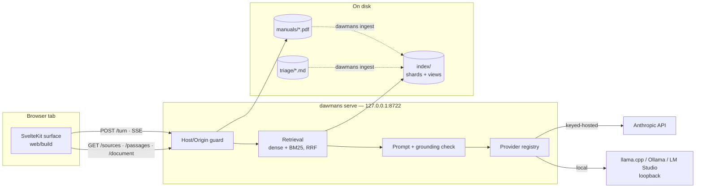
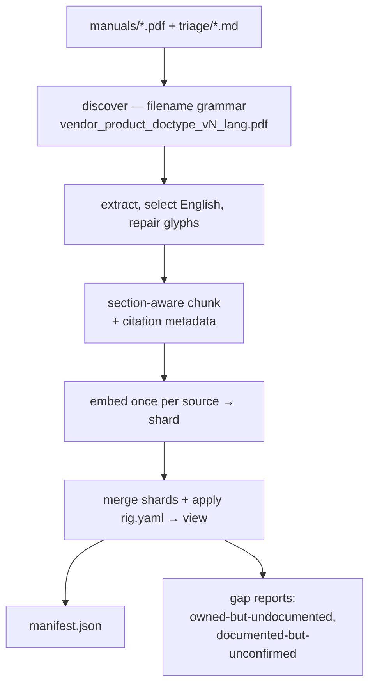
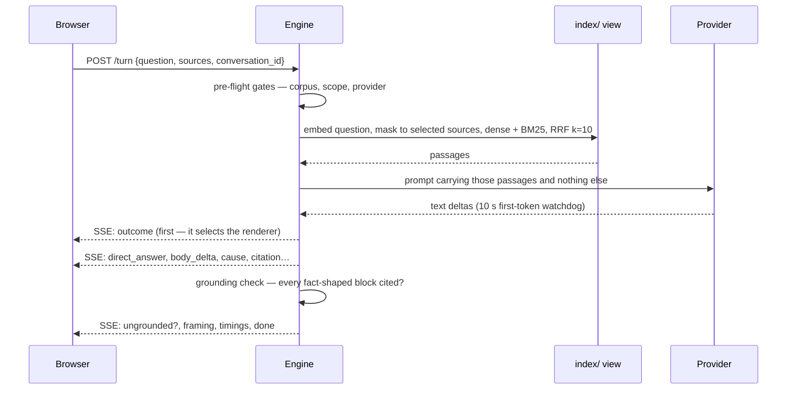
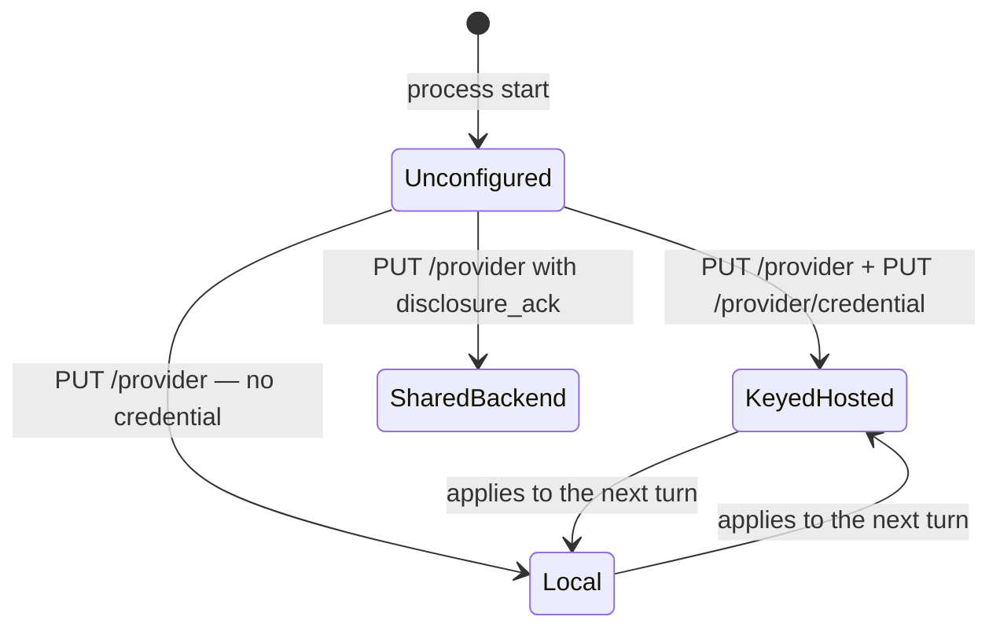

# DAWMans

DAWMans is a loopback-only web application that answers home-studio questions from a locally held
corpus: vendor PDF manuals plus authored symptom-triage entries. Every factual claim in an answer
carries a citation to a source, section and page, and the citation resolves to the PDF opened at
that page. Where the corpus cannot support an answer, the turn ends in an explicit refusal outcome
rather than an unsourced one. Source scoping is per turn: a question is grounded only in the
sources selected for it.

The reference rig is Ableton Live 12 Standard, an Akai APC Key 25 mk2, a Focusrite Scarlett Solo
4th Gen and an Alesis Nitro Max, on macOS. The rig is declared in `rig.yaml` and is not derived
from the corpus.

At answer time the only outbound request is the synthesis call, and that is optional: with the
`local` provider kind pointed at an OpenAI-compatible server on loopback, the running system makes
no network request at all. Setup needs the network twice — once for dependencies, once for the
embedding model.

---

## Requirements

| Requirement | Notes |
|---|---|
| Python ≥ 3.12, [uv](https://docs.astral.sh/uv/) | Ingestion and the answer engine. Not pip or poetry. |
| Node + [pnpm](https://pnpm.io/) | The SvelteKit surface. Not npm or yarn. |
| `make` | The canonical entry point; targets wrap `uv run …` and `pnpm …`. |
| A `keyring` backend | Only for the `keyed-hosted` provider kind. macOS Keychain on the reference platform. |
| Vendor PDFs | Gitignored. `manuals/README.md` lists the expected files and where to obtain them. |
| Network, twice | `make build` (dependencies) and `make fetch-model` (67 MB embedding model). |

---

## Setup

```bash
make build          # uv sync --all-extras + pnpm build
make fetch-model    # one-off per machine, needs network; fills models/
# place vendor PDFs in manuals/ — filename grammar in manuals/README.md
uv run dawmans ingest
make serve          # http://127.0.0.1:8722
```

`make serve` starts the engine with `web/build` mounted at `/`, so the page is same-origin with the
API. `make dev` is the development form: Vite on 5173 with a proxy, and the engine on 8722, in
parallel.

No provider is configured at startup. Until one is selected (see
[Synthesis providers](#synthesis-providers)) every turn ends `provider-unconfigured`.

---

## Repository layout

| Path | Tracked | Contents |
|---|---|---|
| `src/dawmans/corpus/` | ✓ | PDF discovery, extraction, chunking. PyMuPDF is confined to `corpus/pdf/`. |
| `src/dawmans/index/` | ✓ | Embedding, BM25 index build, shard/view/manifest format. |
| `src/dawmans/triage/` | ✓ | Authored entry parsing, fix-pointer resolution, coverage. |
| `src/dawmans/answer/` | ✓ | Retrieval, prompt, parser, grounding, outcome, providers, HTTP surface. |
| `web/` | ✓ | SvelteKit 2 / Svelte 5 surface, runes mode. Builds to `web/build`. |
| `manuals/` | ✗ | Vendor PDFs. Filename is the source identity. |
| `triage/` | ✓ | Authored symptom→cause entries. Five ship as a starter set. |
| `rig.yaml` | ✓ | Declared hardware inventory and source→device applicability. |
| `index/` | ✗ | Derived: shards, views, manifest, audits. Rebuilt entirely by `dawmans ingest`. |
| `models/` | ✗ | Embedding model cache, populated by `make fetch-model`. |
| `specs/`, `docs/` | ✓ | Specifications, contracts, decision logs, module notes. |

---

## Architecture



Ingestion and serving are separate lifecycles. Ingestion is a batch run that commits a *view*; the
engine stats the manifest before each turn and swaps wholesale on a revision change. No answer can
mix revisions, and an in-flight turn keeps the view it started with, so re-ingestion while the
server runs is supported. A new manifest the engine cannot read leaves the live view in place and
reports a fault rather than an empty corpus.

### Dependency split

`pyproject.toml` declares two extras. PyMuPDF is AGPL-3.0-or-later, so it is confined to
`src/dawmans/corpus/pdf/` and never installed in the serving process: an API host runs
`uv sync --extra serve` (`make build-serve`). Three mechanisms enforce the confinement — a ruff
`banned-api` rule on `fitz`/`pymupdf`, `tests/test_agpl_confinement.py` for the package, and
`tests/answer/test_no_pymupdf.py` for the process boundary. The development environment installs
both extras, which is why the confinement tests exist.

Consequently `src/dawmans/cli.py` defers all serve-side imports into the functions that need them:
importing starlette or fastembed at module scope breaks `dawmans --help` in an ingest-only
environment.

### Ingestion



Three orderings are load-bearing:

- Superseded views are collected **first**, so a live reader keeps its files until the next run.
- The embedding model loads **once**, before any source is iterated. Cold load is ~7.2 s against a
  10 s per-source budget.
- The authored triage store loads **last**, after every vendor shard has committed, so fix pointers
  resolve against this run's manuals rather than the previous run's.

`rig.yaml` is applied at the merge, not at shard build. Editing it changes no source byte, so every
shard would be cache-reused and a new declaration would never reach the index. The shard records
what the document says; the view records what the owner declares.

`index/` is fully derived from `manuals/` and `triage/` with no other input. Deleting it and
re-running `dawmans ingest` reproduces it.

### A turn



Event order is contractual: `outcome` is first because it selects the renderer before the first
word paints; `direct_answer` precedes the first `body_delta`; `done` is last and occurs exactly
once. Abnormal terminations re-emit `outcome` (cancelled: `outcome`, `done`; failures: `outcome`,
`timings`, `done`).

Retrieval masks to the selected sources **before** top-k, not after. Retrieve-then-mask would let
out-of-scope rows consume the depth slots, so a narrow scope against the 1009-page Live manual would
present as poor coverage while the index was intact. Constants (`answer/retrieve.py`): dense
τ = 0.30, rare-term document frequency 0.05, per-retriever depth 50, RRF k = 10, base cap 8
passages, narrowing cap 12.

One in-flight turn per conversation. A new question supersedes the previous one, which emits
`cancelled` then `done` before the new stream opens. Cancellation is a close, not a drain: the
response, the SSE encoder and the pipeline each close their iterator in a `finally`, so the
provider stream is released immediately rather than at garbage collection.

### Outcomes

Every turn ends in exactly one of 17 outcomes (`specs/CONTRACTS.md` §6, governing):

| Group | Members |
|---|---|
| Content (model-chosen, 7) | `answered`, `partially-answered`, `needs-narrowing`, `ranked-causes`, `refused-not-covered`, `out-of-domain`, `no-manual-for-device` |
| Configuration / corpus | `no-sources-selected`, `unknown-source-id`, `corpus-empty` |
| Provider | `provider-unconfigured`, `provider-unreachable`, `provider-rate-limited`, `provider-error` |
| Lifecycle | `timeout`, `incomplete`, `cancelled` |

Five reason sub-codes refine them: `no-provider-kind`, `missing-credential`,
`disclosure-unacknowledged`, `authentication-failed`, `provider-rejected`.

A rejection that carries no envelope — an over-length question, a `Host`/`Origin` refusal, a
turn-stream version mismatch — is deliberately not a member. It describes a request, not a turn, and
arrives as `{"rejected": "<name>", …}` with a 4xx status.

---

## Models

Two models are involved and they are independent. The embedding model is always local and is not
configurable at runtime. The synthesis model is chosen through the provider registry and may be
local or hosted.

### Embedding model

| Property | Value |
|---|---|
| Model | `BAAI/bge-small-en-v1.5` (ONNX via fastembed), ~67 MB, CPU |
| Output width | 384 float32, L2-normalised; `vectors.npy` is `(N, 384)` |
| Query prefix | `Represent this sentence for searching relevant passages: ` — applied to queries only; passages are embedded bare |
| Fetch | `make fetch-model` → `tools/fetch_model.py` → `models/` |

Model identity and width are components of the shard cache key and are recorded in the manifest.
Changing either re-embeds every shard rather than concatenating vectors from two models under a
manifest that declares one.

Ingestion sets `HF_HUB_OFFLINE=1` in its own process environment before checking the cache, then
fails immediately naming the model, the directory and `make fetch-model` if `models/` is not
populated. No ingestion path can download anything.

`dawmans serve` loads the same model through `fastembed.TextEmbedding(EMBEDDING_MODEL)` **without**
a `cache_dir` argument and without the offline pin (`cli._load_model`). fastembed's default cache is
`$TMPDIR/fastembed_cache`, so the serving process does not read `models/` and will download the
model on first start if its own cache is empty. `make fetch-model` covers ingestion only.

At startup the model is loaded and then warmed with one throwaway encode, before the socket binds:
the ~7.2 s cold load is paid at startup rather than on the first question.

### Synthesis providers

Three kinds implement one `Provider` protocol (`answer/provider/base.py`). The protocol carries text
deltas and nothing else — no citations, no structure, no outcome. Framing, parsing, citation
resolution and grounding are engine-side for every kind, so answer quality guarantees do not become
per-provider obligations.

| Kind | Credential | Transport | Configured by |
|---|---|---|---|
| `keyed-hosted` | Required — Keychain, service `dawmans`, account `anthropic` | Anthropic SDK, default model `claude-opus-5` | `PUT /provider` + `PUT /provider/credential` |
| `local` | None — the constructor has no key parameter | OpenAI-compatible HTTP on loopback | `PUT /provider` + `--local-url` at start |
| `shared-backend` | None; requires a disclosure acknowledgement | Stub — not hosted or costed | `PUT /provider` with `disclosure_ack` |

Whether a credential is required is a property of the *kind*, not of instance state: a configured
`local` provider is fully configured.

#### Selection semantics

Provider selection is runtime state held in a `ProviderRegistry` (`answer/http/app.py`), not a
configuration file:

- The registry is mutable; the routes write it and a turn reads it **once, at turn start**. A change
  therefore applies to the next turn without restarting the engine.
- Selection is **process-local and not persisted**. After restarting `dawmans serve` no kind is
  selected and the next turn ends `provider-unconfigured` / `no-provider-kind`.
- Storing or clearing a credential calls `registry.refresh()`, which re-constructs the keyed
  provider so its constructor — the stored key's only reader — re-reads the store.
- A keyed kind selected with no stored key yields a `None` provider; pre-flight maps that to
  `provider-unconfigured` / `missing-credential`.
- Selecting `shared-backend` without `disclosure_ack` records **nothing** and responds
  `{"requires_disclosure_ack": true, "recorded": false}`.



#### Running a local model

The `local` kind speaks the OpenAI chat-completions API against a server on loopback. Any server
exposing that API works; three are exercised.

**1. Start a server on loopback.**

| Server | Default port | `--local-url` |
|---|---|---|
| llama.cpp (`llama-server`) | 8080 | `http://127.0.0.1:8080` (the engine default) |
| LM Studio (`lms server start`) | 1234 | `http://127.0.0.1:1234` |
| Ollama | 11434 | `http://127.0.0.1:11434` |

The URL is the origin only. The provider appends `/v1/chat/completions` and `/v1/models` itself, so
a `--local-url` ending in `/v1` produces `/v1/v1/chat/completions`.

**2. Start the engine against it.**

```bash
uv run dawmans serve --local-url http://127.0.0.1:1234
```

`--local-url` is read at process start and is not reachable from the HTTP surface. Changing the
local server's address requires restarting `dawmans serve`. `LocalProvider.__init__` raises on any
non-loopback host (`127.0.0.1`, `localhost`, `::1` are the accepted set), so "a local provider makes
no outbound request" holds by construction.

**3. Select the kind and name the model.**

From the browser surface: the provider configuration region, radio *Local model on this machine*,
then the *Endpoint or model* field, then *Save*. Note the field's value is transmitted as the
request's `model`; it does not set the base URL. The surface requires a non-empty value before it
will save a `local` selection.

Equivalently over HTTP:

```bash
curl -sX PUT http://127.0.0.1:8722/provider \
  -H 'Content-Type: application/json' \
  -d '{"kind":"local","model":"openai/gpt-oss-20b"}'
```

`disclosure_ack` is only consulted for `shared-backend`. A request with an absent `Origin` header
passes the guard; if present it must be `http://` plus a loopback host and the engine's own port.

**4. Verify reachability.**

```bash
curl -sX POST http://127.0.0.1:8722/provider/test    # {"reachable":true}
```

`POST /provider/test` issues `GET /v1/models` against the configured base URL. It tests reachability
only and never synthesises a turn; a transport error or any status ≥ 400 reports
`{"reachable": false, "detail": …}`.

#### What the local provider sends

```json
{
  "messages": [
    {"role": "system", "content": "<the cache-prefix system prompt>"},
    {"role": "user", "content": "<passages, roster, state, history, question>"}
  ],
  "stream": true,
  "model": "<only present when a model was named>"
}
```

No `max_tokens`, `temperature` or sampling parameters are sent — those remain the local server's
configuration. The response is read as SSE: lines starting `data:` are parsed as JSON and
`choices[0].delta.content` is yielded as a text delta; `[DONE]` and unparseable lines are ignored.
The output word cap (400) is carried in the prompt, not in a request field.

#### Failure mapping and timing

| Condition | Result |
|---|---|
| Transport error | `ProviderFailure("unreachable")` → outcome `provider-unreachable` |
| HTTP 429 with `Retry-After` ≤ 3.0 s, before any output | Retried at most once, honouring the stated interval |
| HTTP 429 otherwise | `provider-rate-limited`, carrying `retry_after` exactly as stated (never rounded) |
| Any other status ≥ 400 | `provider-error` / reason `provider-rejected` |
| No first token within 10 s | Engine watchdog → `timeout` |
| Any failure after ≥ 1 token | `incomplete`, whatever the underlying kind |

Client timeouts are 30 s read / 2 s connect, deliberately above the engine's 10 s first-token
watchdog so the engine's own limit fires first.

Two failure modes are specific to local servers and are configuration, not defects:

- **A server hosting more than one model rejects an unnamed request** ("Multiple models are
  loaded"), which surfaces as `provider-error` on every question. Name the model in the `PUT` body.
- **A reasoning model can exceed the 10 s first-token watchdog before emitting anything**, ending
  every turn `timeout` with no output. A model that begins emitting quickly is required, or the
  watchdog is doing its job.

Latency targets measured by `make bench` (`tools/bench.py`), p95: first token 1.2 s hosted /
2.5 s local; completion 6 s hosted / 15 s local; composed 1.5 s / 2.8 s. `make bench` skips honestly
when the index, the key or a local server is absent.

#### Keyed-hosted specifics

Default model `claude-opus-5`; thinking disabled at effort `low` (this is a grounded extraction task
and thinking delays the only figure measured — first token); `max_retries=0` so the retry-once rule
stays enforceable; `httpx.Timeout(30.0, connect=2.0)`; `cache_control: ephemeral` on the system
block. `ProviderStatus.prompt_cache` reports `unavailable` where the ~600-token system prompt does
not clear the selected model's cache minimum (512 for Opus 5, 1024 for Sonnet 5, 4096 for
Haiku 4.5), so cache loss is visible rather than silent.

#### Credential handling

`credentials.read_key()` has exactly one caller: a provider's client constructor. Every other path —
status, configuration surface, logs — receives `mask()`, `…` plus the last four characters. There is
no field anywhere in `ProviderStatus` or its payloads that can hold a full key. A `SecretFilter` on
the root log handler drops any record whose formatted output contains a stored secret, and the same
predicate scrubs the `detail` field on error envelopes — dropping it entirely rather than redacting
in place, since partial redaction still leaks length and shape. The filter is a backstop; the
mechanism is never placing a key in a record.

---

## HTTP surface

Every route passes the `Host`/`Origin` guard. Corpus routes run the same manifest-change check as a
turn, so a passage removed by re-ingestion stops resolving immediately.

| Route | Method | Purpose |
|---|---|---|
| `/turn` | POST | Submit a question; responds SSE. Headers `dawmans-turn-stream`, `dawmans-conversation-id` precede the first body byte. |
| `/sources` | GET | Every source record of both kinds, plus `owned_but_undocumented`, `documented_but_unconfirmed`, `manifest_fault`. |
| `/passages/{passage_id}` | GET | One passage record; a dict lookup, never a substitute. |
| `/sources/{source_id}/document` | GET | The vendor PDF, inline, no `Content-Disposition` (a filename would download it and defeat `#page=N`). |
| `/provider` | GET / PUT | Read status (masked only) / record a selection. |
| `/provider/credential` | PUT / DELETE | Store or clear the keyed credential. |
| `/provider/test` | POST | Reachability probe. |
| `/` | GET | `--static-dir` mount, added last so API routes match first. |

Binding and access control:

- `ensure_loopback_bind` refuses anything but `127.0.0.1` or `::1` before uvicorn is constructed —
  non-zero exit, no fallback bind. Addresses only: `localhost` is refused as a *bind* because it is
  resolvable to anything, while accepted as a *Host*.
- `HostOriginGuard` rejects any request whose `Host` is not the loopback service on the bound port.
  This is what closes DNS rebinding: an attacker hostname resolving to 127.0.0.1 reaches the socket
  but arrives carrying the wrong `Host`.
- An absent `Origin` passes. `null` (a `file://` page) and every cross-port loopback origin are 403.
  The Vite dev proxy therefore rewrites `Origin` itself — `changeOrigin: true` rewrites only `Host`,
  so without the rewrite every proxied request in development is a 403.
- No filesystem path appears in any response payload. A manifest fault reports a fixed notice.

Startup order is four steps, each load-bearing: loopback check (a configuration that can never serve
must not pay the model load first) → manifest read and view load (refuse to serve a view the engine
cannot interpret) → model load and warm encode → bind last, because a listener that accepts before
the warm promises a latency budget it cannot meet.

---

## Configuration surfaces

| Surface | Kind | Controls |
|---|---|---|
| `manuals/*.pdf` | gitignored | The vendor corpus. The filename **is** the identity: `vendor_product_doctype_vN_lang.pdf`, and `source_id` is `<vendor>/<product>`. |
| `triage/*.md` | tracked | Authored symptom→cause entries: ranked causes, an observable check per cause, a fix pointer into a manual. |
| `rig.yaml` | tracked | Declared devices and `source_applicability`. Hand-maintained: nothing detects hardware, and a document is not evidence of ownership. Drives both gap reports. |
| `index/`, `models/` | derived | Rebuilt by `dawmans ingest` and `make fetch-model` respectively. |
| Keychain `dawmans`/`anthropic` | credential | The API key. Never a file, environment variable or log line. |
| Provider selection | runtime | `PUT /provider`. Applies to the next turn; lost on restart. |
| `--root` | flag | Repository root; the other paths default relative to it. |
| `--index-dir`, `--manuals-root` | flags | Override the two locations independently. |
| `--host`, `--port` | flags | Default `127.0.0.1:8722`. A non-loopback host is refused, not coerced. |
| `--local-url` | flag | Base URL for the `local` kind. Default `http://127.0.0.1:8080`. |
| `--static-dir` | flag | Built surface to mount at `/`. Defaults to `web/build` when present. |
| `ENGINE_ORIGIN` | env, dev only | Where the Vite proxy sends `/turn`, `/passages`, `/sources`, `/provider`. Default `http://127.0.0.1:8722`. The e2e suite points it at a stub engine. |

---

## Commands

```bash
dawmans ingest      # both stores → a committed view
dawmans validate    # read the index back as the engine would; report what breaks
dawmans inventory   # every indexed source, with its English page ranges
dawmans coverage    # what the triage store covers
dawmans serve       # the loopback API
```

`dawmans validate` exits non-zero on a rejection or an unresolved term; `dawmans coverage` reports
without passing judgement and exits zero over a store full of rejections.

```bash
make build        # both halves          make test        # pytest + vitest
make build-serve  # serve extra only     make test-py     # pytest
make dev          # vite + engine        make web-test    # vitest
make serve        # engine only          make web-e2e     # Playwright + axe
make fetch-model  # embedding model      make lint        # spelling + ruff + svelte-check
make sections     # ARGS="…" → paste-ready fix: pointers from the committed index
make bench        # ingest + answer timing
make help         # everything else
```

Single tests: `uv run pytest tests/answer/test_ground.py::test_name`, and
`cd web && pnpm vitest run src/lib/state/scope.test.ts`. `make web-e2e` needs
`pnpm exec playwright install chromium` once per machine; the suite starts its own stub engine on
8788 and a Vite server on 4173 and never contacts the real engine.

CI runs the spelling check and the Claude review workflows only. No workflow runs pytest, vitest or
ruff — a green PR is not a passing suite.

---

## Constraints on contributions

- **PyMuPDF stays in `src/dawmans/corpus/pdf/`** and out of the `serve` extra. Three checks enforce
  it; all three must keep passing.
- **`src/dawmans/cli.py` defers serve-side imports** into the functions that use them.
- **No `--host 0.0.0.0` escape hatch.** Loopback-only is a requirement, not a default.
- **No filesystem path in a response payload.**
- **`tests/` carries no `__init__.py`**, so pytest imports modules by bare basename and every test
  filename in the tree must be unique. Two branches each landing a `test_scope.py` has already
  broken collection once.
- **`addopts` pins `-m 'not bench'`**; `make bench` passes `-m bench` on the command line and pytest
  takes the last `-m` it is given.
- **The web surface is runes mode**, forced in `web/vite.config.ts`. There is no `svelte.config.js`:
  the adapter and compiler options are configured through the `sveltekit()` plugin.
- **Irish/British English spelling** in documentation, comments and user-facing strings.
- Commits are `[type]: Sentence-case subject`, type ∈ {`feat`, `fix`, `doc`, `chore`, `style`}.

---

## Specifications and notes

- `specs/CONTRACTS.md` — **governing** for anything crossing a spec boundary: the shared records, the
  outcome taxonomy, the composed latency budget. Where a spec disagrees with it, the spec is the
  defect.
- `specs/OVERVIEW.md` — generated index of the four specs (`data/manual-corpus`,
  `data/symptom-triage`, `api/answer-engine`, `ui/ask-and-source-picker`).
- `specs/DECISIONS.md` — the cross-cutting ADRs; per-spec `decision_log.md` files carry the detail.
- `specs/PROCESS.md` — the spec-driven workflow.
- `docs/agent-notes/` — module-level implementation notes, including behaviour found only by running
  the system. Read the relevant note before changing a module.
- `docs/workflows/triage-from-threads.md` — how to author a `triage/` entry grounded in the manuals.
  A forum thread is never a source: it is never fetched, ingested, cited or committed.
- `AGENTS.md` — working guidance for coding agents; harness-neutral by intent.
