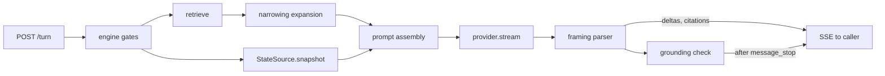

# Design: Answer Engine

**Domain:** `api` · **Capability:** answer-engine · **Status:** draft

Implements [`requirements.md`](requirements.md) against [`CONTRACTS.md`](../../CONTRACTS.md) (governing).
Criteria are referenced by ID and not restated. Reads the index published by
[`data/manual-corpus`](../../data/manual-corpus/design.md) and the sidecar published by
[`data/symptom-triage`](../../data/symptom-triage/design.md).

## Overview

A Python service, loopback-only, that turns a question plus a source scope into a streamed
`AnswerEnvelope`. Retrieval is in-memory over the merged index view (~4 ms measured); everything
else in the wall-clock budget belongs to one LLM call. The two decisions that carry the design are
therefore **how few context tokens reach the provider** and **how much structure the engine can
extract from a plain text stream without a second round trip**.

---

## Architecture

### The turn



Retrieval and state acquisition run concurrently under `asyncio.gather` (4.4); the gather is
bounded by the state timeout, which is shorter than nothing else on the path. Everything after the
provider call is a single pass over the token stream: the parser emits SSE events as it goes, and
the grounding check runs on the accumulated block structure once `message_stop` arrives (3.7).

### What the engine reads, and what it may rely on

The merged view contract in `data/manual-corpus` §Index layout. Load order at startup is
load-bearing:

| # | Startup step | Why in this order |
|---|---|---|
| 1 | Read `index/manifest.json`; refuse to serve if `index_version` differs | A view the engine cannot interpret must not be half-read |
| 2 | `mmap` `vectors.npy`, read `passages.jsonl`, load `lexical/`, `sources.json`, `gaps.json`, `reports/authored-triage.json` | ~5 MB; sub-200 ms |
| 3 | Load and **warm** `bge-small-en-v1.5` with one throwaway encode | Cold load is **7.2 s measured**. Paid here or on the user's first question |
| 4 | Bind `127.0.0.1` | A listener that accepts before step 3 promises a budget it cannot meet |

Row `i` of `vectors.npy` corresponds to line `i` of `passages.jsonl`, and `manifest.sources[]`
carries `row_start`/`row_count` sorted by `source_id`. Source scoping is therefore a set of
contiguous row slices, not a scan.

### Corpus change detection (5.10, 5.11)

Before each turn's retrieval, `os.stat` on `index/manifest.json` (~50 µs). On a changed mtime or
size, re-read it and compare `corpus_revision`; on a change, discard the loaded view wholesale —
vectors, lexical index, passages, sources, gaps, sidecar — and load the directory named by the new
`manifest.view_dir`. Nothing partial is reused, so no answer can mix revisions.

- The reload costs ~200 ms and is charged to the turn that triggers it, reported as its own
  `corpus_reload_ms` timing. 4.2's p95 is measured over turns that do not reload; a re-ingest is a
  user-initiated event, not steady state.
- An in-flight turn keeps its files: the corpus deletes superseded views at the **start of the next
  run**, not on commit.
- A new manifest whose `index_version` the engine cannot read is **not** loaded. The live view stays
  in place and `GET /sources` reports the mismatch. Mapping this to `corpus-empty` would be a lie —
  the corpus is not empty — and §6 is closed, so the honest home is a non-turn report.
- 5.11: sources dropped from a conversation's carried scope are removed and reported on the turn's
  stream as a `scope_dropped` event before the outcome; if none remain, `no-sources-selected`.

### Module placement

Inside the package `data/manual-corpus` establishes, as `dawmans.answer`:

```
src/dawmans/answer/
  view.py         CorpusView: manifest, row slices, revision watch, sidecar
  retrieve.py     query embed, dense, lexical, fusion, scope mask, device filter
  scope.py        device scope derivation (5.12) and the passage predicate (5.13)
  narrow.py       triage sidecar -> ranked candidates and fix expansion (7.2, 7.6)
  prompt.py       system prompt, framing spec, passage and history budget
  parse.py        stream framing -> envelope events (total; never raises)
  ground.py       citation resolution, the ungrounded rule (3.6, 3.7)
  outcome.py      the classification procedure (§6 totality)
  envelope.py     AnswerEnvelope, Citation — CONTRACTS §3/§4
  conversation.py history, carried scope, narrowing counter
  provider/       base.py anthropic.py local.py shared.py credentials.py
  state/          base.py null.py
  http/           app.py guard.py
```

`dawmans serve` is added to the existing `dawmans/cli.py`.

**Keeping PyMuPDF out of the API process.** The corpus design confines PyMuPDF to `corpus/pdf/`
for AGPL reasons, and that confinement is only load-bearing if the served process cannot reach it.
Two mechanisms, both needed:

1. **Dependency groups.** `pymupdf`, `lingua-py` and `fontTools` move to
   `[project.optional-dependencies] ingest`; `fastembed`, `bm25s`, `numpy`, `anthropic`, `uvicorn`,
   `keyring` go in `serve`. The API host runs `uv sync --extra serve` and PyMuPDF is not installed.
2. **An import test.** A test imports every `dawmans.answer.*` module in a subprocess with a
   `sys.meta_path` finder that raises on `fitz`. This catches the case a shared dev environment
   hides: an accidental `from dawmans.corpus.pdf import …` in a machine that has both groups.

`dawmans.answer` may import `dawmans.records`, `dawmans.index.embed`, `dawmans.index.lexical`,
`dawmans.index.manifest` and `dawmans.corpus.passage_id`; none of those touches `fitz`.

---

## Retrieval

Per turn, in order. Measured costs on the reference machine.

| # | Step | Cost |
|---|---|---|
| 1 | Embed the question with the BGE **query** prefix (`Represent this sentence for searching relevant passages: `) | 2.2 ms |
| 2 | Build the candidate mask: rows in the selected sources' slices, minus rows failing the device predicate | ~0.01 ms |
| 3 | Dense: `vectors @ q`, mask, `argpartition` to depth 50 | 0.011 ms |
| 4 | Lexical: `bm25s.retrieve`, mask, depth 50 | 0.047 ms |
| 5 | Fuse (RRF, k=10) | <0.5 ms |
| 6 | Apply the relevance threshold, the per-source floor, and the cap | <0.1 ms |
| | **Total** | **~3 ms** against a 50 ms budget |

Masking rather than slicing the arrays is deliberate: at 1,200 rows a full scan plus a boolean mask
is cheaper than materialising a scoped sub-matrix, and it keeps row indices global so a candidate's
`passage_id` needs no index translation. One selected source and all selected sources are the same
code path — the mask is just narrower or wider — so 5.4 and 5.8 need no special case and none
exists.

### Fusion

`score(c) = Σ_retrievers 1/(k + rank(c))`, ranks 1-based, **k = 10**, depth 50 per retriever.
Rationale and the rejection of k=60 and of weighted blending are
[Decision 1](decision_log.md); the arithmetic property it buys is stated as a test invariant below.

### Device scope (5.12) and the passage predicate (5.13)

Device scope for a turn is

```
{ record.hardware_applicability.device for record in selected sources }
  ∪ { device for device in gaps.owned_but_undocumented }
```

The engine relays `gaps.json`; it never reads `rig.yaml` and never derives the inventory. A passage's
declared devices come from the triage sidecar keyed on `passage_id`; a passage with no entry there
declares none and is scoped by its source alone.

The predicate is applied at step 2, **inside the candidate mask** — the cheapest place, and the only
place where "filter, not rank" holds by construction rather than by discipline. Device-match
closeness is not used at all: 5.13 permits it as a ranking input, and there is no evidence to tune
it with, so it stays unbuilt.

### The relevance threshold (2.7)

An absolute threshold on a fused RRF score is meaningless — the score measures how many retrievers
found a chunk, not how well it matches. τ is therefore defined on the pre-fusion signals, with two
arms, either of which qualifies a candidate:

| Arm | Test | Catches |
|---|---|---|
| Dense | `cosine ≥ 0.30` | Paraphrases |
| Lexical | BM25 rank 1 **and** shares a query term whose document frequency is ≤5% of the corpus | `MIDI note 38`, `Glue Compressor` — a decisive rare-term hit that dense retrieval is blind to |

A turn with no qualifying in-scope candidate is uncovered per 2.1. **Both constants are guesses
until the evaluation set exists** and calibrating them is that set's first job; they are
configuration, not literals.

### How many passages reach synthesis

**8**, subject to 5.6. Retrieval is 0.3% of the answer and prompt length drives TTFT linearly, so
this is the highest-leverage number in the design; the reasoning and the rejected alternatives are
[Decision 5](decision_log.md).

Allocation, in order:
1. One slot per **qualifying source** (a selected source with ≥1 candidate above τ), in fused order —
   this is 5.6's floor.
2. Remaining slots filled by fused rank.
3. Cap = `max(8, |qualifying sources|)`, and never above 12 (1.3) except that 5.6 takes precedence
   when qualifying sources exceed 12, exactly as 5.6 directs.
4. On a narrowing turn the cap is 12, to carry the fix passages the entry's causes point at.

Token arithmetic at 350-word chunks (~420 tokens): 8 passages ≈ 3.4k, 12 ≈ 5.0k, 16 sources in
scope ≈ 6.7k. Against a ~600-token cached system prompt and a bounded history, the difference
between 8 and 12 is roughly 100–200 ms of prefill on a hosted provider.

---

## Answer shape and the framing

The provider returns **plain text in one declared format** and the engine parses it. The format is
declared as `dawmans/answer-framing/1` (1.11) and is identical for every provider and every outcome.
Structured-output APIs are rejected in [Decision 2](decision_log.md).

```
answered
Turn the Track Activator back on — click the dimmed track number in the mixer. [[p:ableton/live-12#4b12a1]]
---
## Why
The Track Activator mutes the track's output when off. [[p:ableton/live-12#4b12a1]]

1. Look at the mixer for a dimmed track number. [[p:authored/triage#9f3c1a]]
2. Click it to re-enable the track. [[p:ableton/live-12#4b12a1]]
~uncovered whether the interface's direct monitoring is also muted
```

| Element | Rule |
|---|---|
| Line 1 | One of six **content outcomes**, bare. See §Outcome |
| Line 2 | `direct_answer`, one line, first actionable instruction within 25 words (1.9) |
| Line 3 | `---` |
| After | `body`, a restricted Markdown subset plus five sigil lines |

Body block types, all identifiable at column 0 without prose heuristics (1.10): `## ` heading,
`N. ` ordered step, `- ` bullet, blank-line-separated paragraph, and the sigils:

| Sigil | Meaning | Destination |
|---|---|---|
| `~uncovered ` | A named part of the question the sources do not cover (2.2) | Hoisted to `uncovered_parts[]` |
| `?narrow ` + `* ` lines | The narrowing question and its 2–4 candidates (7.1, 7.2) | Hoisted to `narrowing` |
| `@device ` | The device whose documentation is needed (2.10) | Hoisted to `required_device` |
| `!caveat ` | A recommendation depending on an edition or add-on the rig lacks (1.12) | Stays in `body` as a typed block |
| `!conflict ` + two `- ` lines | Two readings of conflicting passages, each with its own citations (1.4) | Stays in `body` as a typed block |
| `!suggest <source_id>` | An unselected source likely to hold the answer (2.3) | Stays in `body` as a typed block |

Citations are inline markers `[[p:<passage_id>]]`.

**Source suggestion (2.3–2.5) needs no content from the suggested source.** The prompt carries a
metadata-only roster of the *unselected* sources — `source_id`, `display_name`, `product`, `kind` —
and nothing else. 2.4 then holds by construction: source scoping is a mask applied before retrieval,
so no passage from an unselected source exists anywhere in the turn to be quoted. The model orders
up to three `!suggest` lines by likelihood from names alone, emits none when no source is a
plausible holder (2.5), and the prompt forbids them entirely on `out-of-domain` (2.9). Suggestions
have no field on the closed `AnswerEnvelope`, so like 1.12 and 1.4 they ride in `body` as a typed
block rather than inventing one.

**No envelope field is invented.** 1.12 and 1.4 both need machine-identifiable output that CONTRACTS
§4 has no field for; both ride in `body`, which §4 defines as carrying machine-identifiable
structure. That is the whole reason `body` is not a plain string.

**The outcome token precedes `direct_answer`, and 1.8 still holds.** 1.8 forbids qualification,
caveats, restatement and supporting context ahead of the answer. An outcome token is none of those —
it is the renderer selector, and without it the caller cannot decide what to paint before the first
word arrives.

**Parser contract.** `parse.py` is a total function over bytes: any input yields a well-formed
envelope or a parse-failure envelope, and it never raises and never emits a partial `Citation`.
When line 1 is not a valid content outcome, the whole stream is treated as `body`, `direct_answer`
is the first sentence, and the outcome comes from the engine's coverage signal alone
(`answered` if anything passed τ, `refused-not-covered` otherwise). That path is the honest
degradation for a provider that ignores the framing; it is reported in `timings` as
`framing: unparsed` so it is visible rather than silent.

**Suppressing the model's own XML.** With thinking disabled on Claude Opus 5 the model occasionally
leaks `<thinking>` tags into visible output. The system prompt therefore carries *"Do not include
internal or system XML tags in your response"* — stated generically, and it must **not** carry any
"do not think" or "do not reason" instruction, which measurably worsens the leak.

---

## Grounding and citation verification

**Supplied set.** The turn holds `supplied: dict[passage_id, Passage]` — exactly the passages sent
to synthesis, plus any fix passages a narrowing expansion admitted.

- **3.6 holds by construction.** A `Citation` is assembled only from an entry in `supplied`; the
  model's text can never become one. An unresolvable marker is stripped from the streamed text —
  the user is never shown a dangling reference — and counted.
- **3.2, 3.3, 3.8** are a field copy from `Passage` and its `SourceRecord`. Pageless sources emit
  `section_number`, `page` and `doc_version` as absent; nothing is synthesised or substituted.
- **3.4/3.5** — `GET /passages/{id}` is a dict lookup against the loaded view. `source_id` is the
  visible prefix of `passage_id`, so the route needs no index. Unknown or removed ⇒ 404 with a
  not-found body; never a substitute.

**The ungrounded rule (3.7).** Deciding "a substantive claim with no resolvable citation" cannot be
an NLP judgement inside a 150 ms budget. The deterministic rule, evaluated per body block once
`message_stop` arrives:

> A block is ungrounded when it carries no resolved citation **and** contains a fact-shaped token:
> a numeric literal with or without a unit, a run of two or more Capitalised or ALL-CAPS tokens, or
> a menu path (a token sequence separated by `>` or `→`).

The term extractor is `dawmans.triage.terms`, already specified by `data/symptom-triage` 2.6 —
reused rather than reimplemented, so the two specs cannot drift on what counts as a product term.

**The rule is deliberately fact-shaped, and that is the CONTRACTS §8 split made executable.** It
fires on parameter names, numeric values and menu paths — the things 2.6 forbids without a citation.
It cannot fire on a block that only orders or eliminates causes, because such a block carries no
fact-shaped token. So reasoning over cited facts, which 7.2 requires, is never marked ungrounded,
while an invented parameter name always is. Writing the check any other way would make symptom
triage simultaneously required and prohibited.

`ungrounded: true` is emitted as its own SSE event after the last body delta and before `done`
(3.7), never withheld and never deferred past the turn. The rule is a heuristic over prose whose
false-positive rate cannot be bounded, which is exactly why it marks an already-rendered answer
rather than gating one.

**State values are never citations** (8.6) — for the same structural reason: they are not in
`supplied`. They enter the prompt in a separate labelled block carrying origin and age, and 8.7's
staleness warning is emitted by the model as a `!caveat` block when `origin_kind == "saved-file"` or
the value is older than 60 s. 8.10 (state contradicting a passage) is likewise a `!conflict` block
with the state side unattributed to any citation.

---

## The outcome procedure

§6 is closed and every turn yields exactly one member. The set splits in two, disjointly.

**Engine-determined (11).** Checked in this fixed order, first match wins, before any provider call:

| # | Condition | Outcome |
|---|---|---|
| 0 | Question > 1000 characters | **Not an outcome** — 9.12 rejected submission, no turn exists |
| 1 | No manifest, or 0 passages | `corpus-empty` |
| 2 | A selected id is not in `sources.json` | `unknown-source-id` |
| 3 | Selected set empty, or emptied by 5.11 | `no-sources-selected` |
| 4 | No provider kind set; or kind requires a key and none stored; or shared backend not acknowledged (6.15) | `provider-unconfigured` + reason |
| 5 | Connection refused / DNS / TLS | `provider-unreachable` |
| 6 | HTTP 429 after the single retry | `provider-rate-limited` + `retry_after` |
| 7 | No first token within 10 s (4.9) | `timeout` |
| 8 | Any other provider error, including 401 | `provider-error` + reason |
| 9 | Provider failed after partial output (6.10) | `incomplete` |
| 10 | Caller disconnected, cancelled, or superseded by 9.13 | `cancelled` |

**Model-chosen (6).** Line 1 of the stream, validated against the enum
`answered | partially-answered | needs-narrowing | refused-not-covered | out-of-domain |
no-manual-for-device`. The model can emit no other member; the engine can emit none of these.

The classification is a byproduct of the synthesis call — no pre-flight classifier, no second round
trip, no latency. [Decision 3](decision_log.md) records why.

### Distinguishing `out-of-domain` from `refused-not-covered`

This is the distinction the requirements are written against, and it is not a similarity threshold —
"why is my kick distorting" retrieves Saturator, Drum Buss and Overdrive at *high* relevance, and
all three are wrong. The threshold in 2.7 cannot catch it because the scores are high, which is
2.8's whole point.

The prompt puts the test to the model that has read the passages, as a **responsiveness** question
rather than a similarity one:

| Question asks | Passages | Outcome |
|---|---|---|
| What a documented control is or does | A passage states it | `answered` |
| What a documented control is or does | Nothing states it; another ingested source plausibly might | `refused-not-covered` + up to 3 suggestions (2.3) |
| How to achieve a production outcome | Passages share vocabulary but state no cause or procedure for it, **and** no `authored-triage` passage matches | `out-of-domain`, suggestions suppressed (2.9) |
| How to achieve a production outcome | An `authored-triage` passage matches | Answer from it — never `out-of-domain` (2.9's carve-out) |
| Answerable from documentation for a device with neither a manual nor an entry | — | `no-manual-for-device` + `@device` (2.10) |

`refused-not-covered` and `out-of-domain` differ by *whether any manual could ever hold the answer*,
which is a property of the question, not of the retrieval scores. The prompt states the corpus fact
that grounds it: a reference manual documents controls, not practice.

**`required_device`.** The model emits a device name on the `@device` line. Where it matches an
entry in `gaps.owned_but_undocumented`, the engine substitutes the canonical `<vendor>/<product>` id
and the rig display name; otherwise the free-form name is carried through. 2.10 names a device, not
a source id, so an unmatched name is valid output, not an error.

**`contributing_sources[]`** is the set of `source_id` over `supplied`. CONTRACTS §4 fixes it as
"which selected sources actually supplied passages". A citation-derived set would be more
informative — it would show a source that supplied a passage the answer ignored — but §4 governs.

---

## Narrowing from triage entries

7.2 is only satisfiable against the real corpus because an authored entry states the distinguishing
conditions no vendor passage states. The flow:

1. Retrieval admits an `authored-triage` passage. Look it up in the sidecar by `passage_id`.
2. `causes[]` is already in the author's likelihood order, and the chunker preserves unit order, so
   nothing here sorts (7.6 preserves the ranking for free).
3. Take the first **2–4** causes. Candidate label is the cause's `check` — an observable the user
   can look at — and its value is the cause `statement`.
4. For each taken cause, resolve `fix[].passage_ids` against the view and admit those passages to
   `supplied`. Bounded at ≤4 causes × ≤3 pointers; the cap rises to 12 for the turn (1.3's ceiling)
   and any excess fix passages are dropped in cause order, not at random.
5. Session state that already supplies a candidate's value removes that candidate (7.8); if all are
   removed, no narrowing question is asked.
6. `unbacked` on a cause's passage travels to its citation untouched (1.13, 3.3) — the engine reads
   the flag, never sets it.

Where no entry matched, candidates come from distinguishing conditions in the retrieved passages,
generated by the model over cited text. 7.7 (a candidate must change the retrieval or the reported
cause) is structural on the entry path — each cause has its own check and its own fix pointer — and
prompt-level only on the fallback path. That asymmetry is honest: the entry path is the one the
requirements call satisfiable.

Budget: the sidecar lookup is a dict hit; the fix resolution is ≤12 dict hits. 7.3 is met because a
narrowing turn is an ordinary synthesis call with a shorter output, held to the same first-token
target and not to a completion target that would have to precede it.

---

## Provider abstraction

```python
class ProviderKind(StrEnum):
    KEYED_HOSTED = "keyed-hosted"     # requires_key = True
    LOCAL = "local"                   # requires_key = False
    SHARED_BACKEND = "shared-backend" # requires_key = False, requires acknowledgement

@dataclass(frozen=True)
class SynthesisRequest:
    system: str            # static; the cache prefix
    passages: tuple[Passage, ...]
    question: str
    history: tuple[Turn, ...]
    state: StateSnapshot | None
    max_words: int         # 400 unless the caller asks for more (1.6)

class Provider(Protocol):
    kind: ProviderKind
    def status(self) -> ProviderStatus: ...                  # never carries credential material
    async def probe(self) -> ProbeResult: ...                # test-provider; no synthesis
    def stream(self, req: SynthesisRequest) -> AsyncIterator[str]: ...   # text deltas only

class ProviderFailure(Exception):
    kind: Literal["unreachable", "rate-limited", "auth", "error"]
    retry_after: float | None
```

The interface carries **text deltas and nothing else** — no citations, no structure, no outcome.
Framing, parsing, citation resolution and grounding are engine-side for every provider, which is
what makes 6.2 structural rather than a per-provider obligation. [Decision 4](decision_log.md).

### The three kinds

| Kind | Implementation | Notes |
|---|---|---|
| Keyed hosted | `anthropic.AsyncAnthropic` | Default model `claude-opus-5`; `claude-sonnet-5` and `claude-haiku-4-5` selectable for lower TTFT |
| Local | OpenAI-compatible HTTP on loopback (llama.cpp server, Ollama, LM Studio) | `requires_key = False`; the client is constructed against a loopback base URL only, so 6.14's no-outbound-request holds by construction |
| Shared backend | Stub behind the 6.15 gate | Not costed, hosted or owned — see §Open |

A configured keyless provider is a **fully configured state**: `requires_key` is derived from the
kind, and `status()` returns `configured=True, credential=None`. Nothing reports it as unconfigured
or as missing a credential (6.4).

### Anthropic provider specifics

Named from the `claude-api` skill, not from memory.

| Setting | Value | Why |
|---|---|---|
| Model | `claude-opus-5` | Current default; `claude-sonnet-5` / `claude-haiku-4-5` trade quality for TTFT |
| Thinking | `{"type": "disabled"}` | Thinking delays the first *text* token, which is the only figure 4.6 measures. On Opus 5 disabling is accepted only at effort `high` or below |
| Effort | `output_config={"effort": "low"}` | Compatible with disabled thinking; this is a grounded extraction task, not a reasoning one |
| Streaming | `client.messages.stream(...)`, consumed as `text_stream` | 4.5 |
| Caching | `cache_control: {"type": "ephemeral"}` on the last system block | The ~600-token system prompt clears Opus 5's **512-token** minimum. It does **not** clear Sonnet 5's 1024 or Haiku 4.5's 4096 — selecting those models silently loses the cache, and `GET /provider` reports `prompt_cache: unavailable` so it is visible |
| Retries | `max_retries=0` | The SDK's default of 2 would apply its own backoff inside our 10 s window and make 6.8's "retry at most once" unenforceable |
| Timeout | `httpx.Timeout(30.0, connect=2.0)` | Longer than our 10 s watchdog so ours fires first and attributes the stall to the provider (4.9) |

Cache ordering: system (cached) → passages → history → question. Passages and history vary per turn
and must sit after the breakpoint.

**Rate limits (6.8).** `anthropic.RateLimitError` carries `retry-after`. Retry once if the stated
interval is ≤3 s, after sleeping it; otherwise surface `provider-rate-limited` with the value
unchanged.

**Cancellation (4.10).** The stream is driven by an `asyncio.Task`; cancelling it exits the async
context manager, which closes the HTTP response. The 250 ms bound is a close, not a drain.

### Credentials

Stored in the macOS Keychain via `keyring`, under service `dawmans` and a per-provider account key
— never in a config file. [Decision 6](decision_log.md).

- 6.11: the key is never placed in a log record's message or extras. A `logging.Filter` additionally
  drops any record whose formatted output contains the stored secret — a backstop, not the
  mechanism.
- 6.12: each provider constructs its own client against its own base URL. There is no shared
  "send the configured key to the configured URL" path that a misconfiguration could redirect.
- 6.13: `status()` and every configuration response return `masked: "…" + key[-4:]`, or `None`.
  The full value has exactly one reader: the provider's client constructor.
- 6.6: `provider-unconfigured` + `reason: missing-credential` (no key stored) is distinct from
  `provider-error` + `reason: authentication-failed` (HTTP 401 with a key present).
- 6.15: `PUT /provider` to `shared-backend` returns `requires_disclosure_ack: true` and records
  nothing; a turn on an unacknowledged shared backend fails as `provider-unconfigured` +
  `reason: disclosure-unacknowledged`. §6 is closed, so the reason field is the only honest place
  for this and no outcome is added.

---

## The `StateSource` seam

```python
@dataclass(frozen=True)
class StateValue:
    key: str                                    # "track.3.monitor", "audio.device"
    value: str | int | float | bool
    observed_at: datetime                       # 8.5 freshness
    origin: str                                 # 8.5 which implementation
    origin_kind: Literal["live", "saved-file"]  # drives 8.7

@dataclass(frozen=True)
class StateSnapshot:
    values: tuple[StateValue, ...]
    acquired_at: datetime

class StateSource(Protocol):
    origin: str
    async def snapshot(self) -> StateSnapshot: ...   # may raise; the engine bounds it
```

`NullStateSource.snapshot()` returns an empty snapshot immediately and is the only MVP
implementation (8.3). The engine wraps every call in `asyncio.wait_for(..., 0.100)` (8.9) inside the
`gather` with retrieval (4.4); a timeout, exception or malformed snapshot degrades the turn to
manual-only with a note and never fails it (8.8).

**Why this admits the two later sources without redefinition (8.4).** Per
`docs/agent-notes/ableton-state-integration.md`:

| Later source | What it produces | What the seam needs |
|---|---|---|
| `LogTailStateSource` — Live's `Log.txt`, plain text, appended live | The open Set's path and the active audio device | `origin_kind="live"`, `observed_at` from the log line |
| `AlsStateSource` — gzipped XML | Track state from a saved file | `origin_kind="saved-file"` ⇒ 8.7's warning fires automatically, with no engine change |

The `.als` freeze-sequencer section duplicating monitoring and armed values, and its inverted mute,
are parsing concerns wholly inside that implementation. They are invisible to the seam because a
`StateValue` is a flat key, value and provenance — not a DAW-shaped object model whose fields would
have to grow a "which copy" discriminator. Neither implementation is designed here.

---

## The local HTTP surface

Starlette on uvicorn, bound `127.0.0.1`.

| Operation | Route | Notes |
|---|---|---|
| submit-question | `POST /turn` → `text/event-stream` | Body carries `conversation_id` (null starts one, 10.6), `question`, `sources[]` |
| fetch-passage | `GET /passages/{passage_id}` | Dict lookup; <50 ms at p95 by construction (3.4) |
| list-sources | `GET /sources` | `SourceRecord[]` per 9.5, plus both gap reports per 9.6–9.7 |
| get-provider-status | `GET /provider` | Masked only (9.8) |
| set-provider | `PUT /provider` | Kind and model; applies from the next turn without restart and without touching the view (6.3) |
| set-credential | `PUT /provider/credential` | Returns masked (9.8) |
| clear-credential | `DELETE /provider/credential` | |
| test-provider | `POST /provider/test` | Reachability only; no synthesis |

**Streaming is SSE over a POST, not `EventSource`.** `EventSource` cannot POST, and the request
carries a question plus a source list that does not belong in a URL. The caller uses `fetch` with a
`ReadableStream`; the response is `text/event-stream` so the framing, the retry semantics and — most
usefully — 9.10's "caller disconnects ⇒ cancellation" all come for free from the transport.

SSE event names: `scope_dropped`, `outcome`, `direct_answer`, `body_delta`, `citation`,
`contributing_sources`, `uncovered_parts`, `narrowing`, `required_device`, `ungrounded`, `timings`,
`done`.

**Binding and headers.**

- 9.2: the configured host is checked against `{127.0.0.1, ::1}` before `uvicorn.run`. A non-loopback
  address exits non-zero naming the address and the constraint. There is no fallback bind.
- 9.3: middleware rejects any request whose `Host` is not `127.0.0.1:<port>`, `localhost:<port>` or
  `[::1]:<port>`, and any request with an `Origin` outside the same set — including `null`, which is
  what a `file://` page sends. **The `Host` check is the one that closes DNS rebinding**: an
  attacker's hostname resolving to 127.0.0.1 reaches the socket but arrives carrying
  `Host: evil.example`. Rejection is 403 with a machine-readable reason and no outcome.
- 9.12: a question over 1000 characters is rejected by the request validator with HTTP 422 and
  `{"rejected": "question-too-long", "limit": 1000, "received": N}`. **No `outcome` field is
  present**, which is precisely what makes it distinguishable from every member of §6 — the taxonomy
  describes turns and no turn was started.
- 9.13: one in-flight turn per conversation. A new `POST /turn` cancels the old, whose stream emits
  `outcome: cancelled` then `done` before the new stream opens. No interleaving, no queue.
- 9.11: question, answer and passage text log at `DEBUG` only; credentials at no level.

---

## Conversation state

In-memory, per process, discarded on restart (10.7). Last 6 turns (10.1), used to interpret the
question and never as a grounding source (10.3) — history enters the prompt in a block the framing
spec marks as uncitable, and since a `Citation` can only be built from `supplied`, a model that
tried to cite history would produce an unresolvable marker that is stripped and counted as
ungrounded. Retrieval re-runs every turn (10.2, 7.4). The carried scope persists until the caller
changes it (10.4, 10.5). History is truncated oldest-first to a fixed 800-token budget (10.8),
which is checked with `client.messages.count_tokens` at turn assembly rather than estimated.

---

## Error handling

| Failure | Outcome | Retained |
|---|---|---|
| Provider fails before the first token | `provider-unreachable` / `-error` / `-rate-limited` / `timeout` | Nothing |
| Provider fails mid-stream | `incomplete` | Everything streamed so far, marked (6.10) |
| Framing unparseable | The engine's coverage-derived outcome | Whole stream as `body`, `timings.framing: unparsed` |
| Marker resolves to nothing | Unchanged | Marker stripped; counted; feeds the 3.7 check |
| State source fails or times out | Unchanged | Manual-only, with a note (8.8) |
| New manifest unreadable | Unchanged | Live view retained; reported on `GET /sources` |
| Caller disconnects | `cancelled` | Nothing further sent |

No provider error substitutes a synthesised or cached answer from another turn (6.9); there is no
answer cache at all.

---

## Testing Strategy

`pytest` + `hypothesis`, per the sibling specs. Providers are stubbed by a `Provider` returning a
scripted stream, so every path except the network is deterministic.

### Property-based

Genuine invariants — each is a universal statement, not an example wearing a generator.

| Property | Guarantee | Criteria |
|---|---|---|
| Outcome totality | For any gate state and any provider transcript, classification returns exactly one member of §6 and never raises | 9.9 |
| Outcome disjointness | No engine-determined outcome is reachable from a model line, and no content outcome from a gate | 9.9 |
| Fusion monotonicity | Improving a candidate's rank in either list never lowers its fused rank | 5.5 |
| Fusion input invariance | Fused order is invariant to the order candidates arrive in, ties broken by `passage_id` | 5.5 |
| Fusion decisiveness | A sole rank-1 hit outranks every double hit at ranks worse than (k+2, k+2) — the arithmetic Decision 1 rests on, stated executably | 5.5 |
| Scope soundness | No returned passage's `source_id` is outside the selected set, and none declares devices disjoint from the device scope | 5.1, 5.13 |
| Floor/cap precedence | `|result| ≤ max(8, |qualifying|)` and every qualifying source contributes ≥1 | 1.3, 5.6 |
| Citation round-trip | For any supplied set and any stream of markers drawn from supplied ∪ unknown, every emitted `Citation` resolves to a supplied passage and every unknown marker is stripped and counted | 3.6 |
| Pageless citations | For any `authored-triage` passage, the citation carries absent section, page and `doc_version` — never empty strings, never synthesised | 3.2, 3.3 |
| Parser totality | For **any** byte string the parser yields an envelope; never raises, never emits a partial `Citation` | 1.10, 1.11 |
| Cancellation | For any prefix of a stream, cancelling yields `cancelled`, retains the partial, and emits nothing after `done` | 4.10, 9.13 |
| History non-citability | For any history containing text that looks like a citation marker, no `Citation` is produced from it | 10.3 |

**Disguised examples, written as examples:** that the kick-distortion question returns
`out-of-domain` (it depends on the model, and it is a fixture with a scripted stream); that RRF at
k=60 loses the MIDI-38 case (one arithmetic instance of the decisiveness property); that `Dry/Wet`
survives tokenisation (owned by `data/manual-corpus`).

### Example-based

| Test | Asserts |
|---|---|
| Loopback guard | `Host: evil.example` and `Origin: null` are both 403; `127.0.0.1`, `localhost` and `[::1]` pass; a non-loopback configured bind exits non-zero |
| Over-length question | 1001 characters yields 422 with no `outcome` field and no envelope |
| Keyless configured | A `local` provider with no key reports `configured=True` and answers a turn |
| Credential masking | `GET /provider`, `PUT /provider/credential` and `POST /provider/test` return only the masked form; the raw key appears in no log record at any level |
| No-PyMuPDF | Every `dawmans.answer.*` module imports with `fitz` poisoned |
| Rate-limit policy | A 429 with `retry-after: 2` retries once; with `retry-after: 8` surfaces `provider-rate-limited` carrying 8; the SDK's own retries are off |
| Corpus swap | A `corpus_revision` change between turns discards the view; a source removed mid-conversation drops from the carried scope with a `scope_dropped` event; removing the last one yields `no-sources-selected` |
| Narrowing expansion | A matching entry's causes become 2–4 candidates in the entry's order, each fix passage is in `supplied`, and `unbacked` reaches the citation |
| Cross-source | A question needing both the controller guide and the Live manual cites both, with the small guide represented under 5.6 |

### Timing

4.2 (retrieval ≤10 ms median, ≤50 ms p95) and 4.3 (engine overhead ≤150 ms p95, stub provider) run
in CI against a synthetic 1,200-chunk index. 4.1, 4.6–4.8 need a real provider and a real index and
are a `make bench` target, skipped when either is absent — the same honest limitation the sibling
specs accept for their full-corpus budgets.

### The evaluation set — the missing prerequisite

No retrieval-quality evaluation exists. Every quality claim above is reasoned from published
benchmarks on other corpora, and the fusion parameters, both threshold arms and the passage cap are
all unvalidated. The research note's condition is adopted: **recall@10 ≥ 95% on the fused list means
reranking stays unbuilt**, and a materially lower figure is diagnosed as a chunking or tokenisation
fault before a reranker is considered.

30–50 questions, hand-labelled. Composition is not arbitrary — each band exists to exercise a
specific criterion this design rests on:

| Band | Count | Exercises |
|---|---|---|
| Verbatim identifiers: device names including `Utility`, parameter names shared across devices, `Scene Launch`, bare numerals (`MIDI note 38`, `CC 74`) | ≥8 | The lexical arm of τ and the fusion decisiveness property |
| Paraphrases sharing no vocabulary with the target section | ≥8 | The dense arm; the case BM25 cannot serve |
| Cross-source questions needing two sources | ≥6 | 5.6's floor and 5.7 |
| Symptom-shaped questions with a matching triage entry | ≥6 | 7.2 and 2.8's "entry outranks topically-similar device documentation" |
| Uncovered questions | ≥4 | Expected `refused-not-covered` |
| Technique questions no manual covers | ≥4 | Expected `out-of-domain`, and 2.9's carve-out when an entry exists |
| Scarlett Solo questions | ≥2 | `no-manual-for-device` and 5.12's undocumented-device inclusion |

Labels are gold `(source_id, section_number)` pairs, **not** `passage_id` — a re-chunk changes every
`passage_id` and would invalidate the whole set, while section identity survives it. The last three
bands carry no gold passage: they label the expected **outcome**, and scoring them is a confusion
matrix over the six content outcomes. Without those bands, 2.8 and 2.9 — the criteria written
against this product's worst failure mode — are untestable at all.
