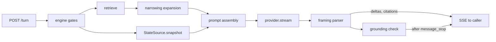

# Design: Answer Engine

**Domain:** `api` · **Capability:** answer-engine · **Status:** draft

Implements [`requirements.md`](requirements.md) against [`CONTRACTS.md`](../../CONTRACTS.md) (governing).
Criteria are referenced by ID and not restated. Reads the index published by
[`data/manual-corpus`](../../data/manual-corpus/design.md) and the sidecar published by
[`data/symptom-triage`](../../data/symptom-triage/design.md).

## Overview

A Python service, loopback-only, that turns a question plus a source scope into a streamed
`AnswerEnvelope`. Retrieval is in-memory over the merged index view (~4 ms measured); everything
else in the wall-clock budget belongs to one LLM call. The two decisions that carry the design are
therefore **how few context tokens reach the provider** and **how much structure the engine can
extract from a plain text stream without a second round trip**.

---

## Architecture

### The turn



Retrieval and state acquisition run concurrently under `asyncio.gather` (4.4). **Retrieval is
synchronous numpy and `bm25s` work**, so wrapping it in a coroutine would not make it concurrent —
it would run to completion without yielding, the state coroutine would not be scheduled until it
finished, and `asyncio.wait_for(…, 0.100)` could not fire during the blocking section. Retrieval
therefore runs under `asyncio.to_thread` so the state task is genuinely scheduled alongside it.

The gather is bounded by the **100 ms state timeout, the longest member of the gather**, not the
shortest. With the `NullStateSource` the MVP ships this is immaterial — it returns immediately and
the observed bound is retrieval's ~3 ms — but CONTRACTS §7 allots this concurrent stage only
retrieval's 50 ms, so a live state source at the full 100 ms exceeds what the composed figure
budgets and needs CONTRACTS §7 reconciling before `LogTailStateSource` lands. Everything after the
provider call is a single pass over the token stream: the parser emits SSE events as it goes, and
the grounding check runs on the accumulated block structure once `message_stop` arrives (3.7).

### What the engine reads, and what it may rely on

The merged view contract in `data/manual-corpus` §Index layout. Load order at startup is
load-bearing:

| # | Startup step | Why in this order |
|---|---|---|
| 1 | Read `index/manifest.json`; refuse to serve if `index_version` differs | A view the engine cannot interpret must not be half-read |
| 2 | `mmap` `vectors.npy`, read `passages.jsonl`, load `lexical/`, `sources.json`, `gaps.json`, and the triage sidecar (below) | ~5 MB; sub-200 ms |
| 3 | Load and **warm** `bge-small-en-v1.5` with one throwaway encode | Cold load is **7.2 s measured**. Paid here or on the user's first question |
| 4 | Bind `127.0.0.1` | A listener that accepts before step 3 promises a budget it cannot meet |

Row `i` of `vectors.npy` corresponds to line `i` of `passages.jsonl`, and `manifest.sources[]`
carries `row_start`/`row_count` sorted by `source_id`. Source scoping is therefore a set of
contiguous row slices, not a scan.

**The triage sidecar is named by rule, not spelled.** Its filename is the corpus's slug rule —
`source_id` with `/` replaced by `_` — applied to the authored source's `source_id`, which
CONTRACTS §1 fixes at the constant `authored/triage`. So the file is `authored_triage.json` and the
engine derives that name rather than writing it literally. `data/symptom-triage` §Sidecar names the
literal-and-hyphenated spelling as a **silent** failure: the corpus writes `authored_triage.json`, a
reader looking for `authored-triage.json` finds nothing, no error is raised, and under 5.13 no
passage then declares any device — so every entry stays in scope for every turn, which is precisely
what 5.13 exists to prevent. The engine therefore **fails loudly** when a view names an
`authored-triage` source whose sidecar is absent, rather than serving with an empty one.

Its location is `<manifest.view_dir>/reports/authored_triage.json` — inside the view, so the sidecar
and the passages it keys are always the same revision. That is now what `data/manual-corpus` writes:
its §Index layout splits view sidecars, which go inside the view and swap with the manifest rename,
from per-run ingestion audits, which stay beside it at `index/audits/<slug>.json`; Decision 8 there
records the split. The engine therefore never pairs a sidecar with a view it did not come from, and
§Corpus change detection can discard the sidecar with the rest of the view rather than tracking it
separately.

### Corpus change detection (5.10, 5.11)

Before each turn's retrieval, `os.stat` on `index/manifest.json` (~50 µs). On a changed mtime or
size, re-read it and compare `corpus_revision`; on a change, discard the loaded view wholesale —
vectors, lexical index, passages, sources, gaps, sidecar — and load the directory named by the new
`manifest.view_dir`. Nothing partial is reused, so no answer can mix revisions.

- The reload costs ~200 ms. It is **not** charged to a turn: CONTRACTS §7 says the stage budgets are
  hard, and excluding reload turns from 4.2's p95 would be a carve-out from a governing budget that
  CONTRACTS does not authorise. Instead the `os.stat` check swaps the view **before the turn's timer
  starts**, or — when a turn is already in flight — that turn keeps its files under the rule below
  and the swap happens before the next one. Either way no turn's measured stages contain the reload,
  and `corpus_reload_ms` is reported as a run-level timing rather than a stage of a turn.
- An in-flight turn keeps its files: the corpus deletes superseded views at the **start of the next
  run**, not on commit.
- A new manifest whose `index_version` the engine cannot read is **not** loaded. The live view stays
  in place and `GET /sources` reports the mismatch. Mapping this to `corpus-empty` would be a lie —
  the corpus is not empty — and §6 is closed, so the honest home is a non-turn report.
- 5.11: sources dropped from a conversation's carried scope are removed and reported on the turn's
  stream as a `scope_dropped` event before the outcome; if none remain, `no-sources-selected`.

### Module placement

Inside the package `data/manual-corpus` establishes, as `dawmans.answer`:

```
src/dawmans/answer/
  view.py         CorpusView: manifest, row slices, revision watch, sidecar
  retrieve.py     query embed, dense, lexical, fusion, scope mask, device filter
  scope.py        device scope derivation (5.12) and the passage predicate (5.13)
  narrow.py       triage sidecar -> ranked candidates and fix expansion (7.2, 7.6)
  prompt.py       system prompt, framing spec, passage and history budget
  parse.py        stream framing -> envelope events (total; never raises)
  ground.py       citation resolution, the ungrounded rule (3.6, 3.7)
  outcome.py      the classification procedure (§6 totality)
  envelope.py     AnswerEnvelope, Citation — CONTRACTS §3/§4
  conversation.py history, carried scope, narrowing counter
  provider/       base.py anthropic.py local.py shared.py credentials.py
  state/          base.py null.py
  http/           app.py guard.py
```

`dawmans serve` is added to the existing `dawmans/cli.py`.

**Keeping PyMuPDF out of the API process.** The corpus design confines PyMuPDF to `corpus/pdf/`
for AGPL reasons, and that confinement is only load-bearing if the served process cannot reach it.
Two mechanisms, both needed:

1. **Dependency groups.** `pymupdf`, `lingua-py` and `fontTools` move to
   `[project.optional-dependencies] ingest`; `fastembed`, `bm25s`, `numpy`, `anthropic`, `uvicorn`,
   `keyring` go in `serve`. The API host runs `uv sync --extra serve` and PyMuPDF is not installed.
2. **An import test.** A test imports every `dawmans.answer.*` module in a subprocess with a
   `sys.meta_path` finder that raises on `fitz`. This catches the case a shared dev environment
   hides: an accidental `from dawmans.corpus.pdf import …` in a machine that has both groups.

`dawmans.answer` may import `dawmans.records`, `dawmans.index.embed`, `dawmans.index.lexical`,
`dawmans.index.manifest`, `dawmans.corpus.passage_id` and `dawmans.triage.terms`; none of those
touches `fitz`. `dawmans.triage.terms` is on the list because §Grounding reuses it as the term
extractor rather than reimplementing it — which also means `dawmans/triage/` must pull in no
ingest-only dependency, and the import test above covers it alongside the rest.

---

## Retrieval

Per turn, in order. Measured costs on the reference machine.

| # | Step | Cost |
|---|---|---|
| 1 | Embed the question with the BGE **query** prefix (`Represent this sentence for searching relevant passages: `) | 2.2 ms |
| 2 | Build the candidate mask: rows in the selected sources' slices, minus rows failing the device predicate | ~0.01 ms |
| 3 | Dense: `vectors @ q`, **mask, then** `argpartition` to depth 50 | 0.011 ms |
| 4 | Lexical: `bm25s.retrieve` with the mask as a weight mask, **then** depth 50 | 0.047 ms |
| 5 | Fuse (RRF, k=10) | <0.5 ms |
| 6 | Apply the relevance threshold, the per-source floor, and the cap | <0.1 ms |
| | **Total** | **~3 ms** against a 50 ms budget |

**Masking precedes top-k on both retrievers**, not after it. Retrieve-then-mask would let
out-of-scope and device-filtered rows consume the 50 slots, so a narrow scope against the 1009-page
Live manual could return a nearly empty candidate set while the index held plenty — the failure
would look like poor coverage rather than a masking bug.

Masking rather than slicing the arrays is deliberate: at 1,200 rows a full scan plus a boolean mask
is cheaper than materialising a scoped sub-matrix, and it keeps row indices global so a candidate's
`passage_id` needs no index translation. One selected source and all selected sources are the same
code path — the mask is just narrower or wider — so 5.4 and 5.8 need no special case and none
exists.

### Fusion

`score(c) = Σ_retrievers 1/(k + rank(c))`, ranks 1-based, **k = 10**, depth 50 per retriever.
Rationale and the rejection of k=60 and of weighted blending are
[Decision 1](decision_log.md); the arithmetic property it buys is stated as a test invariant below.

### Device scope (5.12) and the passage predicate (5.13)

Device scope for a turn is

derived **over source kind**, because the two kinds carry applicability differently:

```
{ record.hardware_applicability.device
    for record in selected sources if record.kind == "vendor-manual" }
  ∪ { device for device in gaps.owned_but_undocumented }
```

An `authored-triage` source contributes **nothing** to the device scope and is not required to.
CONTRACTS §1 fixes its source-level `hardware_applicability` at `assumed` with no device — the store
is not about one device, and applicability varies per entry as passage-level data. Reading a device
off it would yield `None` and poison the set.

That leaves the case where the triage source is the **only** selection — an ordinary diagnostic
scope. The device scope would then be just the owned-but-undocumented gaps, and 5.13 would filter out
every entry declaring a device that *has* a manual, i.e. the whole starter set. So: **where no
`vendor-manual` is selected, the device scope is every device the view knows about** —

```
{ record.hardware_applicability.device
    for record in all indexed vendor-manual sources }
  ∪ { device for device in gaps.owned_but_undocumented }
```

— which is the documented devices plus the undocumented ones, and is derivable from `sources.json`
and `gaps.json` alone. `gaps.json` carries only the two reports, not the rig inventory, so this is
the widest device set the engine can name without reading `rig.yaml`, which it must not. A
triage-only turn is asking about the rig, not about a document, and scoping it to the gaps alone
would answer nothing.

The engine relays `gaps.json`; it never reads `rig.yaml` and never derives the inventory. A passage's
declared devices come from the triage sidecar keyed on `passage_id`; a passage with no entry there
declares none and is scoped by its source alone.

The predicate is applied at step 2, **inside the candidate mask** — the cheapest place, and the only
place where "filter, not rank" holds by construction rather than by discipline. Device-match
closeness is not used at all: 5.13 permits it as a ranking input, and there is no evidence to tune
it with, so it stays unbuilt.

### The relevance threshold (2.7)

An absolute threshold on a fused RRF score is meaningless — the score measures how many retrievers
found a chunk, not how well it matches. τ is therefore defined on the pre-fusion signals, with two
arms, either of which qualifies a candidate:

| Arm | Test | Catches |
|---|---|---|
| Dense | `cosine ≥ 0.30` | Paraphrases |
| Lexical | BM25 rank 1 **within its own source** and shares a query term whose document frequency is ≤5% of the corpus | `MIDI note 38`, `Glue Compressor` — a decisive rare-term hit that dense retrieval is blind to |

**The lexical arm is per-source rank 1, not global rank 1.** A global rank 1 can qualify at most one
candidate corpus-wide, so for every source but one, qualification would rest on `cosine ≥ 0.30`
alone. That breaks exactly the case 5.6 and the "small-source drowning" risk exist for: the 5-page
APC guide holds the decisive rare term against a 1009-page Live manual but never takes global BM25
rank 1, so it would qualify for nothing and the per-source floor would never fire on it.

A turn with no qualifying in-scope candidate is uncovered per 2.1. **Both constants are guesses
until the evaluation set exists** and calibrating them is that set's first job, alongside the
per-source rank rule above; they are configuration, not literals.

### How many passages reach synthesis

**8**, subject to 5.6. Retrieval is 0.3% of the answer and prompt length drives TTFT linearly, so
this is the highest-leverage number in the design; the reasoning and the rejected alternatives are
[Decision 5](decision_log.md).

Allocation, in order:
1. One slot per **qualifying source**, in fused order — this is 5.6's floor. A source qualifies when
   it has ≥1 candidate above τ **among its own candidates**, evaluated per source rather than over
   the fused depth-50 pool. Qualification decided over one global pool would let the Live manual fill
   all 50 slots and leave the APC guide qualifying for nothing, which is the drowning case 5.6 is
   written against — the floor would silently never fire and the cross-source test would pass or fail
   on luck.
2. Remaining slots filled by fused rank.
3. Cap = `max(8, |qualifying sources|)`, and never above 12 (1.3) except that 5.6 takes precedence
   when qualifying sources exceed 12, exactly as 5.6 directs.
4. On a narrowing turn the cap is 12, to carry the fix passages the entry's causes point at.

The effective cap is therefore `max(8, |qualifying|, 12 if narrowing_expansion else 0)`, and where
qualifying sources exceed 12 on a narrowing turn, 5.6's floor still wins — one slot per qualifying
source — with fix passages dropped in cause order for the excess.

Token arithmetic at 350-word chunks (~420 tokens): 8 passages ≈ 3.4k, 12 ≈ 5.0k, 16 sources in
scope ≈ 6.7k. Against a ~600-token cached system prompt and a bounded history, the difference
between 8 and 12 is roughly 100–200 ms of prefill on a hosted provider.

---

## Answer shape and the framing

The provider returns **plain text in one declared format** and the engine parses it. The format is
declared as `dawmans/answer-framing/1` (1.11) and is identical for every provider and every outcome.
Structured-output APIs are rejected in [Decision 2](decision_log.md).

```
answered
Turn the Track Activator back on — click the dimmed track number in the mixer. [[p:ableton/live-12#4b12a1]]
---
## Why
The `Track Activator` mutes the track's output when off. [[p:ableton/live-12#4b12a1]]

1. Look at the mixer for a dimmed track number. [[p:authored/triage#9f3c1a]]
2. Click it to re-enable the track. [[p:ableton/live-12#4b12a1]]
~uncovered whether the interface's direct monitoring is also muted
```

The backticks around `Track Activator` are CONTRACTS §4d's key-term inline form, which UI 4.4 and
4.12 render as a discrete key-styled element. There is no other emphasis in the subset.

| Element | Rule |
|---|---|
| Line 1 | One of seven **content outcomes**, bare. See §The outcome procedure |
| Line 2 | `direct_answer`, one line, first actionable instruction within 25 words (1.9) |
| Line 3 | `---` |
| After | `body`, the closed subset CONTRACTS §4d fixes, plus the sigil lines below |

**The framing is engine-internal; `body` is not.** The sigils never reach a consumer — the parser
either hoists them into an envelope field or, for the two that stay, emits them as the typed blocks
CONTRACTS §4d governs. So the sigil spelling is this design's to choose, while the block set and the
two inline forms are the contract's. Body block types, all identifiable at column 0 without prose
heuristics (1.10): `## ` heading, `N. ` ordered step, `- ` bullet, blank-line-separated paragraph,
and the sigils:

| Sigil | Meaning | Destination |
|---|---|---|
| `~uncovered ` | A named part of the question the sources do not cover (2.2) | Hoisted to `uncovered_parts[]` |
| `?narrow ` + `* ` lines | The narrowing question and its 2–4 candidates (7.1, 7.2) | Hoisted to `narrowing` |
| `?cause ` + a `check: ` line | One terminal candidate cause on the **fallback** path only (7.6) | Hoisted to `causes[]` |
| `@device ` | The device whose documentation is needed (2.10) | Hoisted to `required_device`, from which the engine assembles `required_manual` |
| `!suggest <source_id>` | An unselected source likely to hold the answer (2.3) | Hoisted to `suggested_sources[]`, in emitted order |
| `!caveat ` | A recommendation depending on an edition or add-on the rig lacks (1.12) | Stays in `body` as the CONTRACTS §4d caveat block |
| `!conflict ` + two `- ` lines | Two readings of conflicting passages, each with its own citations (1.4) | Stays in `body` as the CONTRACTS §4d conflict block |

Citations are inline markers `[[p:<passage_id>]]`. A key term — a key name or combination, a
parameter name, a menu path — is a backtick span, which is CONTRACTS §4d's second inline form and
what UI 4.4 and 4.12 render as a discrete element. Emphasis, links and images are outside the
subset and the prompt forbids them.

**Source suggestion (2.3–2.5) needs no content from the suggested source.** The prompt carries a
metadata-only roster of the *unselected* sources — `source_id`, `display_name`, `product`, `kind` —
and nothing else. 2.4 then holds by construction: source scoping is a mask applied before retrieval,
so no passage from an unselected source exists anywhere in the turn to be quoted. The model orders
up to three `!suggest` lines by likelihood from names alone, emits none when no source is a
plausible holder (2.5), and the prompt forbids them entirely on `out-of-domain` (2.9). The parser
hoists them into `suggested_sources[]`, resolving each `source_id` against `sources.json` for its
`display_name` and **dropping any that does not resolve** — a model-invented id is not an
addressable value, and 2.4 already guarantees no unselected source's content is in the turn. Where
none survives, the field is **absent**, never an empty array (2.5).

**Riding in `body` is now a position with a contract behind it.** CONTRACTS §4d names the closed
block set and its two inline forms, and UI 4.4 renders every one of them — so `!caveat` and
`!conflict` arrive at a consumer obliged to show them, with `!caveat` in its reading position and
both readings of a `!conflict` unchosen. `!suggest` left that class entirely: it was an addressable
value spelled as text, and UI 7.4 needs the `source_id` as a value to offer "add this source and
re-ask in one activation". It is hoisted like `~uncovered`, `?narrow` and `@device` and no longer
rides in `body` at all.

Two consequences for the parser. First, an unknown first line is **not** dropped: CONTRACTS §4b rule
2 makes the consumer render it as a paragraph, so the engine's own block classifier does the same
rather than discarding output it does not recognise. Second, `!conflict`'s arity is a producer
obligation the parser checks and reports through `framing`; it never causes a block already emitted
to be re-typed, which UI 4.2 forbids.

**The outcome token precedes `direct_answer`, and 1.8 still holds.** 1.8 forbids qualification,
caveats, restatement and supporting context ahead of the answer. An outcome token is none of those —
it is the renderer selector, and without it the caller cannot decide what to paint before the first
word arrives.

**Parser contract.** `parse.py` is a total function over bytes: any input yields a well-formed
envelope or a parse-failure envelope, and it never raises and never emits a partial `Citation`.
When line 1 is not a valid content outcome, the whole stream is treated as `body`, `direct_answer`
is the first sentence, and the outcome comes from the engine's coverage signal alone
(`answered` if anything passed τ, `refused-not-covered` otherwise). That path is the honest
degradation for a provider that ignores the framing.

**This is the one path on which the engine emits a content outcome**, and it is restricted to those
two. It is stated here because §The outcome procedure otherwise asserts the two sets are disjoint,
and on this path they are not.

The unparsed status is reported as its own `framing` field, **not** on `timings` — CONTRACTS §4 now
names both, and fixes `timings` as durations only. `framing` is a parser status over the provider's
output, not a fact about the transport, which is why it is an envelope field carried by an event
rather than a property of the stream. Its consumer is UI 9.3, which for this reason opens its
diagnostic disclosure on a successful turn as well as a failed one: a `framing: unparsed` answer had
its `direct_answer` recovered by fallback, and nothing else on the envelope would say so.

**Suppressing the model's own XML.** With thinking disabled on Claude Opus 5 the model occasionally
leaks `<thinking>` tags into visible output. The system prompt therefore carries *"Do not include
internal or system XML tags in your response"* — stated generically, and it must **not** carry any
"do not think" or "do not reason" instruction, which measurably worsens the leak.

---

## Grounding and citation verification

**Supplied set.** The turn holds `supplied: dict[passage_id, Passage]` — exactly the passages sent
to synthesis, plus any fix passages a narrowing expansion admitted.

- **3.6 holds by construction.** A `Citation` is assembled only from an entry in `supplied`; the
  model's text can never become one. An unresolvable marker is stripped from the streamed text —
  the user is never shown a dangling reference — and counted.
- **3.2, 3.3, 3.8** are a field copy from `Passage` and its `SourceRecord`. Pageless sources emit
  `section_number`, `page` and `doc_version` as absent; nothing is synthesised or substituted.
- **3.4/3.5** — `GET /passages/{id}` is a dict lookup against the loaded view. `source_id` is the
  visible prefix of `passage_id`, so the route needs no index. Unknown or removed ⇒ 404 with a
  not-found body; never a substitute. The route runs **the same `os.stat` change check as a turn**
  (~50 µs, comfortably inside 3.4's 50 ms p95): change detection scoped to turns alone would let a
  passage removed by a re-ingest keep resolving until the next question, and 3.5 requires a
  not-found for a passage "no longer in the corpus". UI 5.6 fetches passages on citation expansion,
  so a stale hit here is reachable in ordinary use, not a corner case.

**The ungrounded rule (3.7).** Deciding "a substantive claim with no resolvable citation" cannot be
an NLP judgement inside a 150 ms budget. The deterministic rule, evaluated per body block once
`message_stop` arrives:

> A block is ungrounded when it carries no resolved citation **and** either
> (a) contains a fact-shaped token: a numeric literal with or without a unit, a run of two or more
> Capitalised or ALL-CAPS tokens, or a menu path (a token sequence separated by `>` or `→`); or
> (b) is an `N. ` **ordered-step block**.

Arm (b) is not redundant. 3.1 counts "any statement of product behaviour, setting, value **or
procedure step**" as substantive, and 1.5 requires every step be traceable to a retrieved passage.
An uncited step such as *"Click it to re-enable the track"* carries no numeral, no capitalised run
and no menu path, so arm (a) alone would let the most action-bearing sentence in an answer through
uncited. A procedure step is exactly what the user acts on.

The residual false-negative class is stated rather than implied: an uncited **prose** block making a
behavioural claim in entirely lower-case, ordinary words still passes. The rule is a cheap syntactic
proxy for 3.1, not a decision procedure for it.

The term extractor is `dawmans.triage.terms`, already specified by `data/symptom-triage` 2.6 —
reused rather than reimplemented, so the two specs cannot drift on what counts as a product term.

**The rule is deliberately fact-shaped, and that is the CONTRACTS §8 split made executable.** It
fires on parameter names, numeric values and menu paths — the things 2.6 forbids without a citation.
It cannot fire on a **prose** block that only orders or eliminates causes, because such a block
carries no fact-shaped token and is not an ordered step. So reasoning over cited facts, which 7.2
requires, is never marked ungrounded, while an invented parameter name always is. Writing the check
any other way would make symptom triage simultaneously required and prohibited.

Arm (b) does not disturb that split. A cause the engine derived from a triage entry always carries
that entry's citation, because the causes come from `supplied` passages; an ordered step with no
citation at all is not reasoning over cited facts, it is an instruction from nowhere.

`ungrounded: true` is emitted as its own SSE event after the last body delta and before `done`
(3.7), never withheld and never deferred past the turn. The rule is a heuristic over prose whose
false-positive rate cannot be bounded, which is exactly why it marks an already-rendered answer
rather than gating one.

**State values are never citations** (8.6) — for the same structural reason: they are not in
`supplied`. They enter the prompt in a separate labelled block carrying origin and age, and 8.7's
staleness warning is emitted by the model as a `!caveat` block when `origin_kind == "saved-file"` or
the value is older than 60 s. 8.10 (state contradicting a passage) is likewise a `!conflict` block
with the state side unattributed to any citation.

---

## The outcome procedure

§6 is closed — **17 members: 10 engine-determined and 7 content** — and every turn yields exactly
one. The two sets are disjoint on every path but one, named below.

A question over 1000 characters is **not** in the table below: 9.12 rejects the submission with HTTP
422 and no turn exists, so no outcome is produced. That is what makes it distinguishable from every
member of §6.

**Engine-determined (10), pre-flight.** Checked in this fixed order, first match wins, genuinely
before any provider call:

| # | Condition | Outcome |
|---|---|---|
| 1 | No manifest, or 0 passages | `corpus-empty` |
| 2 | A selected id is not in `sources.json` | `unknown-source-id` |
| 3 | Selected set empty, or emptied by 5.11 | `no-sources-selected` |
| 4 | No provider kind set; or kind requires a key and none stored; or shared backend not acknowledged (6.15) | `provider-unconfigured` + reason |

**Engine-determined, in-flight.** During or after the provider call. **The first check is whether
any output has already been streamed**, and it precedes every error-kind gate:

| # | Condition | Outcome |
|---|---|---|
| 5 | Caller disconnected, cancelled, or superseded by 9.13 | `cancelled` |
| 6 | **Any** provider failure after partial output (6.10) | `incomplete` |
| 7 | Connection refused / DNS / TLS | `provider-unreachable` |
| 8 | HTTP 429 after the single retry | `provider-rate-limited` + `retry_after` |
| 9 | No first token within 10 s (4.9) | `timeout` |
| 10 | Any other provider error, including 401 | `provider-error` + reason |

Ordering row 6 ahead of rows 7–10 is load-bearing. With the error-kind gates first, a mid-stream
failure would match "any other provider error" and `incomplete` would be unreachable — 6.10 would be
violated ("SHALL mark the answer as incomplete and SHALL NOT present the truncated text as a
finished answer") and UI 9.14 would have no producer at all. Whether output already exists is a
property of the turn, not of the error, so it is asked first.

**Model-chosen (7).** Line 1 of the stream, validated against the enum
`answered | partially-answered | needs-narrowing | ranked-causes | refused-not-covered |
out-of-domain | no-manual-for-device`. The model can emit no other member; the engine emits none of
these **except** on the framing-unparsed path, where it is restricted to `answered` and
`refused-not-covered` (§Answer shape). That exception remains the only overlap between the two sets.

**`ranked-causes` is model-chosen, deliberately, and that is what keeps disjointness intact.** The
engine could reach the terminal form from its own narrowing counter, but making it engine-determined
would put a content outcome behind a gate and add a second exception to the disjointness property.
Instead the counter is carried into the prompt exactly as it already is for 7.5: at the limit the
prompt forbids `?narrow` and directs `ranked-causes`. `causes[]` itself is still **engine-built** on
the entry path, from the sidecar, for the same reason `narrowing` is — see below.

The classification is a byproduct of the synthesis call — no pre-flight classifier, no second round
trip, no latency. [Decision 3](decision_log.md) records why.

### Distinguishing `out-of-domain` from `refused-not-covered`

This is the distinction the requirements are written against, and it is not a similarity threshold —
"why is my kick distorting" retrieves Saturator, Drum Buss and Overdrive at *high* relevance, and
all three are wrong. The threshold in 2.7 cannot catch it because the scores are high, which is
2.8's whole point.

The prompt puts the test to the model that has read the passages, as a **responsiveness** question
rather than a similarity one:

| Question asks | Passages | Outcome |
|---|---|---|
| What a documented control is or does | A passage states it | `answered` |
| What a documented control is or does | Nothing states it; another ingested source plausibly might | `refused-not-covered` + up to 3 suggestions (2.3) |
| How to achieve a production outcome | Passages share vocabulary but state no cause or procedure for it, **and** no `authored-triage` passage matches | `out-of-domain`, suggestions suppressed (2.9) |
| How to achieve a production outcome | An `authored-triage` passage matches | Answer from it — never `out-of-domain` (2.9's carve-out) |
| Answerable from documentation for a device with neither a manual nor an entry | — | `no-manual-for-device` + `@device` (2.10) |

`refused-not-covered` and `out-of-domain` differ by *whether any manual could ever hold the answer*,
which is a property of the question, not of the retrieval scores. The prompt states the corpus fact
that grounds it: a reference manual documents controls, not practice.

**`required_device`.** The model emits a device name on the `@device` line. Where it matches an
entry in `gaps.owned_but_undocumented`, the engine substitutes the canonical `<vendor>/<product>` id
and the rig display name; otherwise the free-form name is carried through. 2.10 names a device, not
a source id, so an unmatched name is valid output, not an error.

**The filename travels with it, as its own field.** CONTRACTS §6 defines `no-manual-for-device` as
naming "the device **and the filename** to add", and UI 7.7 renders it copyable in one activation.
The UI cannot synthesise it: the grammar needs `doctype`, `version` and `lang`, none of which a
browser can know. So where the device resolved to a canonical id the engine emits `required_manual`
(CONTRACTS §4e): `filename` assembled from `<vendor>_<product>` plus a named placeholder for each
unknown field, and `placeholders[]` listing those fields so the UI can say which parts the user
supplies without splitting a human-facing string. Where the device did **not** resolve, vendor and
product are unknown too, no placeholder can stand in for them, and `required_manual` is omitted —
the UI then names the convention and the device. 2.10 now requires all of this; it previously asked
only for the device, which was defect 4.

**`contributing_sources[]`** is the set of `source_id` over `supplied`. CONTRACTS §4 fixes it as
"which selected sources actually supplied passages". A citation-derived set would be more
informative — it would show a source that supplied a passage the answer ignored — but §4 governs.

---

## Narrowing from triage entries

7.2 is only satisfiable against the real corpus because an authored entry states the distinguishing
conditions no vendor passage states. The flow:

1. Retrieval admits an `authored-triage` passage. Look it up in the sidecar by `passage_id`.
2. `causes[]` is already in the author's likelihood order, and the chunker preserves unit order, so
   nothing here sorts (7.6 preserves the ranking for free).
3. Take the first **2–4** causes. Candidate label is the cause's `check` — an observable the user
   can look at — and its value is the cause `statement`.
4. For each taken cause, resolve `fix[].passage_ids` against the view, **filter the result through
   the turn's source scope mask**, and admit what survives to `supplied`.
5. Session state that already supplies a candidate's value removes that candidate (7.8); if all are
   removed, no narrowing question is asked.
6. `unbacked` on a cause's passage travels to its citation untouched (1.13, 3.3) — the engine reads
   the flag, never sets it.

**The engine constructs `narrowing`; the model does not, on the entry path.** The framing's `?narrow`
sigil is used **only** on the no-entry fallback. Where an entry matched, the candidate list is built
from the sidecar and the model is not asked for one. Promoting model-authored `*` lines into
selectable controls would break 7.2 ("that entry's ranked causes and their confirming checks SHALL be
the source of the candidates, taken in the entry's own order"), 7.6's ranking preservation, and UI
6.2 ("numbered in the order the engine supplied them, and SHALL NOT reorder, merge, or add
candidates") — and it is the one place a model's prose would otherwise become an actionable
affordance with no equivalent of the `supplied`-set check that makes 3.6 airtight. Constructing it in
the engine is also what makes step 5 executable: the engine cannot suppress a question the model
chose to ask.

**Fix pointers are scope-filtered, not admitted blind.** A triage entry's fix pointers target vendor
manuals. Admitting them unfiltered would put passages from *unselected* sources into `supplied`, and
therefore into the prompt and into citations — breaking 1.1, 5.1, 2.4 and this design's own scope
soundness invariant, and corrupting `contributing_sources[]`, which CONTRACTS §4 defines over
**selected** sources. The case is ordinary, not exotic: selecting only the triage source is the
common diagnostic scope. Where a cause's fix passage is out of scope, the cause is carried as if
`unbacked` **for this turn** and the holding source is named through 2.3's suggestion path, so the
user is told what to select rather than silently given an uncited fix.

**The expansion bound is over resolved passages, not pointers.** A pointer addresses a *section* and
resolves to every passage that section produced, so where a section split into *k* chunks one pointer
yields *k* passages: the bound is ≤4 causes × ≤3 pointers × *k*, not 12. The 12-passage cap is what
holds correctness, which makes the drop rule load-bearing rather than incidental — excess is dropped
**in cause order, and within a cause in section order**, so the highest-ranked cause keeps its first
chunk before any lower cause is served.

Where no entry matched, candidates come from distinguishing conditions in the retrieved passages,
generated by the model over cited text via `?narrow`. 7.7 (a candidate must change the retrieval or
the reported cause) is structural on the entry path — each cause has its own check and its own fix
pointer — and prompt-level only on the fallback path. That asymmetry is honest: the entry path is the
one the requirements call satisfiable.

### The narrowing limit and its terminal form (7.5, 7.6)

`conversation.py` holds a per-symptom consecutive-narrowing counter, and it is **carried into prompt
assembly** rather than merely recorded. On a turn where the counter has reached 2, the prompt forbids
`?narrow` outright and directs the terminal form. Without that carriage the counter is inert: the
outcome is model-chosen, so nothing else in the design can stop a third question, and 7.5 would have
no mechanism at all.

The terminal form 7.6 requires is now `ranked-causes` carrying `causes[]` (CONTRACTS §4c), and it is
built the same way `narrowing` is:

1. The prompt, at counter 2, forbids `?narrow` and directs `ranked-causes` on line 1.
2. **On the entry path the engine builds `causes[]` from the sidecar**, not from the model — the
   same rule, and for the same reasons, as `narrowing`: 7.6 preserves the entry's ranking, and a
   model-authored list would put prose where a ranked, individually-cited record has to be. `rank`
   is the 1-based position, `statement` and `check` are the cause's own, `cites[]` is the entry
   passage, and `fix_cites[]` is that cause's fix passages **after the same scope filter** the
   narrowing expansion applies. Out of scope ⇒ empty `fix_cites[]` and the cause's citation carries
   `unbacked`, exactly as the narrowing path already handles it.
3. **On the fallback path** — the limit reached with no matching entry — there is no authored
   ranking to preserve, so the causes come from the model over cited passages, one `?cause` sigil
   block each, in emitted order. `rank` is that order. This asymmetry is the same one 7.7 already
   carries: the entry path is the one the requirements call satisfiable.
4. `direct_answer` is the rank-1 cause's `check`, stated as an instruction — never the cause. That
   is what keeps UI 4.10 and 11.7 reachable on a turn whose whole content is four things to check,
   while satisfying UI 6.6's "SHALL NOT present the first cause as the answer".

`cites[]` and `fix_cites[]` carry `passage_id` and nothing else. The citations themselves go out on
the turn's ordinary `citation` events, into the one `citations[]` the consumer already keys by
`passage_id` — a `Cause` bearing citation records of its own would open a second channel on which
§3's inline obligations would have to be met twice.

Budget: the sidecar lookup is a dict hit; the fix resolution is at most a few dozen dict hits. 7.3 is
met because a narrowing turn is an ordinary synthesis call with a shorter output, held to the same
first-token target and not to a completion target that would have to precede it.

---

## Provider abstraction

```python
class ProviderKind(StrEnum):
    KEYED_HOSTED = "keyed-hosted"     # requires_key = True
    LOCAL = "local"                   # requires_key = False
    SHARED_BACKEND = "shared-backend" # requires_key = False, requires acknowledgement

@dataclass(frozen=True)
class SynthesisRequest:
    system: str            # static; the cache prefix
    passages: tuple[Passage, ...]
    question: str
    history: tuple[Turn, ...]
    state: StateSnapshot | None
    max_words: int         # 400; see the note on 1.6 below

class Provider(Protocol):
    kind: ProviderKind
    def status(self) -> ProviderStatus: ...                  # never carries credential material
    async def probe(self) -> ProbeResult: ...                # test-provider; no synthesis
    def stream(self, req: SynthesisRequest) -> AsyncIterator[str]: ...   # text deltas only

class ProviderFailure(Exception):
    kind: Literal["unreachable", "rate-limited", "auth", "error"]
    retry_after: float | None       # seconds, as the provider stated it; never rounded here
    detail: str | None              # CONTRACTS §4 `detail`; filtered, never parsed
```

**1.6's longer form has no transport, and is deferred rather than pretended.** `max_words` is
documented as "400 unless the caller requests a longer form", but the `POST /turn` body carries only
`conversation_id`, `question` and `sources[]` — there is no way for the caller to ask. MVP fixes it
at 400 and 1.6's exception is deferred; adding it later is an optional request field plus a
validator bound, not a redesign. Recorded so the clause is not read as implemented.

The interface carries **text deltas and nothing else** — no citations, no structure, no outcome.
Framing, parsing, citation resolution and grounding are engine-side for every provider, which is
what makes 6.2 structural rather than a per-provider obligation. [Decision 4](decision_log.md).

### The three kinds

| Kind | Implementation | Notes |
|---|---|---|
| Keyed hosted | `anthropic.AsyncAnthropic` | Default model `claude-opus-5`; `claude-sonnet-5` and `claude-haiku-4-5` selectable for lower TTFT |
| Local | OpenAI-compatible HTTP on loopback (llama.cpp server, Ollama, LM Studio) | `requires_key = False`; the client is constructed against a loopback base URL only, so 6.14's no-outbound-request holds by construction |
| Shared backend | Stub behind the 6.15 gate | Not costed, hosted or owned — see §Open |

A configured keyless provider is a **fully configured state**: `requires_key` is derived from the
kind, and `status()` returns `configured=True, credential=None`. Nothing reports it as unconfigured
or as missing a credential (6.4).

### Anthropic provider specifics

Named from the `claude-api` skill, not from memory.

| Setting | Value | Why |
|---|---|---|
| Model | `claude-opus-5` | Current default; `claude-sonnet-5` / `claude-haiku-4-5` trade quality for TTFT |
| Thinking | `{"type": "disabled"}` | Thinking delays the first *text* token, which is the only figure 4.6 measures. On Opus 5 disabling is accepted only at effort `high` or below |
| Effort | `output_config={"effort": "low"}` | Compatible with disabled thinking; this is a grounded extraction task, not a reasoning one |
| Streaming | `client.messages.stream(...)`, consumed as `text_stream` | 4.5 |
| Caching | `cache_control: {"type": "ephemeral"}` on the last system block | The ~600-token system prompt clears Opus 5's **512-token** minimum. It does **not** clear Sonnet 5's 1024 or Haiku 4.5's 4096 — selecting those models silently loses the cache, and `GET /provider` reports `prompt_cache: unavailable` so it is visible |
| Retries | `max_retries=0` | The SDK's default of 2 would apply its own backoff inside our 10 s window and make 6.8's "retry at most once" unenforceable |
| Timeout | `httpx.Timeout(30.0, connect=2.0)` | Longer than our 10 s watchdog so ours fires first and attributes the stall to the provider (4.9) |

Cache ordering: system (cached) → passages → history → question. Passages and history vary per turn
and must sit after the breakpoint.

**Rate limits (6.8).** `anthropic.RateLimitError` carries `retry-after`. Retry once if the stated
interval is ≤3 s, after sleeping it; otherwise surface `provider-rate-limited` with the value
unchanged. **Unrounded on both branches**, which is what keeps the retry decision and the reported
value consistent: rounding 3.4 s up to 4 s before the comparison would change which branch runs.
`retry_after` is absent where the provider stated none, and the engine invents nothing (UI 9.8).

**Cancellation (4.10).** The stream is driven by an `asyncio.Task`; cancelling it exits the async
context manager, which closes the HTTP response. The 250 ms bound is a close, not a drain.

### Credentials

Stored in the macOS Keychain via `keyring`, under service `dawmans` and a per-provider account key
— never in a config file. [Decision 6](decision_log.md).

- 6.11: the key is never placed in a log record's message or extras. A `logging.Filter` additionally
  drops any record whose formatted output contains the stored secret — a backstop, not the
  mechanism.
- 6.12: each provider constructs its own client against its own base URL. There is no shared
  "send the configured key to the configured URL" path that a misconfiguration could redirect.
- 6.13: `status()` and every configuration response return `masked: "…" + key[-4:]`, or `None`.
  The full value has exactly one reader: the provider's client constructor.
- 6.6: `provider-unconfigured` + `reason: missing-credential` (no key stored) is distinct from
  `provider-error` + `reason: authentication-failed` (HTTP 401 with a key present).
- 6.15: `PUT /provider` to `shared-backend` returns `requires_disclosure_ack: true` and records
  nothing; a turn on an unacknowledged shared backend fails as `provider-unconfigured` +
  `reason: disclosure-unacknowledged`. §6 is closed, so no outcome is added; `reason` is now a
  CONTRACTS §4 field drawn from the closed §6a vocabulary, which is what makes these three cases
  distinguishable by the caller without a seventeenth outcome per distinction.
- `detail` (CONTRACTS §4) carries the engine's own wording for a failure, and is the one string a
  provider SDK's exception text reaches. It is filtered before it is set — the same
  `logging.Filter` predicate that drops a record containing the stored secret is applied to it — and
  it never carries a stack trace, a raw provider payload, or a path outside the two store roots.
  Nothing may parse it: everything the caller acts on is `reason`, `retry_after` or a field of its
  own.

---

## The `StateSource` seam

```python
@dataclass(frozen=True)
class StateValue:
    key: str                                    # "track.3.monitor", "audio.device"
    value: str | int | float | bool
    observed_at: datetime                       # 8.5 freshness
    origin: str                                 # 8.5 which implementation
    origin_kind: Literal["live", "saved-file"]  # drives 8.7

@dataclass(frozen=True)
class StateSnapshot:
    values: tuple[StateValue, ...]
    acquired_at: datetime

class StateSource(Protocol):
    origin: str
    async def snapshot(self) -> StateSnapshot: ...   # may raise; the engine bounds it
```

`NullStateSource.snapshot()` returns an empty snapshot immediately and is the only MVP
implementation (8.3). The engine wraps every call in `asyncio.wait_for(..., 0.100)` (8.9) inside the
`gather` with retrieval (4.4); a timeout, exception or malformed snapshot degrades the turn to
manual-only with a note and never fails it (8.8).

**Why this admits the two later sources without redefinition (8.4).** Per
`docs/agent-notes/ableton-state-integration.md`:

| Later source | What it produces | What the seam needs |
|---|---|---|
| `LogTailStateSource` — Live's `Log.txt`, plain text, appended live | The open Set's path and the active audio device | `origin_kind="live"`, `observed_at` from the log line |
| `AlsStateSource` — gzipped XML | Track state from a saved file | `origin_kind="saved-file"` ⇒ 8.7's warning fires automatically, with no engine change |

The `.als` freeze-sequencer section duplicating monitoring and armed values, and its inverted mute,
are parsing concerns wholly inside that implementation. They are invisible to the seam because a
`StateValue` is a flat key, value and provenance — not a DAW-shaped object model whose fields would
have to grow a "which copy" discriminator. Neither implementation is designed here.

---

## The local HTTP surface

Starlette on uvicorn, bound `127.0.0.1`.

| Operation | Route | Notes |
|---|---|---|
| submit-question | `POST /turn` → `text/event-stream` | Body carries `conversation_id` (null starts one, 10.6), `question`, `sources[]` |
| fetch-passage | `GET /passages/{passage_id}` | Dict lookup; <50 ms at p95 by construction (3.4) |
| list-sources | `GET /sources` | `SourceRecord[]` per 9.5, plus both gap reports per 9.6–9.7 |
| get-provider-status | `GET /provider` | Masked only (9.8) |
| set-provider | `PUT /provider` | Kind and model; applies from the next turn without restart and without touching the view (6.3) |
| set-credential | `PUT /provider/credential` | Returns masked (9.8) |
| clear-credential | `DELETE /provider/credential` | |
| test-provider | `POST /provider/test` | Reachability only; no synthesis |
| serve-document | `GET /sources/{source_id}/document` | 9.4. The PDF served **inline** — `Content-Type: application/pdf`, **no `Content-Disposition` filename**, `Range` honoured — so the browser's own viewer opens it and honours `#page=N`. Anything that sets an attachment disposition downloads the file instead and silently defeats the fragment |
| the surface | `GET /` and static assets | `web/build`, mounted so the page is same-origin. A route on this surface, listed because `ui/ask-and-source-picker` depends on it |

**serve-document takes no path and reads no index it did not load.** It resolves `source_id` against
`sources.json`, refuses anything that is not a `vendor-manual`, and rebuilds the filename from that
record's own fields under Decision 2's grammar —
`f"{vendor}_{product}_{doctype}_v{doc_version}_{lang}.pdf"`, with `doc_version` already stripped of
its leading `v` by the corpus (`data/manual-corpus` 2.7), so there is one reconstruction rule and no
`_vv1.0_`. The name is joined to the configured manuals root, the result is `realpath`-resolved and
refused if it escapes that root, and a missing or unreadable file is a 404 — the caller degrades the
citation to its string form (UI 5.11), never to a broken action. **The engine gains a read dependency
on `manuals/` and no parsing dependency**: it streams bytes, so the PyMuPDF confinement above is
untouched and the import test still passes. The route is not a stage of a turn (CONTRACTS §7).

There is no `POST /sources/{source_id}/open`. The authored kind's open-at-source is served by
`GET /passages/{passage_id}`, which already exists and which UI 5.6 already renders in place; the
entry's file and line reach the surface as `entry_location` on the citation. Launching an editor
would add a loopback endpoint whose whole purpose is starting a process, to reach a line only an
editor-specific invocation can reach, for an action CONTRACTS §3a makes mandatory — so it is not
built.

**Streaming is SSE over a POST, not `EventSource`.** `EventSource` cannot POST, and the request
carries a question plus a source list that does not belong in a URL. The caller uses `fetch` with a
`ReadableStream`. Only 9.10's "caller disconnects ⇒ cancellation" comes free from the transport:
`retry`, `Last-Event-ID` and automatic reconnection are `EventSource` processing-model behaviours
that a hand-rolled stream reader does not inherit, and CONTRACTS §4b now states that a broken stream
is a failed turn with no resumption. `done` therefore carries `{"complete": true}` — an event with a
name and no data line is never dispatched — and the response declares `dawmans/turn-stream/1` in a
header before the first body byte (9.15).

The SSE event set is **CONTRACTS §4b's**, not this design's: `scope_dropped`, `outcome`,
`direct_answer`, `body_delta`, `citation`, `cause`, `contributing_sources`, `uncovered_parts`,
`suggested_sources`, `narrowing`, `required_device`, `required_manual`, `ungrounded`, `framing`,
`timings`, `done` — sixteen, in the ordering that table fixes, each carrying a named envelope field
except `done`. `scope_dropped` and `framing` now have obliged consumers (UI 3.11, UI 9.3), which
was defect 3.

**`timings` carries the five stages 4.11 names, and only durations:**
`retrieval_ms`, `state_acquisition_ms`, `engine_overhead_ms`, `first_token_ms`, `completion_ms`, plus
the run-level `corpus_reload_ms`. The framing parse status is the separate `framing` field — CONTRACTS
§4 fixes `timings` as durations only.

**Binding and headers.**

- 9.2: the configured host is checked against `{127.0.0.1, ::1}` before `uvicorn.run`. A non-loopback
  address exits non-zero naming the address and the constraint. There is no fallback bind.
- 9.3: middleware rejects any request whose `Host` is not `127.0.0.1:<port>`, `localhost:<port>` or
  `[::1]:<port>`, and any request with an `Origin` outside the same set — including `null`, which is
  what a `file://` page sends. **The `Host` check is the one that closes DNS rebinding**: an
  attacker's hostname resolving to 127.0.0.1 reaches the socket but arrives carrying
  `Host: evil.example`. Rejection is 403 with a machine-readable reason and no outcome.
- **The browser surface must share this origin.** Decision 10 puts the SvelteKit surface in its own
  process with its own dev server on a different port, and a `fetch` from that page carries
  `Origin: http://localhost:5173` — outside the set, so 403, and the product is unusable while every
  test passes. Two things close it, and both are needed. In **production** the engine mounts the
  built surface at `/` (below), so the page is same-origin and the question does not arise. In
  **development** the Vite proxy rewrites `Origin` as well as `Host`; `changeOrigin: true` alone
  rewrites only `Host` and leaves `Origin` forwarded. Rewriting in the proxy is preferred to relaxing
  the guard to any loopback port, which would weaken the rule everywhere to serve a dev-only case.
- **Static mount.** `web/build` is served at `/`, which is what makes the surface same-origin. It is
  a route on this surface and is listed here because `ui/ask-and-source-picker` depends on it.
- 9.12: a question over 1000 characters is rejected by the request validator with HTTP 422 and
  `{"rejected": "question-too-long", "limit": 1000, "received": N}`. **No `outcome` field is
  present**, which is precisely what makes it distinguishable from every member of §6 — the taxonomy
  describes turns and no turn was started.
- 9.13: one in-flight turn per conversation. A new `POST /turn` cancels the old, whose stream emits
  `outcome: cancelled` then `done` before the new stream opens. No interleaving, no queue.
- 9.11: question, answer and passage text log at `DEBUG` only; credentials at no level.

---

## Conversation state

In-memory, per process, discarded on restart (10.7). Last 6 turns (10.1), used to interpret the
question and never as a grounding source (10.3) — history enters the prompt in a block the framing
spec marks as uncitable, and since a `Citation` can only be built from `supplied`, a model that
tried to cite history would produce an unresolvable marker that is stripped and counted as
ungrounded. Retrieval re-runs every turn (10.2, 7.4). The carried scope persists until the caller
changes it (10.4, 10.5). History is truncated oldest-first to a fixed 800-token budget (10.8),
counted **locally** with the BGE tokeniser already resident for retrieval.

**No provider SDK call occurs before `stream()`.** An earlier draft counted the budget with
`client.messages.count_tokens`, which is an HTTP endpoint rather than a local tokeniser, and it fails
three ways: it is an unbudgeted round trip inside 4.3's 150 ms engine-overhead cap on every turn; it
breaks 6.14, which requires *no outbound network request for the whole turn* on a local provider; and
it would ship question and history text to a hosted provider on a turn the user configured as local
or as an unacknowledged shared backend, defeating 6.15's disclosure gate. It also made prompt
assembly provider-specific, which Decision 4 exists to prevent. The resident tokeniser is a different
tokeniser from the provider's, so the 800-token budget is enforced with a **10% safety margin**
against under-count; `count_tokens` is reserved for offline `make bench` calibration of that margin.

---

## Error handling

| Failure | Outcome | Retained |
|---|---|---|
| Provider fails before the first token | `provider-unreachable` / `-error` / `-rate-limited` / `timeout` | Nothing |
| Provider fails mid-stream | `incomplete` | Everything streamed so far, marked (6.10) |
| Framing unparseable | The engine's coverage-derived outcome | Whole stream as `body`, `framing: unparsed` on the envelope |
| Marker resolves to nothing | Unchanged | Marker stripped; counted; feeds the 3.7 check |
| State source fails or times out | Unchanged | Manual-only, with a note (8.8) |
| New manifest unreadable | Unchanged | Live view retained; reported on `GET /sources` |
| Caller disconnects | `cancelled` | Nothing further sent |

No provider error substitutes a synthesised or cached answer from another turn (6.9); there is no
answer cache at all.

---

## Requirements defects to reconcile

All six are **closed** by `DECISIONS.md` Decision 11, which amended CONTRACTS and then reconciled
this spec and `ui/ask-and-source-picker` against it. They are kept here with what closed them rather
than deleted, because each was found from both ends of its seam and the history is the evidence that
the reconciliation was real work.

1. **CLOSED — 7.6's terminal ranked-cause list had no representation.** CONTRACTS §4 carried
   `narrowing` and nothing else, and the framing had no sigil for a ranked cause list, while UI 6.6
   was written to render exactly one. Closed by CONTRACTS §4c `Cause` and the `ranked-causes` outcome
   (§6), with `causes[]` on the envelope, a `?cause` sigil for the fallback path, and 7.6 and UI 6.6
   both amended to them. The interim `partially-answered`-plus-ordered-steps position, which lost the
   rank, is withdrawn.
2. **CLOSED — `reason`, `retry_after`, `detail` and `framing` were fields CONTRACTS §4 did not
   define.** Closed by all four as flat optional members of §4, with `reason` drawn from the closed
   per-outcome vocabulary of §6a. §6's "`rate-limited` carries a retry-after" is weakened to MAY,
   which is what 6.8 and UI 9.8 already assumed. The taxonomy stays closed against refinement.
3. **CLOSED — CONTRACTS governed no SSE event set.** Closed by CONTRACTS §4b: sixteen events, each
   carrying a named §3/§4 field, with ordering, the version token, the three mechanics SSE does not
   supply, and both halves of the unknown-member rule. `scope_dropped` now discharges into UI 3.11
   and `framing` into UI 9.3. §4b also states in one sentence why UI 3.8 and 5.11 were never in
   conflict.
4. **CLOSED — 2.10 omitted the filename CONTRACTS §6 requires.** Closed by CONTRACTS §4e
   `required_manual` and the amendment to 2.10 and UI 7.7. **With a residual, stated:** where the
   engine has never seen the document, `filename` carries named placeholders for `doctype`,
   `version` and `lang`, so UI 7.7 no longer demands an *exact* name — that was unknowable, and the
   criterion was the defect. Where the device does not resolve to a canonical id the field is absent
   altogether and the UI names the convention instead.
5. **CLOSED — open-at-source had no route.** Closed by CONTRACTS §3a and one new operation, 9.4's
   serve-document. The authored kind needed **no** new route: its entry text is `GET /passages/{id}`,
   which already existed, and its file and line travel as `entry_location` (CONTRACTS §2, §3), which
   is `data/symptom-triage`'s `source_file` and `line` finally acquiring a consumer. The proposed
   `POST /sources/{source_id}/open` is dropped — no browser mechanism reaches a line in a file, so a
   mandatory action may not depend on an editor the user may not have installed.
6. **CLOSED — CONTRACTS §4 defined `body` too narrowly.** Closed by CONTRACTS §4d, which names the
   six block types, the two inline forms, and the degrade-don't-drop rule for an unknown block.
   `!suggest` left `body` entirely for `suggested_sources[]`, since UI 7.4 needs an addressable
   value; `!caveat` and `!conflict` stayed, because their position in reading order carries meaning
   that hoisting would destroy.

A seventh item was a dependency rather than a defect: the triage sidecar had to move inside the view
directory before this design held at all. `data/manual-corpus` has landed it — Decision 8 there — and
§What the engine reads now states the location as a contract rather than a request.

**Still open, and untouched by that amendment.** CONTRACTS §7 allots the concurrent retrieval-and-
state stage retrieval's 50 ms, while §Architecture bounds that `gather` by the 100 ms state timeout.
The composed figure holds today only because `NullStateSource` returns immediately, and it stops
holding when `LogTailStateSource` lands. That needs its own §7 amendment — either a line for the
concurrent stage at 100 ms, or a state timeout that fits inside the retrieval budget — and it blocks
that source, not this design.

---

## Testing Strategy

`pytest` + `hypothesis`, per the sibling specs. Providers are stubbed by a `Provider` returning a
scripted stream, so every path except the network is deterministic.

### Property-based

Genuine invariants — each is a universal statement, not an example wearing a generator.

| Property | Guarantee | Criteria |
|---|---|---|
| Outcome totality | For any gate state and any provider transcript, classification returns exactly one member of §6 and never raises | 9.9 |
| Outcome disjointness | No engine-determined outcome is reachable from a model line, and no content outcome from a gate **except on the framing-unparsed path, where the engine may emit `answered` or `refused-not-covered` and nothing else** | 9.9 |
| Incomplete precedence | Any provider failure occurring after ≥1 streamed token yields `incomplete`, whatever the failure kind | 6.10 |
| Narrowing provenance | On the entry path the emitted candidate list equals, in order, the entry's first 2–4 causes — no reorder, no merge, no addition | 7.2, 7.6 |
| Cause provenance and rank | On a `ranked-causes` turn, `causes[]` equals the entry's first ≤4 causes in order; every `rank` equals its 1-based position; every `passage_id` in `cites[]` and `fix_cites[]` appears in the turn's `citations[]`; an empty `fix_cites[]` implies the cause's citation carries `unbacked` | 7.6 |
| Stream completeness | For any turn, every envelope field the engine produced is carried by exactly one CONTRACTS §4b event, the ordering constraints hold, and `done` is emitted exactly once with a payload | 9.14 |
| Fix-pointer scope | No fix passage admitted to `supplied` lies outside the selected set | 1.1, 2.4, 5.1 |
| Fusion monotonicity | Improving a candidate's rank in either list never lowers its fused rank | 5.5 |
| Fusion input invariance | Fused order is invariant to the order candidates arrive in, ties broken by `passage_id` | 5.5 |
| Fusion decisiveness | A sole rank-1 hit outranks every double hit at ranks worse than (k+2, k+2) — the arithmetic Decision 1 rests on, stated executably | 5.5 |
| Scope soundness | No returned passage's `source_id` is outside the selected set, and none declares devices disjoint from the device scope | 5.1, 5.13 |
| Floor/cap precedence | `|result| ≤ max(8, |qualifying|, 12 if narrowing_expansion else 0)` and every qualifying source contributes ≥1 | 1.3, 5.6 |
| Citation round-trip | For any supplied set and any stream of markers drawn from supplied ∪ unknown, every emitted `Citation` resolves to a supplied passage and every unknown marker is stripped and counted | 3.6 |
| Pageless citations | For any `authored-triage` passage, the citation carries absent section, page and `doc_version` — never empty strings, never synthesised | 3.2, 3.3 |
| Parser totality | For **any** byte string the parser yields an envelope; never raises, never emits a partial `Citation` | 1.10, 1.11 |
| Cancellation | For any prefix of a stream, cancelling yields `cancelled`, retains the partial, and emits nothing after `done` | 4.10, 9.13 |
| History non-citability | For any history containing text that looks like a citation marker, no `Citation` is produced from it | 10.3 |

**Disguised examples, written as examples:** that the kick-distortion question returns
`out-of-domain` (it depends on the model, and it is a fixture with a scripted stream); that RRF at
k=60 loses the MIDI-38 case (one arithmetic instance of the decisiveness property); that `Dry/Wet`
survives tokenisation (owned by `data/manual-corpus`).

### Example-based

| Test | Asserts |
|---|---|
| Loopback guard | `Host: evil.example` and `Origin: null` are both 403; `127.0.0.1`, `localhost` and `[::1]` pass; a non-loopback configured bind exits non-zero; **a cross-port `Origin: http://localhost:5173` is 403**, which is what the dev proxy's rewrite exists to avoid and what a same-port-only test would miss |
| Sidecar naming | A view whose authored source's sidecar is written `authored-triage.json` fails loudly at load rather than serving with no device declarations |
| Over-length question | 1001 characters yields 422 with no `outcome` field and no envelope |
| Keyless configured | A `local` provider with no key reports `configured=True` and answers a turn |
| Credential masking | `GET /provider`, `PUT /provider/credential` and `POST /provider/test` return only the masked form; the raw key appears in no log record at any level |
| No-PyMuPDF | Every `dawmans.answer.*` module imports with `fitz` poisoned |
| Rate-limit policy | A 429 with `retry-after: 2` retries once; with `retry-after: 8` surfaces `provider-rate-limited` carrying 8; the SDK's own retries are off |
| Corpus swap | A `corpus_revision` change between turns discards the view; a source removed mid-conversation drops from the carried scope with a `scope_dropped` event; removing the last one yields `no-sources-selected` |
| Narrowing expansion | A matching entry's causes become 2–4 candidates in the entry's order, each fix passage is in `supplied`, and `unbacked` reaches the citation |
| Cross-source | A question needing both the controller guide and the Live manual cites both, with the small guide represented under 5.6 |
| Serve-document | A known `vendor-manual` returns its bytes inline with no attachment disposition and an honoured `Range`; an `authored-triage` id, an unknown id and a renamed file each 404; no request body or path parameter can reach the filesystem, and a `realpath` outside the manuals root is refused |
| Filename round-trip | For every ingested `vendor-manual`, rebuilding `<vendor>_<product>_<doctype>_v<doc_version>_<lang>.pdf` from its `SourceRecord` yields the file it was ingested from — the reconstruction `data/manual-corpus` 2.7 guarantees, asserted rather than assumed |
| Required manual | A canonical device yields `required_manual` whose `placeholders[]` lists exactly the fields written as placeholders in `filename`; a free-form device yields no `required_manual` at all |

### Timing

4.2 (retrieval ≤10 ms median, ≤50 ms p95) and 4.3 (engine overhead ≤150 ms p95, stub provider) run
in CI against a synthetic 1,200-chunk index. 4.1, 4.6–4.8 need a real provider and a real index and
are a `make bench` target, skipped when either is absent — the same honest limitation the sibling
specs accept for their full-corpus budgets.

### The evaluation set — the missing prerequisite

No retrieval-quality evaluation exists. Every quality claim above is reasoned from published
benchmarks on other corpora, and the fusion parameters, both threshold arms and the passage cap are
all unvalidated. The research note's condition is adopted: **recall@10 ≥ 95% on the fused list means
reranking stays unbuilt**, and a materially lower figure is diagnosed as a chunking or tokenisation
fault before a reranker is considered.

30–50 questions, hand-labelled. Composition is not arbitrary — each band exists to exercise a
specific criterion this design rests on:

| Band | Count | Exercises |
|---|---|---|
| Verbatim identifiers: device names including `Utility`, parameter names shared across devices, `Scene Launch`, bare numerals (`MIDI note 38`, `CC 74`) | ≥8 | The lexical arm of τ and the fusion decisiveness property |
| Paraphrases sharing no vocabulary with the target section | ≥8 | The dense arm; the case BM25 cannot serve |
| Cross-source questions needing two sources | ≥6 | 5.6's floor and 5.7 |
| Symptom-shaped questions with a matching triage entry | ≥6 | 7.2 and 2.8's "entry outranks topically-similar device documentation" |
| Uncovered questions | ≥4 | Expected `refused-not-covered` |
| Technique questions no manual covers | ≥4 | Expected `out-of-domain`, and 2.9's carve-out when an entry exists |
| Scarlett Solo questions | ≥2 | `no-manual-for-device` and 5.12's undocumented-device inclusion |

Labels are gold `(source_id, section_number)` pairs, **not** `passage_id` — a re-chunk changes every
`passage_id` and would invalidate the whole set, while section identity survives it. The last three
bands carry no gold passage: they label the expected **outcome**, and scoring them is a confusion
matrix over the seven content outcomes. Without those bands, 2.8 and 2.9 — the criteria written
against this product's worst failure mode — are untestable at all.
