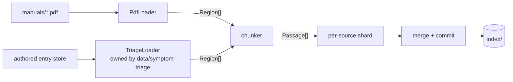

# Design: Manual Corpus

**Domain:** `data` · **Capability:** manual-corpus · **Status:** draft

Implements [`requirements.md`](requirements.md) against
[`CONTRACTS.md`](../../CONTRACTS.md) (governing). Criteria are referenced by ID and not restated.

## Overview

A Python ingestion pass turns two source stores — `manuals/` and the authored entry store — into
one on-disk index of `Passage` records plus a `SourceRecord` inventory, read by a separate process
(`api/answer-engine`). Vendor PDFs are extracted with PyMuPDF into a geometry-carrying span model
that each stage annotates; sectioning is driven by the document's own table of contents, anchored
to in-body heading text so that a citation names a real section and a page a viewer can open.

---

## Architecture

### The loader seam

The two source kinds converge before chunking. Everything from `Region` onwards is shared code,
which is what makes 12.2 structural rather than a set of `if kind ==` branches, and 12.4 a
consequence of there being only one PDF loader.



`TriageLoader` lives behind the same protocol and is implemented by `data/symptom-triage`; this
spec calls it and carries `unbacked` through untouched (12.6). Its 3.3 rule — split between causes,
never within one, repeating the symptom — is not special-cased here: it falls out of the generic
chunker once a cause is emitted as an atomic `Unit` and the symptom as a `repeat_on_split` unit,
the same machinery that repeats table headings under 7.5.

### Stages

| # | Stage | Kind | Reads | Writes | Criteria |
|---|---|---|---|---|---|
| 1 | Discover + fingerprint | both | store directories | `Discovered[]` in memory | 1.1–1.4, 2.1–2.6, 9.2–9.3 |
| 2 | Extract | `vendor-manual` | PDF | `Page[]` span model | 3.1–3.2, 3.4, 10.1–10.2 |
| 3 | Furniture removal | `vendor-manual` | `Page[]` | spans marked `furniture` | 3.6 |
| 4 | Glyph repair | `vendor-manual` | `Page[]` | spans rewritten / marked `unmappable` | 5.1–5.5 |
| 5 | Section map | `vendor-manual` | outline / printed TOC / heading styles | `SectionMap` | 6.3–6.6 |
| 6 | Language selection | `vendor-manual` | `Page[]` | blocks marked `english` | 4.1–4.6 |
| 7 | Unit assembly | `vendor-manual` | `Page[]` + `SectionMap` | `Region[]` | 3.5, 7.1–7.3, 10.3 |
| 7′ | Authored load | `authored-triage` | entry store | `Region[]` | 12.3, 12.5–12.6, 12.8 |
| 8 | Chunk | both | `Region[]` | `Passage[]` | 6.1–6.2, 6.7–6.11, 7.4–7.5 |
| 9 | Embed + shard commit | both | `Passage[]` | `index/shards/<slug>.*` | 8.3–8.4, 8.7 |
| 10 | Merge + manifest commit | run | all shards | `index/*` | 8.1, 8.6, 9.1, 9.5 |
| 11 | Rig report | run | `rig.yaml` + inventory | run report | 11.3–11.6 |

Stages 2–7 **annotate** a shared per-page span model rather than rewriting text into strings. Only
stage 8 flattens to text. This is what lets glyph repair use the font name, row assembly use
bounding boxes, and language selection run per block — none of which survive a text-only
extraction.

Glyph repair precedes language selection deliberately: a run of `ð ñ ô õ` inside English prose
skews a language identifier, and the APC guide contains that run on its English pages.

Sectioning precedes language selection so that anchoring sees the whole document. A region whose
content is entirely non-English is dropped afterwards and its pages appear in the exclusion audit.

### Build budget

Measured on the reference machine against the real corpus; 8.1 allows 60 s.

| Stage | Cost | Basis |
|---|---|---|
| Extract, 1068 pages | ~1 s | 0.63 s measured for Live 12 via a layout extraction; PyMuPDF's dict mode is the same order |
| Furniture, glyphs, sections, language | ≤6 s | estimate; language detection over ~20k blocks dominates |
| Unit assembly + chunking | ≤2 s | estimate |
| Embedding ~1000 chunks | ~21 s | 42.4 chunks/s measured, `bge-small-en-v1.5` at 350 words |
| BM25 index + merge + commit | <1 s | 0.14 s measured for 4000 chunks |
| **Total** | **~31 s** | plus a one-off 7.2 s model load on a cold run |

8.2 (<5 s extraction) has roughly five times its measured cost as headroom. 8.4 (a new ≤50-page
source in <10 s) is dominated by embedding ~60 chunks at 42.4/s ≈ 1.5 s plus model load.

### Module placement

No Python convention exists in the repository yet. `src/` layout, one distributable package:

```
src/dawmans/
  records.py            SourceRecord, Passage — the CONTRACTS §1/§2 types
  corpus/
    discover.py         both stores; the 2.1 filename grammar; fingerprints
    loader.py           SourceLoader protocol, Region, Unit
    pdf/extract.py      PyMuPDF → Page/Line/Span
    pdf/furniture.py    running header/footer/page-number suppression
    pdf/glyphs.py       mojibake detection and repair
    pdf/sections.py     outline / printed-TOC / heading-style → SectionMap, anchoring
    pdf/language.py     content-side English selection
    pdf/layout.py       row assembly, table detection, column ordering
    chunk.py            Region[] → Passage[]
    passage_id.py
    rig.py              rig.yaml, applicability, the two gap reports
  index/
    build.py            shard build, merge, atomic commit
    embed.py            fastembed wrapper
    lexical.py          bm25s wrapper
    manifest.py
  report.py             per-run report
  cli.py                `dawmans ingest`, `dawmans validate`, `dawmans inventory`
```

`data/symptom-triage` owns `dawmans/triage/` and supplies the second `SourceLoader`. Nothing under
`corpus/pdf/` is reachable from an authored source.

---

## Components and Interfaces

### The loader protocol

```python
class SourceLoader(Protocol):
    def discover(self) -> Iterable[Discovered]: ...
    def load(self, d: Discovered) -> LoadResult: ...

@dataclass(frozen=True)
class Discovered:
    source_id: str            # "<vendor>/<product>", or content-derived for authored
    fingerprint: str          # sha256 of the source's bytes / of the entry store's canonical form
    origin: Path

@dataclass(frozen=True)
class LoadResult:
    record: SourceRecord
    regions: list[Region]
    rejection: Rejection | None   # set ⇒ regions empty, run still succeeds (1.6)
    report: dict                  # audits: English ranges, glyph counts, anchor quality

@dataclass(frozen=True)
class Region:                     # exactly one section or one titled region (6.5, 6.7)
    section_number: str | None    # None ⇒ citation renders without one (6.4)
    section_title: str
    page_start: int | None        # None for a pageless source (12.8)
    page_end: int | None
    units: list[Unit]

@dataclass(frozen=True)
class Unit:
    text: str
    page: int | None
    atomic: bool                  # never split if it fits the cap (6.10, 7.4)
    repeat_on_split: bool         # table headings (7.5), authored symptom statement
    flags: UnitFlags              # degraded, has_figures, figure_page, unbacked
```

`Region.units` is ordered and the chunker preserves that order; no stage reorders units, which is
what 1.5 of `data/symptom-triage` depends on.

### Source identity and discovery

Filename grammar (2.1–2.3) as one anchored expression, applied to `vendor-manual` only:

```
^(?P<vendor>[a-z0-9]+(?:-[a-z0-9]+)*)
_(?P<product>[a-z0-9]+(?:-[a-z0-9]+)*)
_(?P<doctype>[a-z0-9]+(?:-[a-z0-9]+)*)
_v(?P<version>\d+(?:\.\d+)*)
_(?P<lang>[a-z]{2}|multi)\.pdf$
```

`source_id = f"{vendor}/{product}"` — the version is deliberately outside it, so replacing v12 with
v12.1 does not orphan an authored fix pointer (`data/symptom-triage` 8.3). `display_name` is the
title-cased vendor and product plus the version, e.g. `Ableton Live 12 (v12)`.

Collision (2.6) is detected by grouping discovered files on `source_id` before any work; every
member of a group with more than one file is rejected. Non-PDF files in `manuals/` are skipped
without a report line (1.3); `manuals/README.md` is the standing case.

Fingerprint is `sha256` over the file bytes. Change detection (9.3) compares it against
`manifest.sources[].fingerprint`; equal ⇒ the shard is reused untouched and the source is reported
as skipped-unchanged (1.5). Removal (1.4) is deletion of any shard whose `source_id` is not in the
current discovery set for that source's own store — the store is recorded on the shard so that 9.5's
"do not test one kind against the other kind's store" holds by construction.

### Extraction

`page.get_text("dict")` per page yields blocks → lines → spans, each with a bbox, font name, size
and flags. Images are enumerated (`page.get_images`) only to set `has_figures` and its page (10.3);
no pixel data is read (10.1). Rejection for no text layer (3.3) is zero extracted non-furniture
spans across every page.

`low_text` (3.4) is words ÷ page count computed on **extracted** text, before language selection.
Computing it after selection would flag every multilingual guide for having translations — the APC
guide averages 360 words/page extracted, and roughly a quarter of that after selection. Neither
reference guide trips the threshold (APC 360, Nitro Max 178, Live 240).

Line and paragraph structure (3.5) survives because the span model keeps line boxes; the chunker
emits one text line per source line and preserves the leading enumerator (`1.`, `•`) so a procedure
reads as discrete steps.

### Furniture removal (3.6)

For each page, take lines wholly inside the top or bottom 8% of the page box. Normalise each to a
key: casefold, collapse whitespace, replace digit runs with `#`. A key occurring on ≥60% of pages
(or ≥5 pages in a document of ≤10) at a consistent y-band is furniture, as is any line in those
bands whose text is only digits. Live 12 prints neither header nor footer; both guides print a bare
page number, which this removes.

Guard: a line that a section anchor resolved to, or that belongs to a detected table region, is
never suppressed.

### Section map (6.3–6.6)

Three sources of structure, tried in order. All three are content-side; none is per-manual
configuration.

| Path | Trigger | Reference corpus |
|---|---|---|
| **A. Embedded outline** | `doc.get_toc()` returns ≥2 entries | Live 12: 816 entries, 41 chapters |
| **B. Printed contents page** | a page whose lines are ≥60% dot-leader matches | Nitro Max p2: `(1.3.1) Connection Diagram ...... 5` |
| **C. Heading styles** | ≥2 spans in a style larger than the modal body style | APC Key 25, which has neither outline nor contents page |

Path B's line grammar: `^\(?(?P<num>\d+(?:\.\d+)*)\)?\s*(?P<title>.+?)[\s.]{3,}(?P<page>\d+)$`,
with the number group optional. Path C ranks candidate styles by font size descending into heading
levels; a style qualifies if its spans start a line, are shorter than 60% of the modal line length,
and do not end in a full stop.

A document is **numbered** (6.3) when ≥60% of its entries carry a parsed section number; otherwise
every region is unnumbered (6.4) and no number is invented. Live and Nitro Max are numbered; APC is
not.

**Anchoring is the load-bearing part.** Live averages 1.2 TOC entries per page, so page-granular
attribution would put several sections' text under one heading and break the citation. For each
entry:

1. Normalise the entry title (casefold, collapse whitespace, strip a leading section number).
2. Scan lines of the target page for the first line whose normalised prefix equals it, at or after
   the previous entry's anchor position on that page.
3. On no match, scan the target page ±1 — outline destinations and printed contents numbers can
   disagree with the physical page by one at a chapter break.
4. On no match still, anchor at the top of the target page and record `anchor: page-only` in the
   report, so weak sectioning is visible rather than silent.

Live's in-body headings are printed with their numbers (`24.1 An Overview of Racks`), so step 2
matches on the first attempt for the overwhelming majority of the 816 entries.

A region runs from its anchor to the next anchor in document order. Contiguous pages before the
first anchor and after the last region's end are **titled regions** (6.5), named by the first line
of the run if that line reads as a title under path C's style test, otherwise `Front matter` /
`Back matter`. The APC language-index page and Live's title page land here.

**Page numbers recorded are physical 1-based indices**, not printed numbers. Live prints no page
numbers at all, and in both guides the printed number equals the physical index, so no offset table
is needed; the physical index is also what the "open at page" action of CONTRACTS §3 needs. A future
source whose printed numbers differ would show the physical index in the citation — a known
limitation, not a correctness failure. 6.11 validates each chunk's page against `page_count` and is
skipped entirely for a pageless source (12.8).

### English selection (4.1–4.6)

Content-side, with no page ranges anywhere in code or configuration (4.2). `lingua-py`, offline,
constrained to the languages actually present in the corpus plus English, returning confidence
values.

| Declared `lang` | Granularity | Why |
|---|---|---|
| `en` | page | one score over a page of prose is reliable and costs 1068 calls, not ~20k |
| anything else, incl. `multi` | block | 4.3 requires page granularity **or finer** |

Two guards, both necessary:

- **Short blocks.** A block under 8 words is not scored; it inherits the decision of the nearest
  scored block above it on the page. Short-string language identification is unreliable and would
  otherwise drop headings and table cells.
- **Language-neutral blocks.** A block whose top confidence is below 0.5 *and* whose tokens are
  predominantly non-alphabetic inherits the same way. Without this, the Nitro Max MIDI note table
  and the APC specifications table — numbers, units, dimensions — would be classed as non-English
  and discarded.

The APC front page prints its own language index (`English ( 3 – 6 )`, `Appendix English ( 23 )`).
It is deliberately **not** parsed: it is exactly the per-manual structure 4.2 forbids depending on,
and content-side detection reaches p23 anyway, which is what 4.6 asks for.

Audit (4.4), written to `index/reports/<slug>.json` and reported alongside the inventory (9.1):

```json
{"english_pages": [[3,6],[23,23]], "excluded_pages": [[1,2],[7,22],[24,24]], "partial_pages": [1]}
```

`partial_pages` lists every page included only in part, so a sub-page selection is visible rather
than hidden inside a whole-page range. No English content at all ⇒ rejection (4.5).

### Glyph repair (5.1–5.5)

The APC case, measured: the four left Clip Stop button symbols extract as `ð, ñ, ô, õ`
(U+00F0, U+00F1, U+00F4, U+00F5). The font is `Wingdings3`, embedded, Identity-H, **with** a
ToUnicode CMap — which is precisely the fault: it maps the font's own byte codes 0x70, 0x71, 0x74,
0x75 into the Latin-1 supplement (+0x80) instead of to arrows. Repair therefore cannot come from
ToUnicode.

Detection is **font-keyed, not character-keyed**. A span is suspect when its font is a symbol
family (a known family name, or an embedded font with no Latin coverage in its `cmap`) and its
characters are non-ASCII while the surrounding spans on the line are ASCII. Character-only
heuristics are not sufficient here: the same document's Spanish pages contain genuine `ñ`, and a
character rule would repair them into arrows.

Mapping, in order:

1. **Embedded glyph names.** Read the embedded font programme, take the glyph name at the source
   code point, resolve through the Adobe Glyph List (`arrowright` → U+2192, `uniXXXX` → U+XXXX).
   Works when a subset font retains a `post` table.
2. **Symbol-family character map.** A static table keyed by `(family, code_point)`, transcribed
   once from the published character map of a known symbol font — Wingdings, Wingdings 2/3, Webdings,
   Symbol, ZapfDingbats. The Wingdings 3 entries cover the APC arrows; the fixture pins the resulting
   characters so a mis-transcription is caught by test rather than by a user.
3. **Unmappable.** The characters are replaced with U+FFFD in `Passage.text` and the containing
   chunk carries `degraded` (5.3). The raw characters are never indexed as words, so BM25 cannot
   match them and the citation is marked as containing unreadable characters.

The table is keyed by font family, not by manual — a second document using Wingdings 3 is repaired
with no new entry. Counts (5.4): `glyph_spans_repaired`, `glyph_spans_degraded` and
`unmappable_char_ratio` go in the source report; the ratio exceeding 2% is a rejection (5.5).

### Layout, tables and rows (7.1–7.6)

Row-first assembly on span geometry. For a page region:

1. Cluster spans into **rows** by y-overlap, tolerance 0.5 × the region's median line height.
2. Order spans within a row by `x0`.
3. Cluster `x0` values across the region's rows into **columns**, tolerance 0.02 × page width.
4. Classify the region **tabular** when ≥3 consecutive rows each occupy ≥3 of the same columns and
   their cells are short; otherwise **prose**.
5. Prose with ≥2 full-height columns is ordered by (column, y). Tabular content is ordered by
   (row, x) — 7.2's precedence rule — and column segmentation is not applied to it.

Cells are assigned to columns **by x-position, not by index**, because panel tables are ragged.

**Headings across physical lines (7.3).** Rows above the first data row whose cells are
non-numeric and whose x-clusters match the data columns are heading rows; consecutive heading rows
are joined per column with a space. The first row whose cells match the majority value pattern of
the rows below it ends the heading.

**Nitro Max §5.2 p25 — the acceptance fixture (7.6).** Measured layout:

```
             MIDI Note                           MIDI Note
Trigger                       Trigger
             Number                              Number
Kick         36               Ride               51
...
Tom 4 Rim    39
```

Four columns printed as two side-by-side panels. Three consequences the design must survive:

- The heading occupies three physical lines with different vertical alignment per column. Joining
  per column yields `Trigger | MIDI Note Number | Trigger | MIDI Note Number`; the naive reading
  treats "MIDI Note" as a data row and loses "Number".
- The panels are **ragged**: 11 rows on the left, 8 on the right, so the last three printed rows
  carry two cells, not four. Index-based cell assignment would misplace them.
- Panel boundaries are detected from the **repeated heading sequence** (columns 1–2 and 3–4 carry
  identical joined headings), not from a hardcoded x. Rows serialise in printed order with the panel
  boundary marked: `Kick | 36 ‖ Ride | 51`. The printed row stays intact and the page is never
  reordered into per-panel runs, which is what 7.2 forbids and what would silently pair the wrong
  trigger with the wrong note.

> **Requirements defect to reconcile.** 7.6 names 15 trigger-to-note pairs. The page as printed
> carries **19** (11 left panel, 8 right). The fixture asserts all 19; 7.6's count should be
> corrected rather than the fixture weakened.

### Chunking (6.7–6.11, 7.4–7.5)

Greedy packing within one region, cap 350 words:

- An `atomic` unit that fits the cap is never split (a numbered procedure, 6.10; a table row, 7.4).
- A table exceeding the cap splits **between** rows, with every `repeat_on_split` unit — the joined
  heading row — prepended to each part (7.5).
- A single row exceeding the cap splits and each part is marked as carrying part of one row (7.4).
- A procedure exceeding the cap splits between steps.
- Overlap ~50 words, snapped to a sentence boundary, **within a region only** and never across an
  atomic unit. Overlapping a region boundary would make the citation ambiguous, which 6.7 forbids.
- Each chunk's `page_start`/`page_end` are the min and max page of **its own** units, not the
  region's (6.8).

**Citation header.** Every chunk is embedded and BM25-indexed as
`f"{display_name} — §{section_number} {section_title}\n{text}"`. The header is **not** part of
`Passage.text`: the text is what the user is shown when a citation is expanded, and repeating the
header there would duplicate what the citation already renders. It costs ~15 tokens and is what
lets a query naming a device reach the right "Threshold" paragraph out of the dozens that exist.

### Passage identity (6.1)

```python
def passage_id(source_id: str, text: str) -> str:
    canon = re.sub(r"\s+", " ", nfc(text)).strip()   # nfc = NFC form, via unicodedata
    return f"{source_id}#{hashlib.sha256(canon.encode()).hexdigest()[:16]}"
```

**In the digest: the chunk's body text and nothing else.** Excluded, each deliberately:

| Excluded | Because |
|---|---|
| citation header, `section_number`, `section_title` | Live point releases renumber sections; `data/symptom-triage` 8.3 requires a pointer to survive that |
| `page_start`, `page_end` | a chunk that moves pages between document versions keeps its identity (8.3 again) |
| `doc_version`, file fingerprint, `ingested_at` | re-ingesting the same text must yield the same ID (6.1) |
| chunk index within the region | insertion of an earlier chunk must not renumber the ones after it |

Case is preserved through the digest — 3.1 keeps casing, and two chunks differing only in case are
different text. Whitespace is collapsed so that a re-extraction differing only in line wrapping does
not orphan every citation in the retained UI history.

`source_id` is the visible prefix and is not hashed, so cross-source collisions are impossible by
construction and `fetch-passage` can route on the prefix without a lookup.

**Duplicates.** If k > 1 chunks within one source share a digest — repeated boilerplate — each gets
a suffix `.1 … .k` in document order. This is the only case where the ID is not purely
content-derived; deleting one duplicate reassigns the suffixes of the rest. Accepted: the
alternative, folding section identity into the digest, breaks every pointer on a renumbering, which
is the far more likely event.

### Rig inventory (11.1–11.6)

`rig.yaml` at the repository root, sibling to `manuals/`, hand-maintained and committed (the PDFs
are not). Device identities use the same `<vendor>/<product>` shape as `source_id`, so matching is
exact and never fuzzy.

```yaml
devices:
  - id: ableton/live-12
    display_name: Ableton Live 12 Standard
    revision: "12 Standard"
  - id: akai/apc-key-25
    display_name: Akai APC Key 25 mk2
    revision: mk2
  - id: focusrite/scarlett-solo
    display_name: Focusrite Scarlett Solo
    revision: 4th-gen

source_applicability:            # optional; absent ⇒ assumed for the filename's product (11.2)
  ableton/live-12: {device: ableton/live-12, revision: "12 Standard", status: confirmed}
```

`hardware_applicability` is never inferred from content (11.2, CONTRACTS §5). An absent entry is
recorded as `assumed` for the product named in the filename; nothing produces `confirmed` by
default.

| Report | Computation | Today |
|---|---|---|
| owned-but-undocumented (11.4) | `{rig device ids}` − `{source_id of indexed sources of kind vendor-manual}` | `focusrite/scarlett-solo` |
| documented-but-unconfirmed (11.5) | indexed sources where `status == assumed`, **or** where the declared revision differs from the rig device's revision under casefold-and-strip comparison | `akai/apc-key-25` (v1.0 describes the original; the rig holds an mk2) |

An `authored-triage` source is excluded from the first computation: a triage entry that mentions
the Scarlett Solo must not make it look documented, which is the case CONTRACTS §5 and
`api/answer-engine` 9.6 both depend on.

---

## Data Models

`SourceRecord` and `Passage` are CONTRACTS §1 and §2 verbatim; no field is added and none is
dropped. Frozen dataclasses in `dawmans/records.py`, with the kind-dependent fields typed `| None`
and a constructor that refuses a value for a field the record's kind marks not applicable (12.5,
12.8).

### Index layout

```
index/
  manifest.json               ~4 KB   written last, by atomic rename
  sources.json                ~3 KB   SourceRecord[] — the 9.1 inventory
  passages.jsonl              ~2.5 MB Passage[], one per line
  vectors.npy                 1.8 MB  float32 (N, 384), L2-normalised
  lexical/                    ~2 MB   bm25s save directory
  reports/<slug>.json         ~10 KB  English audit, glyph counts, anchor quality, rejections
  shards/<slug>.passages.jsonl        per-source cache — the unit of incremental work
  shards/<slug>.vectors.npy
  shards/<slug>.meta.json
```

`index/` is gitignored and derived: 8.6 rebuilds it from the two stores with no other input.
Total under 15 MB, including the shards that duplicate the merged view.

**The merged files are a contract read by `api/answer-engine`.** What it may rely on:

- Row `i` of `vectors.npy` corresponds to line `i` of `passages.jsonl`.
- Both are grouped by source in `manifest.sources` order; each entry carries `row_start` and
  `row_count`, so scoping retrieval to selected sources is a slice, not a scan.
- `manifest.json` exists only when every artefact it names is complete.

```json
{
  "index_version": 1,
  "corpus_revision": "9f3c…",
  "built_at": "2026-08-14T10:00:00Z",
  "embedding": {"model": "BAAI/bge-small-en-v1.5", "dim": 384, "normalised": true},
  "sources": [{"source_id": "ableton/live-12", "kind": "vendor-manual",
               "fingerprint": "sha256:…", "chunk_count": 812,
               "row_start": 0, "row_count": 812}]
}
```

`index_version` is an integer bumped whenever the on-disk shape changes; a reader whose expected
version differs MUST refuse to load rather than interpret the files, and the fix is a rebuild
(~31 s). `corpus_revision` is `sha256` over the sorted `(source_id, fingerprint, chunk_count)`
triples — a single cheap read that lets `api/answer-engine` satisfy its 5.10 (detect a corpus change
and discard cached retrieval state) without diffing the corpus.

### Incremental behaviour (8.3, 8.7)

A source whose fingerprint is unchanged is not re-extracted, re-chunked or re-embedded; its shard
is reused byte-for-byte. Only the merge step runs every time, and it costs under a second, so the
merged view is always a plain concatenation of committed shards rather than a mutable store needing
deletion logic. Re-ingestion replaces a source's shard wholesale, which is 9.4 — no chunk of the
superseded version can survive because nothing merges from anywhere else.

**Commit ordering** — this is what makes 8.7 hold:

1. Shard artefacts are written to `shards/<slug>.*.tmp` and moved into place with `os.replace`, one
   source at a time. A source that fails leaves its `.tmp` files, which are deleted, and its
   previous shard untouched.
2. The merge reads whatever shards exist, so a failed source contributes its **previous** chunks and
   a succeeding source in the same run commits normally.
3. `manifest.json` is renamed into place last. A reader therefore never sees a manifest referencing
   an artefact that is not there.

---

## Error Handling

Rejection reasons are a closed set; anything not in it is a failure (1.7).

| Reason | Raised by | Criterion |
|---|---|---|
| `filename-invalid` | discovery | 2.5 |
| `source-id-collision` | discovery | 2.6 |
| `no-text-layer` | extraction | 3.3 |
| `no-english-content` | language selection | 4.5 |
| `unreadable-text` | glyph repair, >2% unmappable | 5.5 |
| `page-out-of-range` | chunking | 6.11 |
| `authored-invalid` | `TriageLoader` | 12.6 |

A rejection excludes the source, writes a report line naming the source and the reason (and, for
`filename-invalid`, the expected pattern), and the run continues and succeeds. `page-out-of-range`
is raised late, after chunking — harmless, because nothing commits until the shard does.

A failure is any other exception. It is caught per source, the shard is left untouched, remaining
sources are processed, and the run exits non-zero with every failure listed. There is no
abort-on-first-failure path.

---

## Testing Strategy

`pytest` + `hypothesis`.

### Property-based tests

Chunking, passage identity, TOC parsing and row assembly are all total functions over structured
input with universal guarantees, which is where PBT earns more than examples do. Generators produce
the *model* types (`Region`, `Unit`, TOC entry lists, span geometry), not PDFs.

| Property | Guarantee | Criteria |
|---|---|---|
| Cap | no chunk exceeds 350 words unless it is a marked part of an over-cap atomic unit | 6.9, 7.4 |
| Coverage round-trip | concatenating a region's chunks and removing declared overlap reproduces the region's text in order — nothing lost, nothing duplicated | 3.1, 6.8 |
| Region purity | every chunk's `(section_number, section_title)` equals exactly one region's | 6.7 |
| Atomicity | a procedure or table row that fits the cap lies wholly inside one chunk | 6.10, 7.4 |
| Heading repetition | every chunk derived from a split table contains the joined heading | 7.5 |
| ID idempotence | chunking the same region twice yields the identical ID sequence | 6.1 |
| ID metadata-invariance | perturbing `doc_version`, page offsets or section numbers leaves every ID unchanged | 6.1, triage 8.2–8.3 |
| ID sensitivity | any text change alters the ID; a whitespace-only or NFC-form change does not | 6.1 |
| ID uniqueness | IDs are pairwise distinct within a source, including for byte-identical chunks | 6.1 |
| TOC cover | derived regions are ordered, non-overlapping, and together with front/back matter cover every page exactly once | 6.5, 6.7 |
| Section-number round-trip | `parse(render(number, title)) == (number, title)` across both printed forms (`24.1 Title`, `(1.3.1) Title`) | 6.3 |
| Row integrity | for a generated cell grid with x/y jitter inside tolerance, recovered rows equal generated rows, including ragged rows | 7.1–7.2 |
| Audit completeness | included ∪ excluded = all pages, disjoint, and partial ⊆ included | 4.4 |
| Incremental equivalence | for a random source set and a random add/edit/remove sequence, incremental ingestion yields the same merged passages as a full rebuild | 8.3, 8.7, 9.4 |

Row integrity and incremental equivalence are the two highest-value entries: the first targets the
failure mode 7.6 exists to catch, and the second targets a class of bug that only appears after a
particular sequence of runs.

### Fixtures

`manuals/` is gitignored, so no test may open a reference PDF. Fixtures are committed **extraction
snapshots** — span geometry, font names and text for a handful of pages — which are minimal factual
slices, keep the copyrighted documents out of the repository, and have the side benefit of pinning
the extractor's output as an explicit input to every downstream test.

| Fixture | Asserts |
|---|---|
| `nitro_max_p25.spans.json` | all 19 trigger-to-note pairs recoverable with their printed pairings; heading joined from three physical lines; ragged rows placed by x-position (7.1–7.3, 7.6) |
| `apc_p3_arrows.spans.json` | the `Wingdings3` run at U+00F0/F1/F4/F5 repairs to arrows; a genuine Spanish `ñ` on the same fixture is left alone; a mutated span with no mapping sets `degraded` and yields U+FFFD in `text`, not the raw characters (5.1–5.3) |
| `apc_pages.spans.json` | English pp. 3–6 and p. 23 selected, pp. 7–22 excluded, with no page range in the code; the p23 specifications table survives the language-neutral guard (4.2–4.6) |
| `live_toc_slice.json` | a slice of the 816 entries across a chapter boundary anchors to in-body headings, produces `§24.9`-shaped citations, and attributes text to the right section where two sections share a page (6.3, 6.6) |
| `apc_no_toc.spans.json` | no outline and no contents page ⇒ heading-style path, unnumbered regions, citation rendered without a section number (6.4) |
| rejection fixtures | image-only PDF, malformed filename, two files colliding on `source_id`, a source over the 2% unmappable threshold |

### Timing tests

8.2 and 8.4 run against synthetic PDFs generated at test time and assert their budgets in CI. 8.1
(full corpus under 60 s) needs the real, gitignored PDFs, so it is a `make bench` target that runs
locally and is skipped when `manuals/` is empty — CI cannot verify it, and pretending otherwise
would be worse than saying so.
