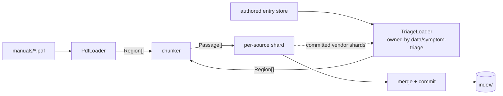

# Design: Manual Corpus

**Domain:** `data` · **Capability:** manual-corpus · **Status:** draft

Implements [`requirements.md`](requirements.md) against
[`CONTRACTS.md`](../../CONTRACTS.md) (governing). Criteria are referenced by ID and not restated.

## Overview

A Python ingestion pass turns two source stores — `manuals/` and the authored entry store — into
one on-disk index of `Passage` records plus a `SourceRecord` inventory, read by a separate process
(`api/answer-engine`). Vendor PDFs are extracted with PyMuPDF into a geometry-carrying span model
that each stage annotates; sectioning is driven by the document's own table of contents, anchored
to in-body heading text so that a citation names a real section and a page a viewer can open.

---

## Architecture

### The loader seam

The two source kinds converge before chunking. Everything from `Region` onwards is shared code,
which is what makes 12.2 structural rather than a set of `if kind ==` branches, and 12.4 a
consequence of there being only one PDF loader.



`TriageLoader` lives behind the same protocol and is implemented by `data/symptom-triage`; this
spec calls it and carries `unbacked` through untouched (12.6). Its 3.3 rule — split between causes,
never within one, repeating the symptom — is not special-cased here: it falls out of the generic
chunker once a cause is emitted as an atomic `Unit` and the symptom as a `repeat_on_split` unit,
the same machinery that repeats table headings under 7.5.

The dashed edge is an ordering constraint, not data flow through the chunker: `TriageLoader`
resolves each entry's fix pointer against vendor passages (its 8.1–8.4) and sets `unbacked` from the
result, so it must read the passages **this** run produced.

### Stages

| # | Stage | Kind | Reads | Writes | Criteria |
|---|---|---|---|---|---|
| 1 | Discover + fingerprint | both | store directories | `Discovered[]` in memory | 1.1–1.4, 2.1–2.6, 9.2–9.3, 12.1 |
| 2 | Extract | `vendor-manual` | PDF | `Page[]` span model | 3.1–3.4, 10.1–10.2, 10.4 |
| 3 | Furniture **mark** | `vendor-manual` | `Page[]` | lines marked `furniture` | 3.6 |
| 4 | Glyph repair | `vendor-manual` | `Page[]` | spans rewritten / marked `unmappable` | 5.1–5.5 |
| 5 | Section map | `vendor-manual` | outline / printed TOC / heading styles | `SectionMap`; **clears** `furniture` on anchored lines | 6.3–6.6 |
| 6 | Language selection | `vendor-manual` | `Page[]` | blocks marked `english` | 4.1–4.6 |
| 7 | Unit assembly | `vendor-manual` | `Page[]` + `SectionMap` | `Region[]`; **clears** `furniture` inside detected tables, then drops what is still marked | 3.5, 7.1–7.3, 7.6, 10.3 |
| 8 | Chunk | `vendor-manual` | `Region[]` | `Passage[]` | 6.1–6.2, 6.7–6.11, 7.4–7.5 |
| 9 | Embed + shard commit | `vendor-manual` | `Passage[]` | `index/shards/<slug>.*` | 8.2–8.5, 8.7, 8.8 |
| 10 | Authored load | `authored-triage` | entry store + **committed vendor shards** | `Region[]` | 12.3, 12.5–12.6, 12.8 |
| 11 | Chunk, embed + shard commit | `authored-triage` | `Region[]` | `index/shards/authored_triage.*` | as 8–9 |
| 12 | Merge + manifest commit | run | all shards | `index/*` | 8.1, 8.6, 8.8–8.11, 9.1, 9.4–9.6, 12.7 |
| 13 | Rig report | run | `rig.yaml` + inventory | `views/<hex>/gaps.json`, before the manifest rename | 11.1–11.6 |

Stage 11 is stages 8–9 called again over the authored regions; their being the same code is 12.2.
The Criteria column is exhaustive for stage-local criteria; 12.2 and 12.4 are properties of the seam
rather than stages.

Each source's **ingestion audit** is written to `index/audits/<slug>.json` as that source finishes,
whether it committed a shard or was rejected. A **view sidecar**, where the loader produces one, is
committed with the shard at stage 9 or 11 and copied into the view at stage 12; §Index layout states
why the two go to different places.

Three orderings are load-bearing:

- **Authored load after every vendor shard commits.** `data/symptom-triage` resolves each fix
  pointer against a vendor passage and sets `unbacked` when it no longer resolves (its 8.1–8.4).
  Loading earlier resolves pointers against the *previous* run's text, flagging entries whose
  targets this run repaired and missing ones it broke.
- **Furniture marks, later stages clear.** Stage 3 cannot consult section anchors or table regions
  because neither exists yet, so it only marks; stages 5 and 7 clear the mark on lines they claim,
  and what is still marked at the end of stage 7 is dropped. Text is discarded once.
- **Glyph repair, then sectioning, then language.** A run of `ð ñ ô õ` inside English prose skews a
  language identifier and the APC guide has exactly that on its English pages; anchoring needs to
  see the whole document before anything is dropped.

Stages 2–7 **annotate** a shared per-page span model rather than rewriting text into strings; only
stage 8 flattens it. That is what lets glyph repair use the font name, row assembly use bounding
boxes, and language selection run per block — none of which survive a text-only extraction.

### Offline operation (8.5)

The only network-capable dependency is `fastembed`, which downloads `bge-small-en-v1.5` (67 MB)
from Hugging Face on first use. Ingestion must never do that.

- The model cache is `models/` at the repository root, gitignored, passed as `cache_dir` and
  pinned by `HF_HUB_OFFLINE=1` set in the ingestion process's own environment, so the library
  cannot reach the network even if the cache is incomplete.
- Populating it is a **prerequisite of running ingestion, not a build step**: `make fetch-model`
  is run once per machine, deliberately outside the ingestion path.
- With the cache absent, the run fails immediately with an error naming the model, the cache
  directory and that command. It is a failure, not a rejection: no source is at fault and nothing
  can be embedded.

### Build budget

Measured on the reference machine against the real corpus; 8.1 allows 60 s.

| Stage | Cost | Basis |
|---|---|---|
| Extract, 1107 pages | ~4 s | **measured 2026-08-15** against the real corpus with `corpus/pdf/extract.py`: 3.99 s, of which Live 12 is 3.45 s. The earlier ~1 s estimate extrapolated from a 0.63 s *layout* extraction; dict mode is roughly five times that, not the same order |
| Furniture, glyphs, sections, language | ≤6 s | estimate; language detection over the APC guide's blocks dominates |
| Unit assembly + chunking | ≤2 s | estimate |
| Embedding ~1000 chunks | ~21 s | 42.4 chunks/s measured, `bge-small-en-v1.5` at 350 words |
| BM25 index + merge + commit | <1 s | 0.14 s measured for 4000 chunks |
| **Total** | **~34 s** | plus a one-off 7.2 s model load per process |

Embedding is the only stage with a slope: 8.1's 60 s is exhausted by embedding alone at ~2,500
chunks, about 2.5× the current corpus. **8.2 is tighter than it looked**: 3.99 s measured against a
5 s budget is 25% headroom, not the 5× the estimate implied, and it is a page-count slope — another
1000-page manual breaks it. If it needs reclaiming, the cost is concentrated in Live 12 and the
lever is `get_text` mode, not the corpus.

**8.4 is the tightest budget in the spec**, not 8.1: a new ≤50-page source is ~60 chunks ≈ 1.5 s of
embedding, but the 7.2 s cold model load takes it to 8.7 s of the allowed 10 s before anything else
runs. The CLI therefore loads the model **once per run**, before iterating sources, and the 8.4
timing test measures the per-source cost with the model resident while asserting the cold load
separately, rather than hiding a 7.2 s constant inside a 10 s budget.

### Module placement

No Python convention exists in the repository yet. `src/` layout, one installable package:

```
src/dawmans/
  records.py            SourceRecord, Passage — the CONTRACTS §1/§2 types
  version.py            INGESTION_VERSION — the shard cache-key component
  corpus/
    discover.py         both stores; the 2.1 filename grammar; fingerprints
    loader.py           SourceLoader protocol, Region, Unit
    pdf/extract.py      PyMuPDF → Page/Line/Span
    pdf/furniture.py    running header/footer/page-number marking
    pdf/glyphs.py       mojibake detection and repair
    pdf/sections.py     outline / printed-TOC / heading-style → SectionMap, anchoring
    pdf/language.py     content-side English selection
    pdf/layout.py       row assembly, table detection, column ordering
    pdf/units.py        stage 7: Region[]/Unit[], the furniture drop, the atomic flags
    pdf/loader.py       PdfLoader — the vendor-manual half of the seam, and the stage order
    chunk.py            Region[] → Passage[]
    passage_id.py
    rig.py              rig.yaml, applicability, the two gap reports
  index/
    build.py            shard build, merge, atomic commit
    embed.py            fastembed wrapper
    lexical.py          bm25s wrapper
    manifest.py
  report.py             the per-run report and the per-source ingestion audits
  cli.py                `dawmans ingest`, `dawmans validate`, `dawmans inventory`
```

`data/symptom-triage` owns `dawmans/triage/` and supplies the second `SourceLoader`.

**PyMuPDF is confined to `corpus/pdf/` and is never imported by the API process.** That is
load-bearing, not tidiness: PyMuPDF is AGPL-3.0-or-later, so publishing this repository conveys a
combined work that must carry the same licence (Decision 6). Confining it means the constraint
attaches to the ingestion tool, and the network clause never fires because no modified library is
reachable over a network.

---

## Components and Interfaces

### The loader protocol

```python
class SourceLoader(Protocol):
    def discover(self) -> Iterable[Discovered]: ...
    def load(self, d: Discovered) -> LoadResult: ...

@dataclass(frozen=True)
class Discovered:
    source_id: str            # "<vendor>/<product>"; the constant "authored/triage" for authored
    fingerprint: str          # sha256 of the source's bytes / of the entry store's canonical form
    origin: Path

@dataclass(frozen=True)
class LoadResult:
    record: SourceRecord
    regions: list[Region]
    rejection: Rejection | None   # set ⇒ regions empty, run still succeeds (1.6)
    audit: dict                   # run diagnostics: English ranges, glyph counts, anchor quality
    sidecar: dict | None          # per-`passage_id` data for the view; None where there is none

@dataclass(frozen=True)
class Region:                     # exactly one section or one titled region (6.5, 6.7)
    section_number: str | None    # None ⇒ citation renders without one (6.4)
    section_title: str            # the leaf title
    section_path: tuple[str, ...] # ancestor titles, nearest two; () at top level
    page_start: int | None        # None for a pageless source (12.8)
    page_end: int | None
    inferred: bool                # sectioning came from path C heading styles
    units: list[Unit]
    entry_location: str | None    # CONTRACTS §2, authored only; see below

@dataclass(frozen=True)
class Unit:
    text: str
    page_start: int | None        # a unit may cross a page boundary; both ends are kept
    page_end: int | None
    atomic: bool                  # never split if it fits the cap (6.10, 7.4)
    repeat_on_split: bool         # table headings (7.5), authored symptom statement
    flags: UnitFlags              # degraded, has_figures, unbacked
```

`Region.units` is ordered and the chunker preserves that order; no stage reorders units, which is
what 1.5 of `data/symptom-triage` depends on.

`Unit.page_start`/`page_end` are two fields rather than one because 6.10 forbids splitting a
numbered procedure that fits the cap, and a procedure can start on p11 and end on p12. One page per
unit would force either a 6.10 violation or a citation naming p11 for text printed on p12.

`Region.entry_location` is CONTRACTS §2's field of the same name, carried across the seam. It is
**region-scoped because a region is exactly one authored entry** (`data/symptom-triage` §Passage
emission), and it is the only route the field has: `LoadResult.sidecar` is keyed by `passage_id`,
which does not exist until the chunker has run, so a sidecar cannot supply a field the chunker needs
in order to emit a passage at all. `TriageLoader` sets it, the chunker copies it onto every passage
of that region and never derives, clears or hashes it (12.6, CONTRACTS §2). It is `None` on a
`vendor-manual`, which has a page instead. [Decision 14](decision_log.md) records the alternatives.

### `Region`/`Unit` → `Passage` — the emission contract

This is the whole output of the spec. Every `Passage` field comes from exactly one rule here.

| `Passage` field | Derived from | Rule |
|---|---|---|
| `passage_id` | chunk text + `source_id` | §Passage identity; nothing else enters the digest |
| `source_id` | `SourceRecord.source_id` | visible prefix of `passage_id`, not hashed |
| `section_number` | `Region.section_number` | `None` on an unnumbered document (6.4) and on a pageless source; never invented |
| `section_title` | `Region.section_title` | the **leaf** title only. `Region.section_path` is used in the citation header and is not emitted — CONTRACTS §2 has no field for it |
| `page_start` / `page_end` | min / max over the chunk's **page-contributing** units | a repeated heading and overlap text contribute text but not pages; `None` for a pageless source (12.8) |
| `text` | the chunk's unit texts joined by newline | the citation header is **not** included |
| `degraded` | OR over **all** the chunk's units | a flagless repeated heading contributes nothing, so a chunk of degraded rows stays degraded |
| `has_figures` | OR over all the chunk's units | chunk-scoped, see §Figures |
| `unbacked` | OR over all the chunk's units | set only by `TriageLoader`; carried unchanged (12.6) |
| `entry_location` | `Region.entry_location` — the entry's own `source_file` and `line` | `authored-triage` only; supplied by `TriageLoader`, carried unchanged, and never an input to `passage_id` (12.6, CONTRACTS §2) |

### Source identity and discovery

Filename grammar (2.1–2.3) as one anchored expression, applied to `vendor-manual` only:

```
^(?P<vendor>[a-z0-9]+(?:-[a-z0-9]+)*)
_(?P<product>[a-z0-9]+(?:-[a-z0-9]+)*)
_(?P<doctype>[a-z0-9]+(?:-[a-z0-9]+)*)
_v(?P<version>\d+(?:\.\d+)*)
_(?P<lang>[a-z]{2}|multi)\.pdf$
```

`source_id = f"{vendor}/{product}"` — the version is deliberately outside it, so replacing v12 with
v12.1 does not orphan an authored fix pointer (`data/symptom-triage` 8.3). `display_name` is the
title-cased vendor and product: `Ableton Live 12`. The version is **not** appended: `doc_version` is
its own `SourceRecord` field and CONTRACTS §3 requires it shown inline on the citation, so folding
it into the display name renders it twice, and `(v12)` after "Live 12" reads as a duplicate.

**The expression above is a bijection, and two other specs now depend on that** (2.7). `doc_version`
is captured **without** its leading `v`, so the inverse is exactly
`f"{vendor}_{product}_{doctype}_v{doc_version}_{lang}.pdf"` and there is one reconstruction rule for
every reader. `api/answer-engine` runs it to locate the PDF it serves for CONTRACTS §3a's
open-at-source action, and again to assemble `required_manual` for a device with no ingested source
(CONTRACTS §4e). Two things follow that did not before. No filesystem path is published on
`SourceRecord` — the five fields already there reconstruct the name, and a published path would be a
field the browser cannot use. And a `vendor-manual` named by a **live** index must stay readable at
that name: the served bytes come from that file, so renaming it under a live index turns a citation's
open action into a not-found rather than a stale document. Serving is a byte stream, so it needs no
PDF library and the PyMuPDF confinement is unaffected.

**`<slug>`** is the on-disk name of a source's shard, its ingestion audit and its view sidecar:
`source_id` with its single `/` replaced by `_`. One rule covers both kinds — the authored store's `source_id` is the constant
`authored/triage` (CONTRACTS §1), giving `authored_triage`. The underscore is the right substitute
and `-` is not: the filename grammar forbids `_` inside `vendor` and `product` but allows `-`, so
`/`→`-` would map `a/b-c` and `a-b/c` to the same shard, while `/`→`_` keeps them `a_b-c` and
`a-b_c`. The mapping is therefore injective over legal source IDs, and a vendor manual named
`authored_triage_*.pdf` would collide with the authored store on `source_id` itself and be rejected
under 2.6 before any slug is formed.

Collision (2.6) is detected by grouping discovered files on `source_id` before any work; every
member of a group with more than one file is rejected. Non-PDF files in `manuals/` are skipped
without a report line (1.3); `manuals/README.md` is the standing case.

Fingerprint is `sha256` over the file bytes. Change detection (9.3) compares it against the shard
meta; the reuse rule is in §Incremental behaviour. Removal (1.4) is deletion of any shard whose
`source_id` is not in the current discovery set **for that shard's own store** — the store name is
recorded on the shard so that 9.5's "do not test one kind against the other kind's store" holds by
construction. Removal takes the source's `shards/<slug>.sidecar.json` and `audits/<slug>.json` with
it: an audit whose shard no longer exists describes nothing, and a sidecar left behind would be
copied into the next view keyed to passages that are gone.

**A missing store is not an empty store.** If `manuals/` or the authored entry store does not exist
or cannot be read, that store's discovery set is *unknown*: no removal is performed for shards from
it, and the run reports the store as unavailable. Only a store that exists and contains no sources
yields an empty set and therefore removes its shards. Without the distinction, an unmounted volume
or a renamed directory deletes every authored passage in the index and reports success.

### Extraction

`page.get_text("dict", flags=…)` per page yields blocks → lines → spans, each with a bbox, font
name, size and flags. The flags are the default set **with `TEXT_PRESERVE_IMAGES` cleared**:
PyMuPDF's default materialises every image's bytes into type-1 blocks, which against Live 12's
96 MB of screenshots both breaks 10.1 (image content is read) and inflates the extraction cost that
8.2 bounds. With the flag cleared, no pixel data is decoded and 10.4 holds — the screenshots cost
file-read time and nothing else.

Rejection for no text layer (3.3) is zero extracted non-furniture spans across every page.

`low_text` (3.4) is words ÷ page count computed on **extracted** text, before language selection.
Computing it after selection would flag every multilingual guide for having translations — the APC
guide averages 360 words/page extracted, and roughly a quarter of that after selection. Neither
reference guide trips the threshold (APC 360, Nitro Max 178, Live 240).

Line and paragraph structure (3.5) survives because the span model keeps line boxes; the chunker
emits one text line per source line and preserves the leading enumerator (`1.`, `•`) so a procedure
reads as discrete steps.

### Figures (10.3)

`page.get_images()` returns every XObject on the page, including logos, rules and background
panels, so on a screenshot-dense manual an unfiltered flag sets almost everywhere and stops
discriminating. An image counts as a figure only when its placed area is ≥2% of the page area.

**`has_figures` is chunk-scoped**: it is set when a qualifying figure appears on any page in the
chunk's own `page_start`–`page_end` range. 10.3 says *section*-scoped and pairs the flag with "the
page number of the figure", but CONTRACTS §2 — which governs — has `has_figures` and no page field
beside it, and this spec adds no field (see §Requirements defects). Section scope with no page
field is unrenderable: CONTRACTS §3 renders "figure on p*N*", and under section scope the figure can
sit outside the chunk's page range, leaving *N* undefined. Chunk scope makes `page_start` the
answer.

### Furniture removal (3.6)

For each page, take lines wholly inside the top or bottom 8% of the page box. Normalise each to a
key: casefold, collapse whitespace, replace digit runs with `#`. A key occurring on ≥60% of pages
(or ≥5 pages in a document of ≤10) at a consistent y-band is marked furniture, as is any line in
those bands whose text is only digits.

Every page of the Live manual from physical page 2 onward prints a right-aligned page number and
nothing else in those bands; both other guides print a bare page number too. The digits-only rule is
therefore the one that does the work on this corpus, and the repeated-key rule exists for the next
manual that prints a running title.

The mark is cleared by stage 5 on any line a section anchor resolved to, and by stage 7 on any line
inside a detected table region. Lines still marked at the end of stage 7 are dropped.

### Section map (6.3–6.6)

Three sources of structure, tried in order. All three are content-side; none is per-manual
configuration.

| Path | Trigger | Reference corpus |
|---|---|---|
| **A. Embedded outline** | `doc.get_toc()` returns ≥2 entries | Live 12: 1054 entries, 41 chapters. Also the APC Key 25 (38) and the Nitro Max (28) |
| **B. Printed contents page** | a page whose lines are ≥60% dot-leader matches | Nitro Max p2: `(1.3.1) Connection Diagram ...... 5` |
| **C. Heading styles** | see the quality gate below | none — see the corpus check below |

Path B's line grammar: `^\(?(?P<num>\d+(?:\.\d+)*)\)?\s*(?P<title>.+?)[\s.]{3,}(?P<page>\d+)$`,
with the number group optional.

**Corpus check (2026-08-15).** Capturing the fixtures of task 11 read the PDFs rather than
describing them, and corrected the column above. **Every manual in the corpus carries an embedded
outline**, so path A fires for all four and paths B and C have no live instance: the earlier claim
that the APC Key 25 has "neither outline nor contents page" is wrong, and the 816-entry figure for
Live was an earlier version of the document. **Live's printed contents pages carry no dot leaders**
either — the page numbers are a separate right-hand column of bare numerals, extracted ahead of the
titles — so path B's grammar does not match them; the Nitro Max contents page is the one that has
leaders. Neither path is dropped: they are what the next manual needs, and their fixtures are
captured with the outline withheld ([Decision 10](decision_log.md)). Two consequences for the
implementation. Path C must not be assumed to run against this corpus, and the exclusion of printed
contents pages below cannot rest on the dot-leader test alone.

**Path C's quality gate.** "≥2 spans in a style larger than the modal body style" is met by almost
any PDF — a cover title alone clears it — and the danger is path C firing *wrongly*: a title plus a
strapline yields two bogus regions spanning the whole document, and every citation in it then names
a wrong section. A candidate style qualifies only when its spans start a line, are shorter than 60%
of the modal line length, do not end in a full stop, and number **≥4 spread over ≥40% of the
document's pages**, at a rate of at least one per ten pages. A document that fails the gate becomes
one titled region under 6.4/6.5 — weak citations, which the requirements anticipate, rather than
confident wrong ones. Path C regions carry `inferred`, and the report records the heading count and
the qualifying style.

**Printed contents pages are excluded from chunking.** The contents-page test is applied to every
page of every document, not only when path B is the chosen sectioning path, and a page that passes
it contributes no text. Dot leaders are one form it takes and not the only one: Live's contents
pages set the page numbers in a separate right-hand column, so the test that catches them is a page
whose lines are predominantly either a bare numeral in a narrow right-hand band or a title paired
with one (corpus check above). Live's printed contents is physical pp2–21, some 12 chunks that
between them contain every section title in the document. Those
chunks BM25-match strongly on precisely the verbatim identifier queries this corpus exists to serve,
citing as "Live 12 — Front matter p13". The pages remain in `page_count` and in the 4.4 audit; only
their text is dropped.

A document is **numbered** (6.3) when ≥60% of its entries carry a parsed section number; otherwise
every region is unnumbered (6.4) and no number is invented. Live and Nitro Max are numbered; APC is
not.

**Anchoring is the load-bearing part.** Live averages 1.2 TOC entries per page, so page-granular
attribution would put several sections' text under one heading and break the citation. For each
entry:

1. Normalise the entry title (casefold, collapse whitespace, strip a leading section number).
2. Scan lines of the target page for the first line whose normalised prefix equals it, at or after
   the previous entry's anchor position on that page.
3. On no match, scan the target page ±1 — outline destinations and printed contents numbers can
   disagree with the physical page by one at a chapter break.
4. On no match still, anchor at the top of the target page and record `anchor: page-only` in the
   report, so weak sectioning is visible rather than silent.

Live's in-body headings are printed with their numbers (`24.1 An Overview of Racks`), so step 2
matches on the first attempt for the overwhelming majority of the 816 entries.

**The parent chain is carried.** `doc.get_toc()` returns a level per entry (path B nests by the
depth of the parsed number, path C by heading level), so the ancestor titles cost nothing to keep.
They are needed: 54 of Live's section titles are duplicated across the TOC, and `Sidechain
Parameters` occurs **eight** times — including §28.21.1 under §28.21 Glue Compressor. Without the
chain that chunk is indexed as `Ableton Live 12 — §28.21.1 Sidechain Parameters` with the device
name nowhere in it, which is the exact failure the citation header exists to prevent.
`Region.section_path` holds the nearest two ancestors; `Passage.section_title` stays the leaf.

A region runs from its anchor to the next anchor in document order. Contiguous pages before the
first anchor and after the last region's end are **titled regions** (6.5), named by the first line
of the run if that line reads as a title under path C's style test, otherwise `Front matter` /
`Back matter`.

**Page numbers recorded are physical 1-based indices**, not printed numbers. In all three guides the
printed number equals the physical index throughout, so no offset table is needed; the physical
index is also what the "open at page" action of CONTRACTS §3 needs. A future source whose printed
numbers differ would show the physical index in the citation — a known limitation, not a correctness
failure.

### English selection (4.1–4.6)

Content-side, with no page ranges anywhere in code or configuration (4.2). `lingua-py`, offline,
constrained to the languages actually present in the corpus plus English, returning confidence
values.

**A source declared with a single ISO 639-1 code is not scored at all.** There is nothing in it to
exclude, so detection can only produce false negatives. Live's Chapter 41 (Live Keyboard Shortcuts,
physical pp984–1006, §41.1–41.29) is the case that settles it: 3,979 words over 23 pages with 24
sentence-final full stops in the entire chapter, because it is almost entirely
`Windows | Mac | Ctrl Shift S | Cmd Shift S` tables. No language identifier returns English
confidently for those pages, and page-granular scoring would delete the most exact-match-heavy
content in the corpus, visible only in the 4.4 audit. 4.1 still holds — the content is English by
declaration — and 4.5 cannot fire for such a source. The 4.4 audit is still written, with every page
listed as included.

Detection therefore runs only where the declared `lang` is `multi`, at **block** granularity, which
satisfies 4.3's "page granularity or finer". Two guards, both necessary:

- **Short blocks.** A block under 8 words is not scored; it inherits the decision of the nearest
  scored block above it on the page. Short-string language identification is unreliable and would
  otherwise drop headings and table cells. Where there is no scored block above it — a page whose
  first block is a heading, the common case — it inherits the nearest scored block **below** it
  instead; if the page has no scored block at all, it inherits the page's own predecessor's
  decision, and the first page of a document with no scored block anywhere is included.
- **Unconfident blocks.** A block whose top confidence is below 0.5 inherits the same way. Without
  this, the Nitro Max MIDI note table and the APC specifications table — numbers, units, dimensions
  — would be classed as non-English and discarded.

  ~~A block whose top confidence is below 0.5 *and* whose tokens are predominantly non-alphabetic
  inherits the same way.~~ **Superseded by [Decision 12](decision_log.md)** (2026-08-15): measured
  against the real APC guide, the conjunction leaks. `• Mac OS X : Live > Preferences` on the French
  page scores English at 0.42 with predominantly alphabetic tokens, so it passed the guard, was
  trusted, and the short French step below it inherited from it and reached the index — 4.1 failing
  on the corpus's only multilingual source. Confidence alone covers strictly more than the pair did,
  so both motivating cases above are unaffected.

The APC front page prints its own language index (`English ( 3 – 6 )`, `Appendix English ( 23 )`).
It is deliberately **not** parsed: it is exactly the per-manual structure 4.2 forbids depending on,
and content-side detection reaches p23 anyway, which is what 4.6 asks for.

Audit (4.4), written to `index/audits/<slug>.json` and reported alongside the inventory (9.1):

```json
{"english_pages": [[3,6],[23,23]], "excluded_pages": [[1,2],[7,22],[24,24]], "partial_pages": [1]}
```

`partial_pages` lists every page included only in part, so a sub-page selection is visible rather
than hidden inside a whole-page range. No English content at all ⇒ rejection (4.5).

The sample above is illustrative and its page 1 is wrong in one way worth naming: it appears in both
`excluded_pages` and `partial_pages`, and a page cannot be both. The governing statement is the
audit-completeness property in §Testing Strategy — included ∪ excluded is every page, the two are
disjoint, and partial ⊆ **included** — because a page is partial for having had part of it kept.
That is what `language.py` implements.

### Glyph repair (5.1–5.5)

The APC case, measured: the four left Clip Stop button symbols extract as `ð, ñ, ô, õ`
(U+00F0, U+00F1, U+00F4, U+00F5). The font is `Wingdings3`, embedded, Identity-H, **with** a
ToUnicode CMap — which is precisely the fault: it maps the font's own byte codes 0x70, 0x71, 0x74,
0x75 into the Latin-1 supplement (+0x80) instead of to arrows. Repair therefore cannot come from
ToUnicode.

Detection is **font-keyed, not character-keyed**. A span is suspect when its font is a symbol family
(a known family name, or an embedded font with no Latin coverage in its `cmap`) and its characters
are non-ASCII. There is no condition on the neighbouring spans: the font test is already causal, and
requiring ASCII neighbours only subtracts coverage — an arrow inside a Spanish sentence has
non-ASCII neighbours and would go unrepaired. The font test alone separates a genuine `ñ` set in the
body face from a `ñ` set in Wingdings 3, which is the distinction that matters.

Mapping, in order:

1. **Embedded glyph names.** `doc.extract_font(xref)` yields the embedded programme; fontTools reads
   its `post` table (strip the `ABCDEF+` subset prefix from the family name first), and the glyph
   name resolves through the Adobe Glyph List (`arrowright` → U+2192, `uniXXXX` → U+XXXX).
   Recovering the *original* code point to look up needs `page.get_texttrace()`, which reports raw
   glyph ids before ToUnicode is applied. Be clear about the yield: most PDF subsetters emit `post`
   v3.0, which carries no glyph names at all, so for a novel symbol font this path usually fails and
   the realistic outcome is `degraded` with 5.5's threshold as the backstop.
2. **Corruption table.** A static table keyed on `(family, extracted_code_point)` — the code point
   the extractor returns *after* ToUnicode, so 0xF0/F1/F4/F5 for the APC arrows, **not** the
   published Wingdings 3 codes 0x70/0x71/0x74/0x75. It is a table of observed corrupt output per
   font family, not a transcription of a published character map, and it is valid only for the
   ToUnicode CMap the vendor shipped. Entries exist for Wingdings 3 today; the fixture pins the
   resulting characters so a wrong entry is caught by test rather than by a user.
3. **Unmappable.** The characters are replaced with U+FFFD in `Passage.text` and the containing
   chunk carries `degraded` (5.3). The raw characters are never indexed as words, so BM25 cannot
   match them and the citation is marked as containing unreadable characters.

Counts (5.4): `glyph_spans_repaired`, `glyph_spans_degraded` and `unmappable_char_ratio` go in the
source's ingestion audit. **The 5.5 ratio's denominator is every character extracted from the source's text
layer, counted after furniture suppression and before language selection.** Furniture is repeated
boilerplate that is never indexed and would dilute the ratio; language selection would make it
depend on how much of the document is English, so a 2% arrow ratio in a quarter-English guide would
read as 8% and reject it. Exceeding 2% is a rejection.

### Layout, tables and rows (7.1–7.6)

Row-first assembly on span geometry. For a page region:

1. Cluster spans into **rows** by y-overlap, tolerance 0.5 × the region's median line height.
2. Order spans within a row by `x0`.
3. Cluster `x0` values across the region's rows into **columns**, tolerance 0.02 × page width.
4. Classify the region **tabular** when ≥3 consecutive rows each occupy ≥3 of the same columns and
   their cells are short; otherwise **prose**.
5. Prose with ≥2 full-height columns is ordered by (column, y). Tabular content is ordered by
   (row, x) — 7.2's precedence rule — and column segmentation is not applied to it.

Cells are assigned to columns **by x-position, not by index**, because panel tables are ragged.

**Headings across physical lines (7.3).** Rows above the first data row whose cells are non-numeric
and whose x-clusters match the data columns are heading rows; consecutive heading rows are joined
per column with a space. The first row whose cells match the majority value pattern of the rows
below it ends the heading. On Nitro Max p25 that yields
`Trigger | MIDI Note Number | Trigger | MIDI Note Number` from three physical lines; the naive
reading treats "MIDI Note" as a data row and loses "Number".

**Panel boundaries (7.6).** Detected from the **repeated heading sequence** — columns 1–2 and 3–4
carry identical joined headings — never from a hardcoded x. Rows serialise in printed order with
the boundary marked: `Kick | 36 ‖ Ride | 51`. The printed row stays intact and the page is never
reordered into per-panel runs, which 7.2 forbids and which would pair the wrong trigger with the
wrong note.

### Chunking (6.7–6.11, 7.4–7.5)

Greedy packing within one region, cap 350 words:

- An `atomic` unit that fits the cap is never split (a numbered procedure, 6.10; a table row, 7.4).
- A table exceeding the cap splits **between** rows, with every `repeat_on_split` unit — the joined
  heading row — prepended to each part (7.5).
- A single row exceeding the cap splits and each part is marked as carrying part of one row (7.4).
- A procedure exceeding the cap splits between steps.
- Overlap ~50 words, snapped to a sentence boundary, **within a region only** and never across an
  atomic unit. Overlapping a region boundary would make the citation ambiguous, which 6.7 forbids.
- **A repeat replaces overlap; the two are never carried together.** Where a chunk copies a
  `repeat_on_split` unit, the repeat already gives the continuity overlap exists to provide, and
  carrying both would put that text into the hashed passage twice. This is the kind-neutral form of
  `data/symptom-triage` §Passage emission's "chunk overlap is suppressed for authored regions": its
  symptom statement is a `repeat_on_split` unit, so the rule reaches it without the chunker knowing
  what kind of source it is (12.2). [Decision 15](decision_log.md).
- Where a region holds a **second** table, the first table's heading is not copied onto it: the
  repeats carried into a new chunk are dropped when the next unit is itself `repeat_on_split`.
  Naming columns a row is not in is worse than naming none.

**Page range (6.8).** `page_start`/`page_end` are the min and max over the chunk's
**page-contributing** units only — the units whose text originates in this chunk. A copied
`repeat_on_split` heading and carried-over overlap text contribute their words but not their pages.
Without the exclusion, a split table's continuation chunk carries a heading copied from p25 while
every row it holds is on p26, records p25–26, and CONTRACTS §3's open-at-page lands on a page
containing none of the rows quoted.

**Citation header.** Every chunk is embedded and BM25-indexed with a prefix that is **not** part of
`Passage.text` — the text is what the user is shown when a citation is expanded, and repeating the
header there duplicates what the citation already renders.

| Case | Header |
|---|---|
| numbered | `{display_name} — §{section_number} {ancestors joined by ' › '} › {section_title}` |
| unnumbered (6.4) | `{display_name} — {ancestors} › {section_title}` |
| pageless authored | `{display_name} — {section_title}` |

The `§` and the number are omitted entirely when `section_number` is absent rather than rendered as
`§None`, which is the common case on an APC region and on every authored passage. The header costs
~15 tokens, ~26 with the ancestor chain.

### Passage identity (6.1)

```python
def passage_id(source_id: str, text: str) -> str:
    canon = re.sub(r"\s+", " ", nfc(text)).strip()   # nfc = NFC form, via unicodedata
    return f"{source_id}#{hashlib.sha256(canon.encode()).hexdigest()[:16]}"
```

The digest covers the chunk's body text and nothing else; what is excluded and why is
[Decision 5](decision_log.md). Case is preserved — 3.1 keeps casing, and two chunks differing only
in case are different text. Whitespace is collapsed so that a re-extraction differing only in line
wrapping does not orphan every citation in the retained UI history. `source_id` is the visible
prefix and is not hashed, so cross-source collisions are impossible by construction and
`fetch-passage` can route on the prefix without a lookup.

**Duplicates.** Where k > 1 chunks within one source share a digest — repeated boilerplate — the
**first in document order keeps the unsuffixed ID** and the 2nd…kth take `.2 … .k`. Suffixing all k
would mean that re-ingesting a source which has newly acquired a second copy of some boilerplate
destroys the stable ID of the first copy, whose text did not change: a citation held in retained UI
history stops resolving because of an edit somewhere else in the document. That breaches 6.1 and
`data/symptom-triage` 8.2. The rule is asymmetric on purpose, and the property is stated in the
Testing Strategy.

### Rig inventory (11.1–11.6)

`rig.yaml` at the repository root, sibling to `manuals/`, hand-maintained and committed (the PDFs
are not). Device identities use the same `<vendor>/<product>` shape as `source_id`, so matching is
exact and never fuzzy.

```yaml
devices:
  - id: ableton/live-12
    display_name: Ableton Live 12 Standard    # rig report only; not a SourceRecord field
    revision: "12 Standard"
  - id: akai/apc-key-25
    display_name: Akai APC Key 25 mk2
    revision: mk2
  - id: alesis/nitro-max
    display_name: Alesis Nitro Max
                                 # revision omitted: no revision marker is declared for this unit
  - id: focusrite/scarlett-solo
    display_name: Focusrite Scarlett Solo 4th Gen
    revision: 4th-gen

source_applicability:            # optional; absent ⇒ assumed for the filename's product (11.2)
  ableton/live-12: {device: ableton/live-12, revision: "12 Standard", status: confirmed}
  focusrite/scarlett-solo-4g:    # required, not optional — see below
    {device: focusrite/scarlett-solo, revision: 4th-gen, status: confirmed}
```

The Focusrite entry is the worked case for 11.7. Its filename product carries the generation
(`scarlett-solo-4g`) and the rig device id does not (`scarlett-solo`), so 11.2's default would
resolve it to a device that does not exist in the inventory: the source would miss its device and
the device would be reported owned-but-undocumented although its manual is sitting in `manuals/`.
The declaration is what makes them meet. `status: confirmed` is legitimate here and nowhere else in
the corpus — the generation was checked against Live's own log on this machine, not inferred from
the document.

`rig.yaml`'s `display_name` names the *device the owner holds* and appears only in the two gap
reports. The `SourceRecord.display_name` names the *document* and is derived from the filename;
where they differ — `Ableton Live 12 Standard` against `Ableton Live 12` — that is not a conflict.

`hardware_applicability` is never inferred from content (11.2, CONTRACTS §5). For a
`vendor-manual`, it comes from `source_applicability`; absent, it is `assumed` for the product named
in the filename. For the `authored-triage` source the source-level value is **fixed at `assumed`**
per CONTRACTS §1, and nothing in `rig.yaml` sets it: the store is not about one device, so 11.2's
"the product named in its filename" has no referent and a per-source declaration would be a claim
the store cannot support. The devices an authored *entry* applies to are passage-level data declared
by [`data/symptom-triage`](../symptom-triage/requirements.md), not a property of the source, and
this spec neither reads nor derives them.

| Report | Computation |
|---|---|
| owned-but-undocumented (11.4) | rig device ids − `{a.device for a in source_applicability of indexed vendor-manual sources}` |
| documented-but-unconfirmed (11.5) | indexed sources whose applicability `device` **is in the rig inventory** and whose `status == assumed`, or whose declared revision differs from that device's revision under casefold-and-strip comparison |
| indexed-but-not-owned (11.7) | indexed vendor-manual sources whose applicability `device` is **not** in the rig inventory — run report only, never `gaps.json` |

Both compute over `source_applicability.device`, not over `source_id`. A manual can document a
device whose id is not its own product — the mapping exists precisely for that — and comparing
against source IDs silently ignores it. The second report is restricted to devices in the rig
inventory because that is 11.5's own qualifier: without it, every undeclared source is reported,
including manuals for gear the owner does not hold, and the report stops meaning anything.

The third is the complement of the first over the same key, and is why they are computed together:
a source whose generation marker was left undeclared appears on **both** — its device under
owned-but-undocumented, itself under indexed-but-not-owned — and that pairing is the only thing on
either report that distinguishes a missing declaration from a genuine gap. It stays in the run
report and out of `gaps.json` because a manual for gear the owner does not hold is not a gap in the
rig, and CONTRACTS §5 governs two reports, not three.

An `authored-triage` source is excluded from the first computation: a triage entry that names a
device must not make that device look documented, which is the case CONTRACTS §5 and
`api/answer-engine` 9.6 both depend on. The exclusion has no live instance today and is still
load-bearing — it is what keeps the report honest the moment a device is added to `rig.yaml` ahead
of its manual.

**Today, with all four manuals present: the first report is empty, the second names
`akai/apc-key-25`, and the third is empty.** The first being empty is the corpus being complete
(11.4), not the check failing to run.

Both reports are published as `views/<hex>/gaps.json` (11.6), part of the read contract below.

---

## Data Models

`SourceRecord` and `Passage` are CONTRACTS §1 and §2 verbatim; no field is added and none is
dropped. Frozen dataclasses in `dawmans/records.py`, with the kind-dependent fields typed `| None`
and a constructor that refuses a value for a field the record's kind marks not applicable (12.5,
12.8).

### Index layout

```
index/
  manifest.json               ~4 KB   written last, by atomic rename
  views/<hex>/                        one immutable merged view per successful run
    sources.json              ~3 KB   SourceRecord[] — the 9.1 inventory, incl. kind (12.1, 12.7)
    passages.jsonl            ~2.5 MB Passage[], one per line
    vectors.npy               1.8 MB  float32 (N, 384), L2-normalised
    lexical/                  ~2 MB   bm25s save directory
    gaps.json                 ~1 KB   the two rig gap reports (11.4–11.6)
    reports/<slug>.json       ~10 KB  view sidecar — per-`passage_id` data the view's readers need
  audits/<slug>.json          ~10 KB  ingestion audit: English ranges, glyph counts, anchor quality,
                                      rejection reason
  shards/<slug>.passages.jsonl        per-source cache — the unit of incremental work
  shards/<slug>.vectors.npy
  shards/<slug>.sidecar.json          only for a source whose loader publishes one
  shards/<slug>.meta.json
```

`index/` is gitignored and derived: 8.6 rebuilds it from the two stores with no other input. Total
under 15 MB, including the shards that duplicate the merged view.

**There are two report locations because there are two lifetimes.** An *ingestion audit* — English
page ranges, glyph counts, anchor quality, the rejection reason — is a diagnostic for one run over
one source. It is keyed to the shard: it is rewritten only when that source is re-ingested, it must
survive the shard being reused, and it has to stay findable after the view it accompanied has been
collected. A *view sidecar* is data about the passages **in a view**, keyed by `passage_id` and read
by `api/answer-engine` as part of the view it has just loaded. Today the only sidecar is the
authored-triage one specified by [`data/symptom-triage`](../symptom-triage/design.md) §The sidecar.

Neither location serves both. Beside the views, a sidecar has no atomic switch — `manifest.json`'s
rename is the only one this spec offers — so it pairs with whichever view a reader happens to hold,
which for the triage sidecar means entries dropped from turns they apply to and entries admitted
into turns they do not (`api/answer-engine` 5.13). Inside the view, an audit is deleted with every
superseded view, so the diagnostics for the run that rejected a source are gone by the end of the
next run, and a reused shard's audit would have to be copied forward for a reader that never wanted
it. So the audit stays beside the views and the sidecar moves inside, each with the lifetime of the
thing it describes.

**The sidecar is a shard artefact that the merge copies in**, written to `shards/<slug>.sidecar.json`
beside that shard's passages and vectors and copied to `views/<hex>/reports/<slug>.json` at stage 12.
It is not written into the view by the loader, because a reused shard runs no loader: a sidecar
produced only by `load()` would be absent from every view built after the run that produced it. The
copy is what makes "the sidecar and the passages it keys are the same revision" hold by construction
for any source, rather than resting on the authored store's `load()` happening to run
unconditionally (`data/symptom-triage` §Discovery).

**The two directories are named differently on purpose.** A second `index/reports/` would put two
files at the same basename `<slug>.json`, distinguished only by their parent, one keyed by
`passage_id` and one not — and a reader resolving the wrong one finds a well-formed JSON document
rather than an error. That is the same silent failure `data/symptom-triage` §The sidecar names for a
hyphenated spelling, and `audits/` costs nothing to avoid it.

**The merged view is a contract read by `api/answer-engine`.** What it may rely on:

- `manifest.json` exists only when every artefact it names is complete, and `manifest.view_dir`
  names the directory holding them.
- Row `i` of `vectors.npy` corresponds to line `i` of `passages.jsonl`.
- Both are grouped by source in `manifest.sources` order, which is **sorted by `source_id`**; each
  entry carries `row_start` and `row_count`, so scoping retrieval to selected sources is a slice,
  not a scan.
- `sources.json` carries every `SourceRecord` field including `kind` and `hardware_applicability`
  (9.1, 9.6, 11.6, 12.7); `gaps.json` carries both rig gap reports (11.6). It carries no filesystem
  path: a `vendor-manual`'s filename is reconstructed from its own fields (2.7), and the reader that
  serves the file resolves it under the store root it is configured with.
- `reports/<slug>.json` is present for every source in `manifest.sources` whose loader publishes a
  sidecar, at the `<slug>` rule below, and is of the same revision as `passages.jsonl`. A reader
  derives the name and does not spell it; a missing sidecar for a source whose kind is known to
  publish one is a fault to be raised, not an empty default (`api/answer-engine` §What the engine
  reads).

Sorting is load-bearing. If the order derived from filesystem iteration, `row_start` offsets could
differ between two runs over an identical source set while `corpus_revision` — hashed over *sorted*
triples — stayed the same, so a consumer keyed on it would keep stale offsets and slice the wrong
rows.

```json
{
  "index_version": 1,
  "view_dir": "views/7f1c2a…",
  "corpus_revision": "9f3c…",
  "built_at": "2026-08-14T10:00:00Z",
  "ingestion_version": 7,
  "embedding": {"model": "BAAI/bge-small-en-v1.5", "dim": 384, "normalised": true},
  "sources": [{"source_id": "ableton/live-12", "kind": "vendor-manual",
               "fingerprint": "sha256:…", "chunk_count": 812,
               "row_start": 0, "row_count": 812}]
}
```

`index_version` is an integer bumped whenever the on-disk shape changes; a reader whose expected
version differs MUST refuse to load rather than interpret the files, and the fix is a rebuild
(~31 s). `corpus_revision` is `sha256` over the sorted `(source_id, fingerprint, chunk_count)`
triples — a single cheap read that lets `api/answer-engine` satisfy its 5.10 (detect a corpus change
and discard cached retrieval state) without diffing the corpus.

### Incremental behaviour (8.3, 8.7)

`shards/<slug>.meta.json` holds the full `SourceRecord`, the name of the store the source was
discovered in, and the cache key:

```json
{"source": {"…": "the full SourceRecord, so 9.1 works off cached shards"},
 "store": "manuals", "fingerprint": "sha256:…",
 "ingestion_version": 7, "embedding": {"model": "BAAI/bge-small-en-v1.5", "dim": 384},
 "ingested_at": "2026-08-14T10:00:00Z", "row_count": 812,
 "vectors": {"…passage_id": 0}}
```

`vectors` is present on the authored shard only; see the granularity note below.

**A shard is reused only when all four of `fingerprint`, `ingestion_version`, `embedding.model` and
`embedding.dim` match the current run.** Any mismatch re-extracts, re-chunks and re-embeds that
source. Keying on the source fingerprint alone — a hash of the PDF bytes — is silently wrong twice
over:

- Changing the embedding model reuses every shard, so `vectors.npy` concatenates vectors from two
  models under a manifest declaring one. The vectors are incomparable and nothing errors, because
  the on-disk *shape* is unchanged and `index_version` therefore does not catch it.
- A bug fixed in table assembly or chunking changes no PDF byte, so the fix reaches nothing. That
  is the same failure in a different costume, and it defeats §8's own user story: "adding a manual
  **or fixing an ingestion bug** never becomes a chore."

`ingestion_version` is an integer in `dawmans/version.py`, bumped by hand whenever a change to any
stage from extraction through chunking could alter a chunk's text or metadata. Forgetting to bump it
is the same class of mistake as forgetting `index_version`, and has the same remedy: delete
`index/`.

`ingested_at` is the time the shard was **built**, carried through reuse unchanged. It answers "when
was this source last actually ingested", which is what makes "skipped as unchanged" (1.5) meaningful
in the inventory; stamping it with the current run would make every source look freshly ingested.

**The cache key is separable from the unit of reuse.** For a `vendor-manual` the unit is the whole
shard: one PDF is one document, and a changed fingerprint invalidates all of it. The authored store
is one source holding many independent entries, and re-embedding all of them because one was edited
is what `data/symptom-triage` cannot afford. Its shard meta therefore carries a `vectors` map from
`passage_id` to row index: the shard is still rewritten wholesale (9.4 is unaffected), but a passage
whose `passage_id` appears in the map copies its existing vector row instead of being re-embedded.
`passage_id` is content-derived, so an unedited entry's ID is unchanged by definition — the reuse key
already exists. The three key components that are not per-passage — `ingestion_version`,
`embedding.model`, `embedding.dim` — invalidate **every** row when they change.

Only the merge runs every time, and it costs under a second, so the merged view is a plain
concatenation of committed shards rather than a mutable store needing deletion logic. Re-ingestion
replaces a source's shard wholesale, which is 9.4 — no chunk of the superseded version can survive
because nothing merges from anywhere else.

**A reused shard carries its sidecar and its audit forward untouched.** `shards/<slug>.sidecar.json`
is copied into every view built from that shard, so a view always holds a sidecar for each source
that has one, including sources this run skipped; `index/audits/<slug>.json` is simply not rewritten,
which is correct — it describes the run that produced the shard being reused, and stamping it with
this run would make a skipped source look freshly audited for the same reason `ingested_at` is
carried through unchanged.

**Commit ordering** — this is what makes 8.7 hold:

1. Shard artefacts are written to `shards/<slug>.*.tmp` and moved into place with `os.replace`, one
   source at a time. A source that fails leaves its `.tmp` files, which are deleted, and its
   previous shard untouched.
2. The merge reads whatever shards exist, so a failed source contributes its **previous** chunks and
   a succeeding source in the same run commits normally.
3. The merged view is built into a **fresh** `views/<hex>/` directory and is never modified after it
   is complete. Building into the live paths would let a reader that has already loaded the manifest
   pair one version's `row_start`/`row_count` against another version's rows, breaking the
   row-correspondence guarantee; and `lexical/` is a directory, which cannot be swapped by a single
   file rename at all. The sidecars are copied in here, which is what extends that same guarantee to
   them: no sidecar is ever written to a view a reader can already see.
4. `manifest.json` is renamed into place last, so that rename is the only switch: a reader sees
   either the old manifest with the old view or the new manifest with the new view, never a mix.
5. Views not named by the live manifest are deleted at the **start of the next run**, not
   immediately, so a reader still working from the previous manifest keeps its files.

---

## Error Handling

Rejection reasons are a closed set; anything not in it is a failure (1.7).

| Reason | Raised by | Criterion |
|---|---|---|
| `filename-invalid` | discovery | 2.5 |
| `source-id-collision` | discovery | 2.6 |
| `no-text-layer` | extraction | 3.3 |
| `no-english-content` | language selection | 4.5 |
| `unreadable-text` | glyph repair, >2% unmappable | 5.5 |
| `authored-invalid` | `TriageLoader` | 12.6 |

A rejection excludes the source, writes a report line naming the source and the reason (and, for
`filename-invalid`, the expected pattern), and the run continues and succeeds.

**A chunk page outside the source's page range (6.11) is a failure, not a rejection.** 6.11 says to
reject the source, but 1.6 — which enumerates the rejection reasons — does not list it, and
rejection is the wrong outcome regardless: it discards a 1009-page primary source over one
mis-anchored chunk while reporting the run as succeeded. As a failure it keeps the source's previous
shard intact, names the offending chunk and page in the report, and exits non-zero, so an anchoring
bug is loud and nothing is silently lost. The check is skipped entirely for a pageless source
(12.8).

A failure is any other exception, plus the missing model cache of §Offline operation. It is caught
per source where a source is at fault, the shard is left untouched, remaining sources are processed,
and the run exits non-zero with every failure listed. There is no abort-on-first-failure path.

---

## Requirements defects to reconcile

Four places where the requirements and CONTRACTS cannot both be satisfied as written. None is
resolved here unilaterally beyond the design position stated above.

1. **10.3 is section-scoped and pairs `has_figures` with a page number.** CONTRACTS §2 has no field
   for that page, and this spec adds none. Implemented chunk-scoped with `page_start` as the page
   (§Figures). Either 10.3 becomes chunk-scoped or CONTRACTS §2 gains a field.
2. **6.11 requires rejecting the source**, which 1.6's closed rejection list does not admit and
   which discards a source over one chunk. Implemented as a failure (§Error Handling).
3. ~~**No acceptance criterion asks for a dense index, a lexical index, or an embedding model.**~~
   **Closed.** 8.1's "a queryable one" was the only hook, and it was doing a great deal of work:
   `vectors.npy`, `index/views/*/lexical/` and the whole embedding stage rested on it, and
   Decision 3 derives the 350-word cap from an embedding window no criterion required. §8 now
   states queryability directly: 8.8 requires both kinds of matching over the same passages (the
   lexical and dense indexes), 8.9 requires every `Passage` and `SourceRecord` field readable
   without a source PDF (`passages.jsonl`, `sources.json`), 8.10 requires source-subset
   restriction (the `row_start`/`row_count` slice), and 8.11 requires the artefacts to be
   self-describing (`index_version`, `corpus_revision`). Neither 8.8 nor any other criterion names
   an embedding model or a word cap; those remain design choices under Decisions 2 and 3.
4. **§11 and 12.5 are written for a filename-bearing source.** 12.5 and the Terms section say an
   authored `source_id` is derived from its own content; CONTRACTS §1 now fixes it at the constant
   `authored/triage`, and fixes `hardware_applicability` at `assumed`, because a content digest in
   the `passage_id` prefix would orphan the citation history on every edit. CONTRACTS governs and
   this design follows it; the requirements wording is the defect.

---

## Testing Strategy

`pytest` + `hypothesis`.

### Property-based tests

Generators produce the *model* types (`Region`, `Unit`, TOC entry lists, span geometry), not PDFs.

| Property | Guarantee | Criteria |
|---|---|---|
| Cap | no chunk exceeds 350 words unless it is a marked part of an over-cap atomic unit | 6.9, 7.4 |
| Coverage round-trip | over the chunker's internal packing type, which records each chunk's overlap length: concatenating a region's chunks and removing the recorded overlap reproduces the region's text in order | 3.1, 6.8 |
| Region purity | every chunk's `(section_number, section_title)` equals exactly one region's | 6.7 |
| Atomicity | a procedure or table row that fits the cap lies wholly inside one chunk | 6.10, 7.4 |
| Heading repetition | every chunk derived from a split table contains the joined heading | 7.5 |
| Page attribution | a chunk's page range covers only pages its own non-copied, non-overlap units occupy | 6.8 |
| Flag aggregation | a chunk's `degraded`/`has_figures`/`unbacked` equal the OR over its units, copied units included | 5.3, 10.3, 12.6 |
| Run determinism | ingesting the same PDF bytes twice yields an identical `(passage_id, text)` sequence — the whole pipeline, not the hash function | 6.1 |
| Duplicate stability | introducing a duplicate of an existing chunk elsewhere in a source leaves the pre-existing chunk's ID unchanged | 6.1, triage 8.2 |
| ID metadata-invariance | perturbing `doc_version`, page offsets or section numbers leaves every ID unchanged | 6.1, triage 8.2–8.3 |
| ID sensitivity | any text change alters the ID; a whitespace-only or NFC-form change does not | 6.1 |
| ID uniqueness | IDs are pairwise distinct within a source, including for byte-identical chunks | 6.1 |
| Furniture safety | no line whose normalised key occurs on exactly one page is ever suppressed | 3.6 |
| TOC cover | derived regions are ordered, non-overlapping, and together with front/back matter cover every page exactly once | 6.5, 6.7 |
| Section-number round-trip | `parse(render(number, title)) == (number, title)` across both printed forms (`24.1 Title`, `(1.3.1) Title`) | 6.3 |
| Row integrity | for a generated cell grid with x/y jitter inside tolerance, recovered rows equal generated rows, including ragged rows | 7.1–7.2 |
| Audit completeness | included ∪ excluded = all pages, disjoint, and partial ⊆ included | 4.4 |
| Incremental equivalence | for a random source set and a random add/edit/remove sequence, incremental ingestion yields the same merged passages as a full rebuild | 8.3, 8.7, 9.4 |

### Example-based tests

| Test | Asserts |
|---|---|
| Lexical tokeniser | `Dry/Wet`, `4th-gen`, `bge-small-en-v1.5` and bare numerals (`38`, `74`) survive tokenisation as retrievable terms — the failure Decision 2 names and the one that is otherwise silent |
| Token budget | every chunk's citation-header-prefixed encoding is under 512 BGE tokens; any chunk within 32 tokens of the window is listed in the run report (Decision 3) |
| No image bytes | the extraction of a screenshot-dense fixture page yields no type-1 block and no `image` key carrying bytes (10.1, 10.4) |
| Offline ingestion | with networking disabled and `HF_HUB_OFFLINE=1`, ingestion of a fixture corpus succeeds with the model cache present, and fails with the named prerequisite error when it is absent (8.5) |
| Store absent | an unreadable `manuals/` removes no shard and reports the store unavailable; an existing empty `manuals/` removes its shards (1.4) |
| Cache-key mismatch | changing `ingestion_version` or the embedding model re-embeds every shard rather than reusing it (8.3) |
| Authored per-passage reuse | editing one authored entry re-embeds that entry's passages and reuses every other row by `passage_id`; changing the embedding model re-embeds all of them (8.3) |
| Pass ordering | an authored fix pointer whose target text this run repaired resolves, and is not flagged `unbacked` from the previous run's passages (12.6, triage 8.4) |
| Sidecar revision pairing | every `passage_id` keyed in a view's `reports/<slug>.json` is present in that view's `passages.jsonl`; a second run that rewrites the authored shard leaves the previous view's sidecar byte-identical |
| Sidecar survives reuse | a run in which every shard is reused still produces a view holding each source's sidecar, copied from the shard rather than regenerated |
| Audit lifetime | a rejected source's `index/audits/<slug>.json` is still readable after two later runs have superseded the view it accompanied; removing the source deletes its audit and its shard sidecar |

### Fixtures

`manuals/` is gitignored, so no test may open a reference PDF. Fixtures are committed **extraction
snapshots** — span geometry, font names and, where the assertion needs it, text — which keeps the
copyrighted documents out of the repository and pins the extractor's output as an explicit input to
every downstream test.

Captured by `tools/capture_fixture.py` and recaptured with `make fixtures`; that file's `FIXTURES`
list is the record of which pages of which guide each one is, and each snapshot carries the same
note in its own header. The names and page ranges below are what was captured — where they differ
from what this table first said, the reason is in the fixture's own note.

| Fixture | Source | Asserts |
|---|---|---|
| `nitro_max_p25.json` | Nitro Max p25 | all 19 trigger-to-note pairs recoverable with their printed pairings; heading joined from three physical lines; ragged rows placed by x-position (7.1–7.3, 7.6) |
| `apc_p14_arrows.json` | APC p14 | the `Wingdings3` run at U+00F0/F1/F4/F5 repairs to arrows; the genuine French `ô` set in the body face **on the same page** is left alone; a mutated span with no mapping sets `degraded` and yields U+FFFD in `text`, not the raw characters (5.1–5.3). p3 carries no symbol font and no page holds both the arrows and a real `ñ`; p14 is the stronger case, holding U+00F4 in two fonts at once |
| `apc_pages.json` | APC pp1–24 | English pp. 3–6 and p. 23 selected, pp. 7–22 excluded, with no page range in the code (4.2–4.6). **Text is redacted**: each block carries its bounding box, font and a language label, and the text is masked to its character classes so the measurements the stage makes survive and no word does ([Decision 11](decision_log.md)) |
| `live_toc_slice.json` | Live pp470–473, 584–592 | a slice of the outline across a chapter boundary anchors to in-body headings, produces `§24.9`-shaped citations, and attributes text to the right section where two sections share a page (6.3, 6.6); the parent chain keeps §28.21.1 `Sidechain Parameters` — one of eight — under `Glue Compressor` |
| `live_contents_p13.json` | Live p13 | a printed contents page is detected and contributes no chunks while remaining in the audit (6.5). It has **no dot leaders**: the page numbers are a right-hand column of bare numerals |
| `live_procedure_pagebreak.json` | Live pp158–159 | a numbered procedure whose steps 1–4 are on p158 and step 5 on p159 stays one chunk with `page_start` 158, `page_end` 159 (6.10, 6.8). The enumerators are set in a left gutter and extract *after* the step text, so only row assembly on geometry puts them back |
| `apc_no_toc.json` | APC pp3–4, outline withheld | no outline and no contents page ⇒ heading-style path, unnumbered regions, citation rendered without a section number (6.4) |
| `cover_only.json` | Live p1, outline withheld | a title plus strapline fails path C's quality gate and yields one titled region, not two spanning ones (6.5) |
| `furniture_pages.json` | Nitro Max pp23–26 | a repeated right-aligned page number is suppressed; a numeric line inside a detected table on one page is not (3.6) |
| `rejections/image_only.json` | synthetic | no text layer at all ⇒ `no-text-layer` (3.3) |
| `rejections/unreadable_text.json` | synthetic | unmappable characters over 2% of the extracted text layer ⇒ `unreadable-text` (5.5) |
| `rejections/filenames.json` | synthetic | malformed names, and two names colliding on `source_id` (2.5, 2.6) |

The three rejection fixtures are synthetic because none of them can be captured: a manual that trips
them is one no vendor ships.

### Timing tests

8.2 and 8.4 run against synthetic PDFs generated at test time and assert their budgets in CI, with
8.4 measured against a resident model and the cold load asserted separately. 8.1 (full corpus under
60 s) needs the real, gitignored PDFs, so it is a `make bench` target that runs locally and is
skipped when `manuals/` is empty; CI cannot verify it.
