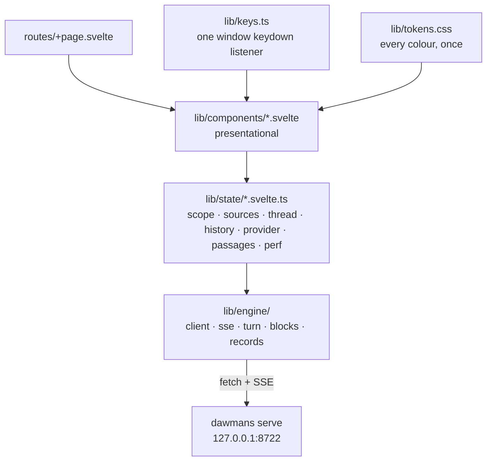

# web — the browser surface

The SvelteKit half of DAWMans. One page: an ask input, a source picker, and the rendered answer
with its citations. Everything on screen comes from the Python engine over loopback HTTP; this side
holds no corpus knowledge and no fixed source list.

See the root [`README.md`](../README.md) for the product and the stack, and
`specs/ui/ask-and-source-picker/` for what every behaviour here is answerable to.

## Shape



- **`lib/engine/`** is the only code that knows the wire format: `client.ts` for the routes,
  `sse.ts` for the turn event stream, `records.ts` for the CONTRACTS §1–§4 shapes, `blocks.ts` for
  the body block types, `turn.svelte.ts` for the turn state machine.
- **`lib/state/`** is the application state, one class instance per concern. Deliberately classes,
  not bare `$state` exports: a reassigned module-level `$state` isn't reactive across a module
  boundary, because the compiler rewrites references per file. Class fields declared `$state`
  survive it.
- **`lib/components/`** render and do not fetch.
- **`lib/keys.ts`** owns one `window` `keydown` listener and a registry. Components register and
  unregister rather than handling keys themselves — whether a `2` types a character or picks a
  candidate isn't knowable to any single component.
- **`lib/tokens.css`** is the only place a colour or size is declared, so the contrast floors stay
  checkable; `tokens.test.ts` asserts them.

## Running it

From the repo root, `make dev` runs this and the engine together. Directly:

```sh
pnpm install
pnpm dev        # vite on 5173, proxying to the engine on 8722
```

Dev is two origins, so `vite.config.ts` proxies `/turn`, `/passages`, `/sources` and `/provider`.
The proxy **rewrites `Origin` itself** — `changeOrigin: true` only touches `Host`, and the engine
rejects any `Origin` outside its own loopback set, so without the rewrite every proxied request in
dev is a 403. Point the proxy elsewhere with `ENGINE_ORIGIN`.

```sh
pnpm build      # → web/build
```

`adapter-static` with `ssr = false` and `prerender = true`: there is no server to render on, the
counterpart is a Python process, and every value on the page arrives from a runtime call to it. The
prerendered shell paints before any network call, which is the headroom the acknowledgement budget
spends. In production `dawmans serve` mounts `web/build` at `/`, so the page is same-origin and no
proxy exists.

There is no `svelte.config.js`. The adapter and the compiler options live in the `sveltekit()`
plugin block in `vite.config.ts`, including **forced runes mode** for everything outside
`node_modules`.

## Tests

```sh
pnpm test       # vitest, jsdom — unit and component
pnpm test:e2e   # playwright + axe
pnpm check      # svelte-check
```

- Vitest needs the `browser` resolve condition, set when `VITEST` is in the environment; without it
  Svelte's server entry resolves and `mount(...)` is unavailable. jsdom is given an explicit URL
  because Web Storage only exists on a non-opaque origin, and `vitest-setup.ts` unshadows Node's
  experimental storage globals.
- The e2e suite starts **its own stub engine** on 8788 and a vite dev server on 4173 behind it — the
  real dev shape, proxy rewrite included, but never the real engine. It needs the browser installed
  once per machine:

  ```sh
  pnpm exec playwright install chromium
  ```

## Editing rules

Svelte work in this repo MUST go through the Svelte MCP server tools and the `svelte-*` skills, and
the autofixer must be re-run after applying its corrections. Runes only — no `export let`, no legacy
stores.
